<!--folio:第1页-->

<!--col:L-->

<!--col:M-->
#### Decision Theory and Method
石婧
华中科技大学公共管理学院
Shi.jing@hust.edu.cn

<!--col:R-->

<!--/folio-->

<!--folio:第2页-->

<!--col:L-->

<!--col:M-->
Every single action that we do in this world is triggering off some amount of data, and most of that data is meaningless until someone adds some interpretation of it or someone adds a narrative around it.
-Jack Dorsey, the founder of Twitter

<!--col:R-->

<!--/folio-->

<!--folio:第3页-->

<!--col:L-->

<!--col:M-->
#### Outline
Why data is the new oil
Market targeting
Behavior targeting
Advertising campaign
Political campaign
Cambridge Analytica Facebook
Civic will is manipulated
US presidential campaign
UK Brexit campaign
How to exploit value from raw data
Ethical, political, social issues
Information right (worldwide)

<!--col:R-->

<!--/folio-->

<!--folio:第4页-->

<!--col:L-->

<!--col:M-->
#### Market targeting
E-commerce marketing
Behavioral targeting
Tracking online behavior of individuals on thousands of Web sites and within apps
Privacy concerns
Personalization/Customization
Technology permits modification of messages/goods
Personalized messages can be sent to individuals as well as groups.
Products and services can be customized to individual preferences.
Manipulation concerns

<!--col:R-->

<!--/folio-->

<!--folio:第5页-->

<!--col:L-->

<!--col:M-->
Online Marketing and Advertising Formats (Billions)

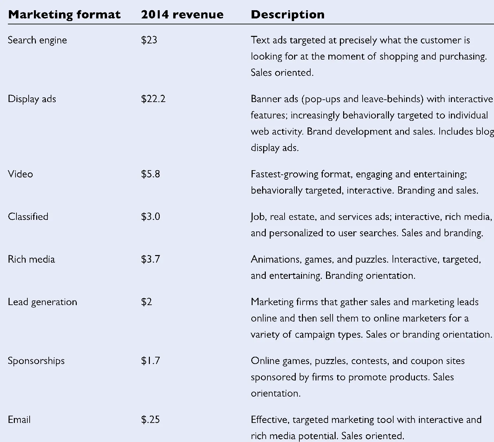

<!--col:R-->

<!--/folio-->

<!--folio:第6页-->

<!--col:L-->

<!--col:M-->
E-commerce Web sites have tools to track a shopper's every step through an online store. Close examination of customer behavior at a Web site selling women's clothing shows what the store might learn at each step and what actions it could take to increase sales.
Web Site Visitor Tracking

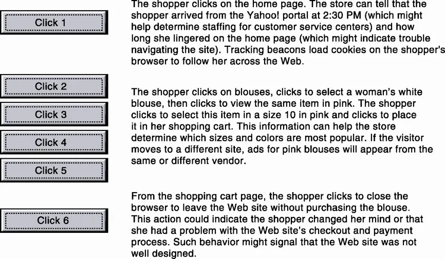

<!--col:R-->

<!--/folio-->

<!--folio:第7页-->

<!--col:L-->

<!--col:M-->
Firms can create unique personalized Web pages that display content or ads for products or services of special interest to individual users, improving the customer experience and creating additional value.
Web Site Personalization

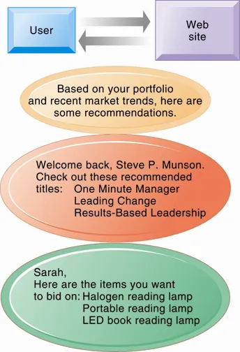

<!--col:R-->

<!--/folio-->

<!--folio:第8页-->

<!--col:L-->

<!--col:M-->
Advertising networks and their use of tracking programs have become controversial among privacy advocates because of their ability to track individual consumers across the Internet.
an Advertising Network

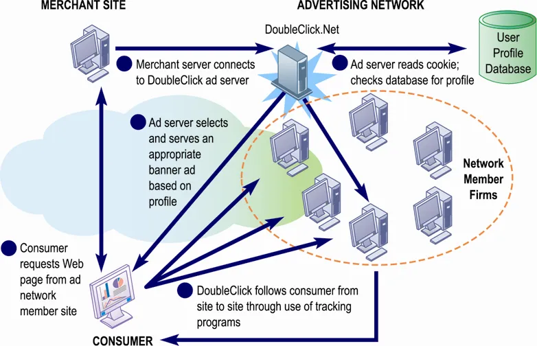

<!--col:R-->

<!--/folio-->

<!--folio:第9页-->

<!--col:L-->

<!--col:M-->

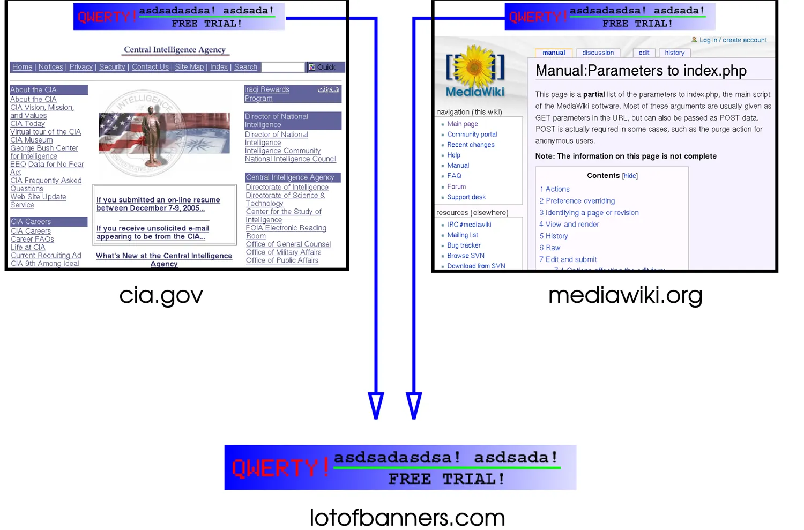

<!--col:R-->

<!--/folio-->

<!--folio:第10页-->

<!--col:L-->

<!--col:M-->
We use cookies to give you the best online experience. By clicking "Accept Cookies" or clicking into any content on this site, you agree to allow cookies to be placed.

<!--col:R-->

<!--/folio-->

<!--folio:第11页-->

<!--col:L-->

<!--col:M-->

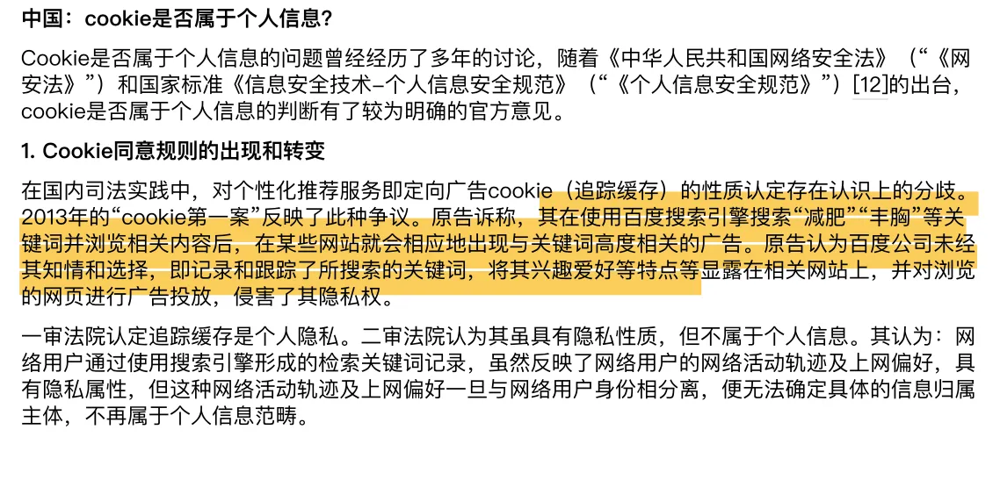

<!--col:R-->

<!--/folio-->

<!--folio:第12页-->

<!--col:L-->

<!--col:M-->
#### Social e-commerce
Social media:
Fastest growing media for branding and marketing
Social network marketing:
Seeks to leverage individuals influence over others in social graph
The target is a social network of people sharing interests and advice
Facebook’s “Like button”
Social networks have huge audiences
Facebook: 137 million U.S. visitors monthly

<!--col:R-->

<!--/folio-->

<!--folio:第13页-->

<!--col:L-->

<!--col:M-->
#### Facebook and Cambridge Analytica
Up to 87 Million Facebook profiles harvested through personality test app developed by Aleksandr Kogan
Research suggests Facebook “Likes” can be used to predict personality, political persuasion, age, gender, even sexual orientation
Combined “psychographic” and demographic data
Same policy message could be delivered in thousands of different ways depending on psychological profile

<!--col:R-->

<!--/folio-->

<!--folio:第14页-->

<!--col:L-->

<!--col:M-->

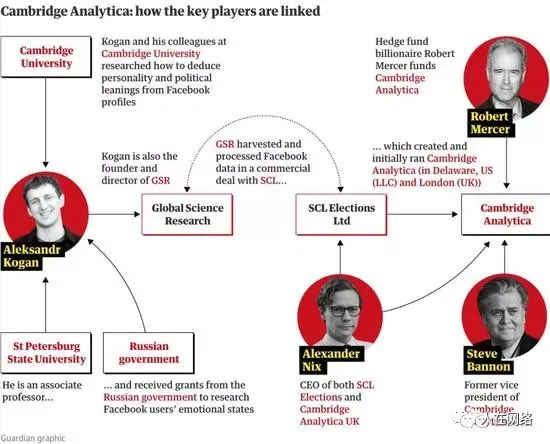

<!--col:R-->

<!--/folio-->

<!--folio:第15页-->

<!--col:L-->

<!--col:M-->

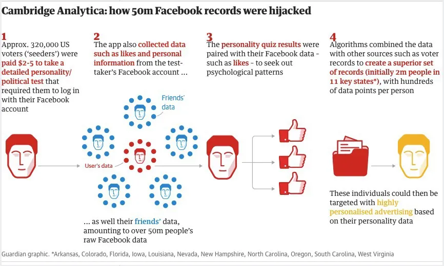

<!--col:R-->

<!--/folio-->

<!--folio:第16页-->

<!--col:L-->

<!--col:M-->

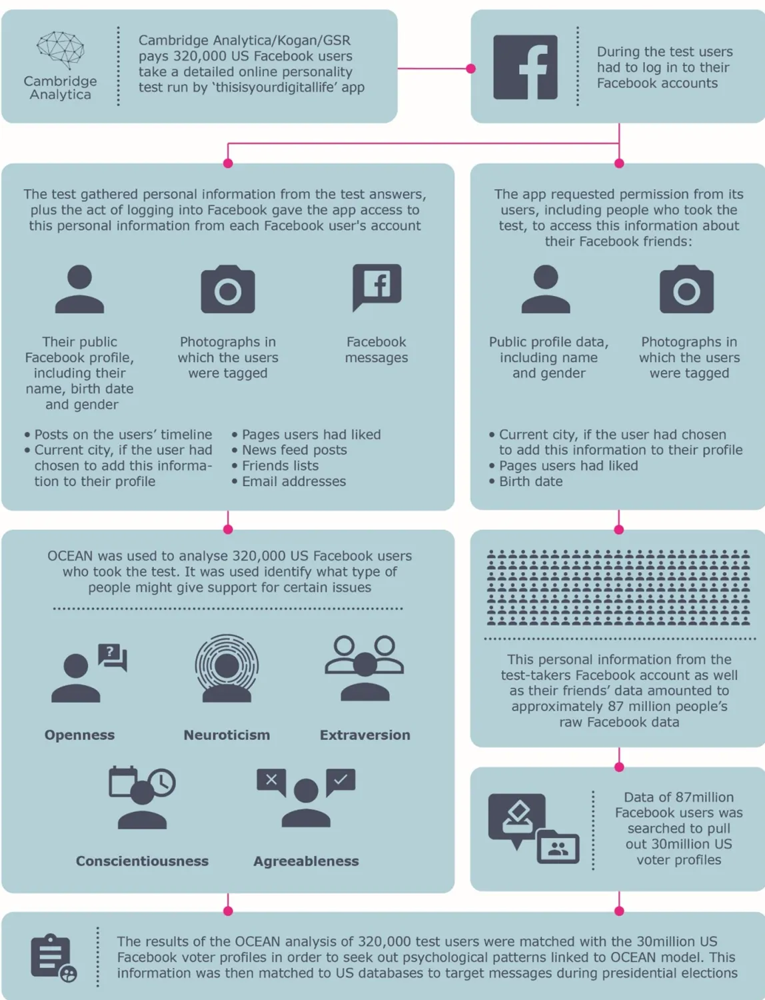

<!--col:R-->

<!--/folio-->

<!--folio:第17页-->

<!--col:L-->

<!--col:M-->

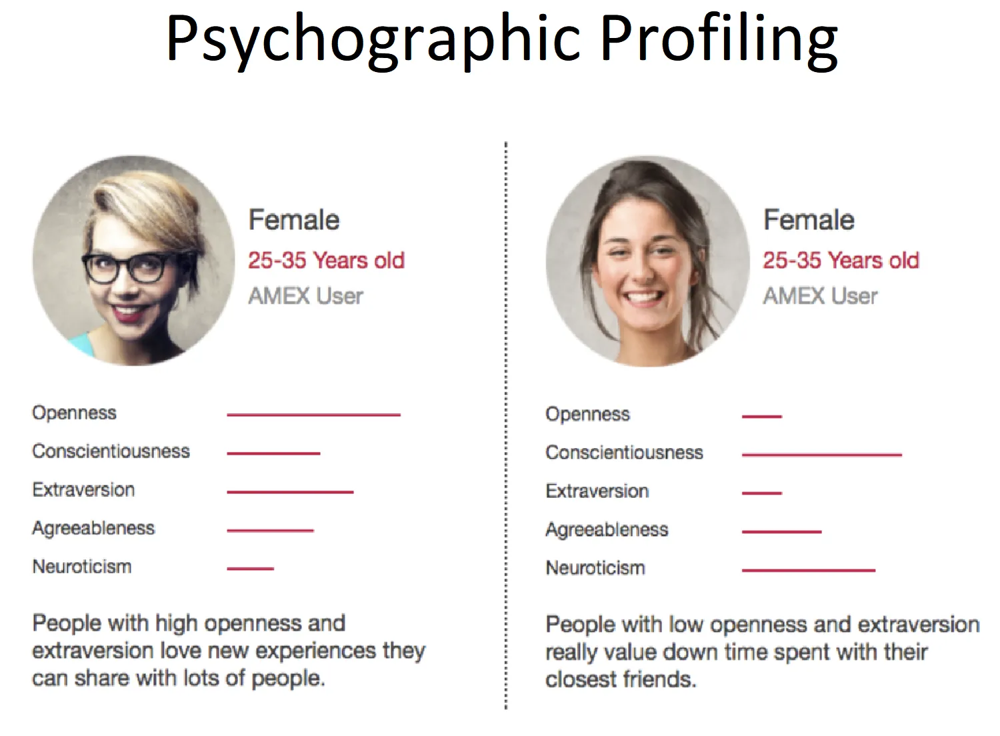

<!--col:R-->

<!--/folio-->

<!--folio:第18页-->

<!--col:L-->

<!--col:M-->
Political parties use many data sources to build a fuller picture of potential voters
Source: Investigation into data analytics for political purposes. https://ico.org.uk/action-weve-taken/investigation-into-data-analytics-for-political-purposes/
ICO information commissioner’s office -The UK’s independent authority set up to uphold information rights in the public interest, promoting openness by public bodies and data privacy for individuals.

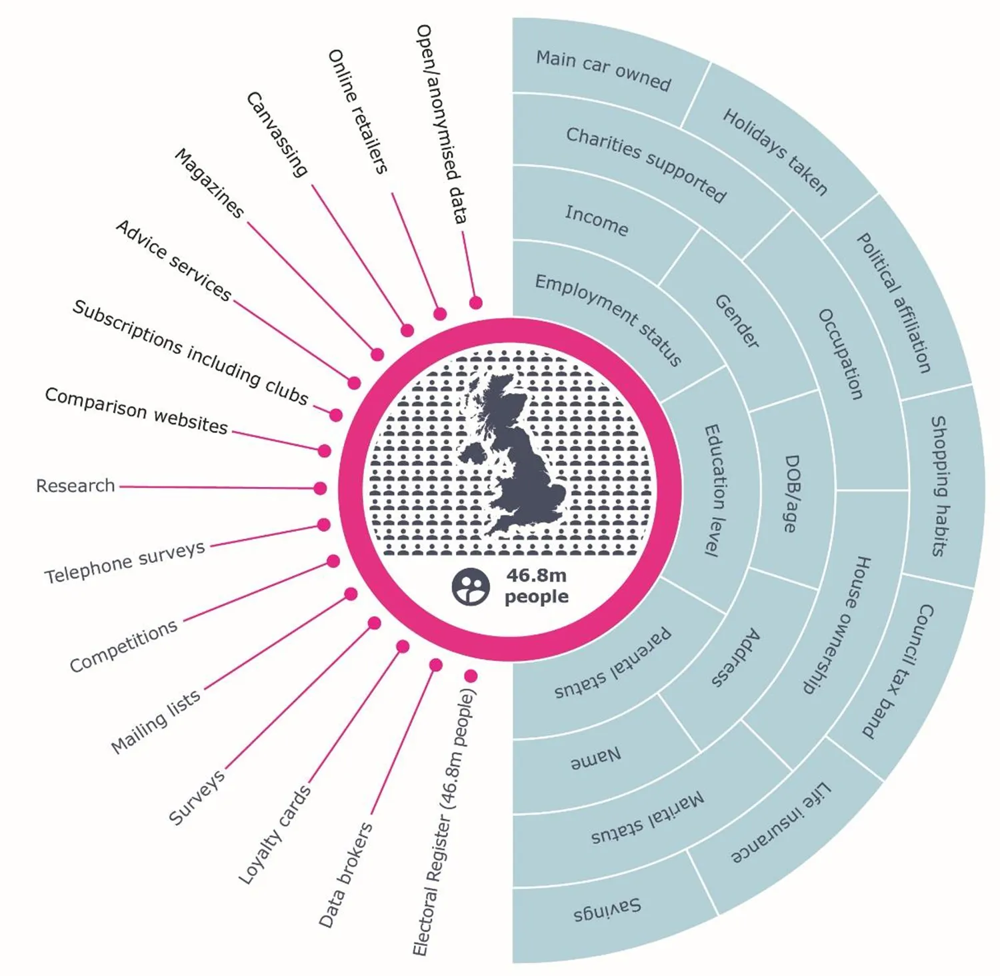

<!--col:R-->

<!--/folio-->

<!--folio:第19页-->

<!--col:L-->

<!--col:M-->
Information is used to create a personal profile

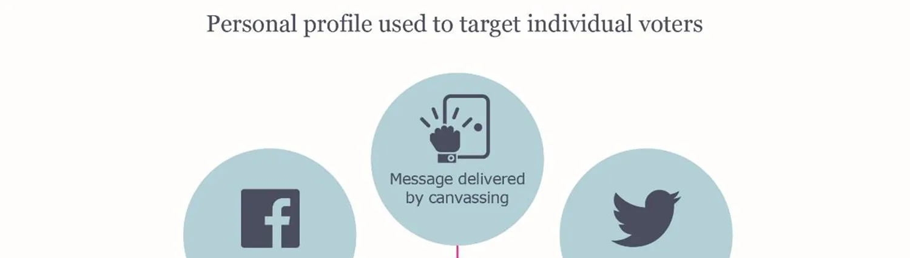

<!--col:R-->

<!--/folio-->

<!--folio:第20页-->

<!--col:L-->

<!--col:M-->
Personal profile used to target individual voters

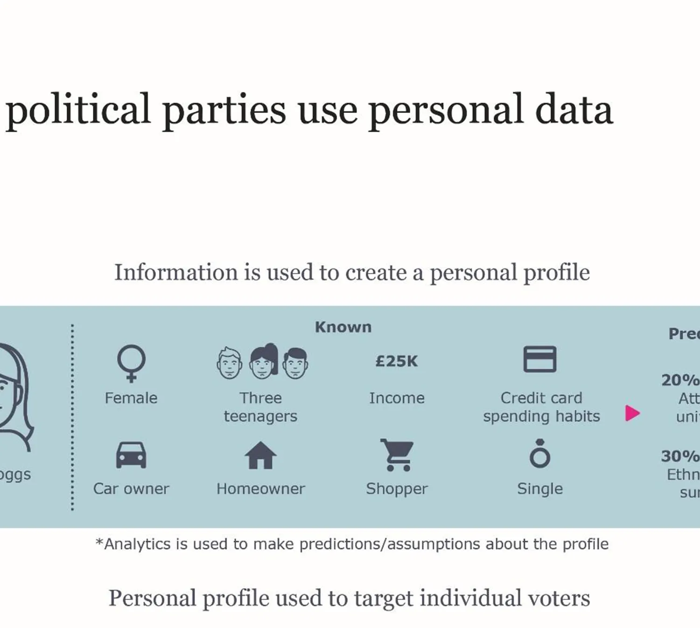

<!--col:R-->

<!--/folio-->

<!--folio:第21页-->

<!--col:L-->

<!--col:M-->
Source: Kosinski M, Stillwell D, Graepel T. Private traits and attributes are predictable from digital records of human behavior[J]. Proceedings of the national academy of sciences, 2013, 110(15): 5802-5805.

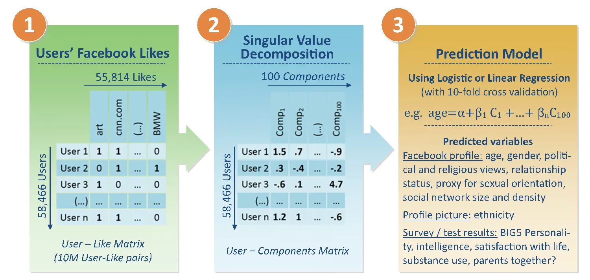

<!--col:R-->

<!--/folio-->

<!--folio:第22页-->

<!--col:L-->

<!--col:M-->
https://www.gsb.stanford.edu/faculty-research/faculty/michal-kosinski
https://drive.google.com/file/d/1zRaTAx0mpRC0m7-3wQRaDPYTOGMdvNBt/edit

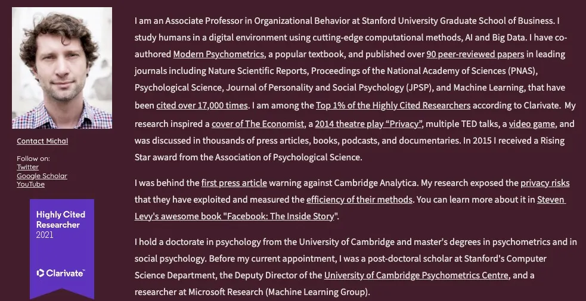

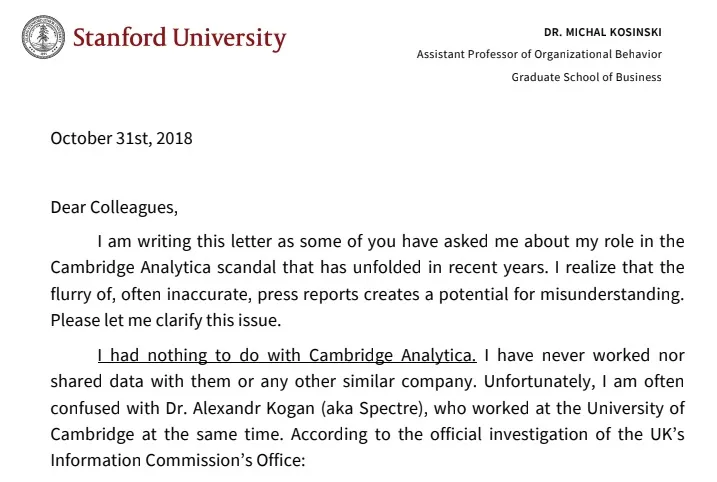

<!--col:R-->

<!--/folio-->

<!--folio:第23页-->

<!--col:L-->

<!--col:M-->
This figure shows the prediction accuracy of dichotomous variables expressed in terms of the area under the receiver-operating characteristic curve (AUC), which is equivalent to the probability of correctly classifying two randomly selected users one from each class (e.g., male and female).
- The highest accuracy was achieved for ethnic origin and gender.
    - African Americans and Caucasian Americans were correctly classified in 95% of cases
    - Males and females were correctly classified in 93% of cases
- suggesting that patterns of online behavior as expressed by Likes significantly differ between those groups allowing for nearly perfect classification.
Source: Kosinski M, Stillwell D, Graepel T. Private traits and attributes are predictable from digital records of human behavior[J]. Proceedings of the national academy of sciences, 2013, 110(15): 5802-5805.

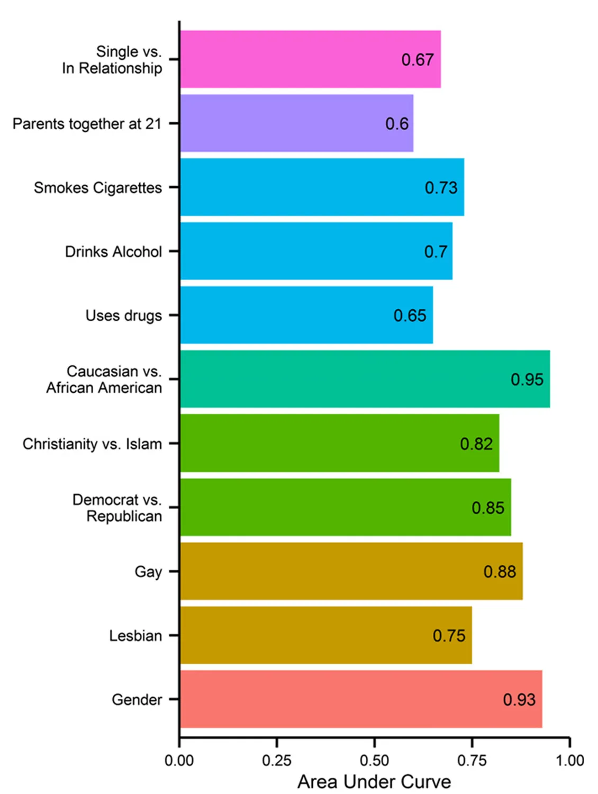

<!--col:R-->

<!--/folio-->

<!--folio:第24页-->

<!--col:L-->

<!--col:M-->
Humans think about other people in just a small number of dimensions - age, race, gender and, if we know them a bit better, personality – while algorithms are already processing billions of data points and making classifications in hundreds of dimensions.
When we don't understand how Facebook classifies us, the joke is on us, not on the algorithms.
We no longer have the capability to fully understand the output of the algorithms we have created.
P40. Ch4 one hundred dimensions of you. Outnumbered: From Facebook and Google to Fake News and Filter-bubbles – The Algorithms That Control Our Lives

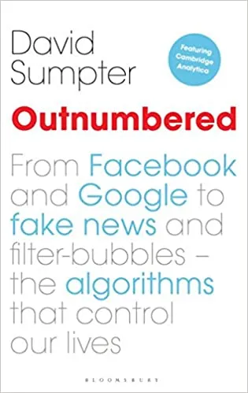

<!--col:R-->

<!--/folio-->

<!--folio:第25页-->

<!--col:L-->

<!--col:M-->
Facebook has obtained a series of patents that allows the company to utilize its multi-dimensional understanding of us.
Romantic matchmaking
The patent proposes allowing single users to look for friends of friends to 'identify [potential dates] that match a preference set of desired traits, interests, or experiences’.
The mutual friend can then be asked if they are willing to be an intermediary.
Find you a job
Over purely professional services like LinkedIn, is that your Facebook profile is (for better or worse) more likely to reveal the true you.
In 2012, researcher Donald Kluemper and his colleagues found that a human assessment of the Facebook profiles of 586 students (primarily white females) provided reliable assessments of their workplace hireability.
Several third-party companies have filed patents to use Facebook and other social-networking sites to extend this finding to automated job-matching.

<!--col:R-->

<!--/folio-->

<!--folio:第26页-->

<!--col:L-->

<!--col:M-->
Measure your state of mind
Measuring your state of mind from your posts, your emotions from your facial expressions in photographs and your level of engagement from your rate of interaction with your screen.
The speed with which users move their mouse during routine computer tasks can reveal the emotional content of what they are looking at on screen.
Principal component analysis can break down the way you are interacting with your phone or your computer, in order to build up a picture of how you are feeling.

<!--col:R-->

<!--/folio-->

<!--folio:第27页-->

<!--col:L-->

<!--col:M-->
#### 案例：政治倾向判定
……but Michal Kosinski and his colleagues have created a tutorial package to allow psychology students to practice creating regression models on an anonymized database of 20,000 Facebook users. I downloaded the package and installed it on my computer. Only 4,744 of the 19,742 US-based Facebook users in the dataset expressed a preference for either Democrats or Republicans. Of these, 31 percent were Republicans.
PP 50-51. Ch5 Cambridge Hyperbolytica. Outnumbered: From Facebook and Google to Fake News and Filter-bubbles – The Algorithms That Control Our Lives

<!--col:R-->

<!--/folio-->

<!--folio:第28页-->

<!--col:L-->

<!--col:M-->
at the time the data was collected between 2007 and 2012 ……I used the data to fit a regression model with the 50 Facebook dimensions as inputs. The output of the regression model is the probability that a person is a Republican.
This is an intuitive measure of accuracy. Imagine you met these two people, and you were allowed to ask them a few questions about their tastes and hobbies, after which you had to decide which person supported which political party.
How often do you think you would get it right? The accuracy of a regression model based on Facebook data is very good. In eight out of nine attempts, the regression correctly identifies the political views of the Facebook user.
The main group of likes that identify a Democrat were for Barack and Michelle Obama, National Public Radio, TED Talks, Harry Potter, the I Fucking Love Science webpage and liberal current affairs shows like The Colbert Report and The Daily Show. Republicans like George W. Bush, the Bible, country and western music, and camping.

<!--col:R-->

<!--/folio-->

<!--folio:第29页-->

<!--col:L-->

<!--col:M-->
It isn't too surprising that Democrats like the Obamas and The Colbert Report or that many Republicans like George W. Bush and the Bible.
So I tried to see if I could break the regression model by taking some of the obvious 'likes' out of the model and performing a new regression.
To my surprise, the model still worked with 85 per cent accuracy, only a slight reduction in performance.
Now it used combinations of likes to determine political affiliations. For example, someone who liked Lady Gaga, Starbucks and country music was more likely to be a Republican, but a Lady Gaga fan who also liked Alicia Keys and Harry Potter was more likely to be a Democrat.
This is where the multiple dimensional understanding gained by using lots unexpected and useful results.

<!--col:R-->

<!--/folio-->

<!--folio:第30页-->

<!--col:L-->

<!--col:M-->
Alex had reached similar conclusions to my own. He didn't believe that Cambridge Analytica, or anyone else, could produce an algorithm that effectively classified people's personality. He was working with a combination of computer simulations and Twitter data to show that, although aspects of personality could be measured from our digital footprint, the signal wasn't strong enough to make reliable predictions about us.
He was blunt about Alexander Nix. ’Nix is trying to promote [the personality algorithm] because he has a strong financial incentive to tell a story about how Cambridge Analytica have a secret weapon.
P54. Ch5 Cambridge Hyperbolytica. Outnumbered: From Facebook and Google to Fake News and Filter-bubbles – The Algorithms That Control Our Lives

<!--col:R-->

<!--/folio-->

<!--folio:第31页-->

<!--col:L-->

<!--col:M-->
2020年购物数据分析
其中主成分一由美妆、服装、娱乐、 日常构成，主成分二由文体和食物构成，根据象限我们将同学们的消费种类偏好划分为四类: 生活精致派、务实校园派、高贵路人派和清心寡欲派。
生活精致(第二象限内):主要消费集中于提升整体精致感的方面，PC1 所占比重高
务实校园(第四象限内):主要消费集中于传统的学生必要开支上，PC2 所占比重高
高贵路人(第一象限内):两者皆重
清心寡欲(第三象限内):整体消费欲望不强，无明显偏好。

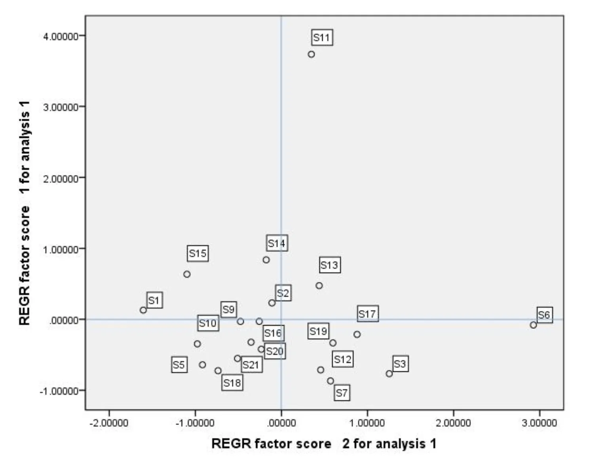

<!--col:R-->

<!--/folio-->

<!--folio:第32页-->

<!--col:L-->

<!--col:M-->
2021年网易/QQ音乐软件数据分析
第一象限表明代入情境程度高，情绪压力大，表明同学主要通过感受音乐所塑造的情境， 释放压力;
第二象限表明情境代入程度高，情绪压力小，表示该同学听歌主要是为了品乐，感受歌曲背后的故事和情境的。
第三象限表明情景带入程度低，情绪压力小，表示该同学听音乐时的情绪可能是游离放空状态。
第四象限表明情境代入程度低，情绪压力大，表明这部分同学是将音乐当成他发泄情绪的渠道，并不是为了去体会音乐塑造的情境。如跑步时单纯需要音乐的刺激，节奏的律动， 并不感受音乐本身的故事和塑造的情境。
主成分二由 BPM 在 40-55 和 141-500 之间的变量组成，基于两个组成变量的分散和极端化——40-55BPM 以及141-500BPM 将其定义为压力程度

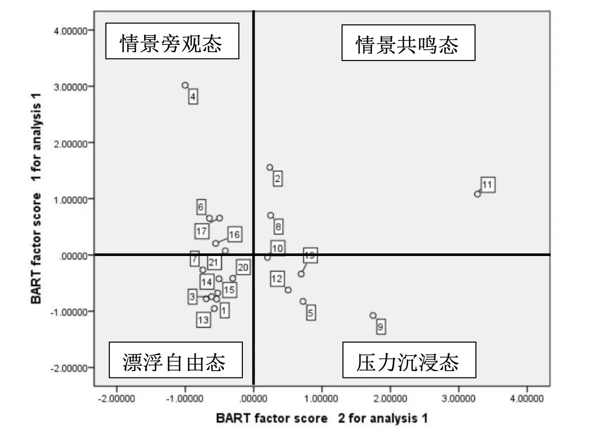

<!--col:R-->

<!--/folio-->

<!--folio:第33页-->

<!--col:L-->

<!--col:M-->
2022年B站数据分析

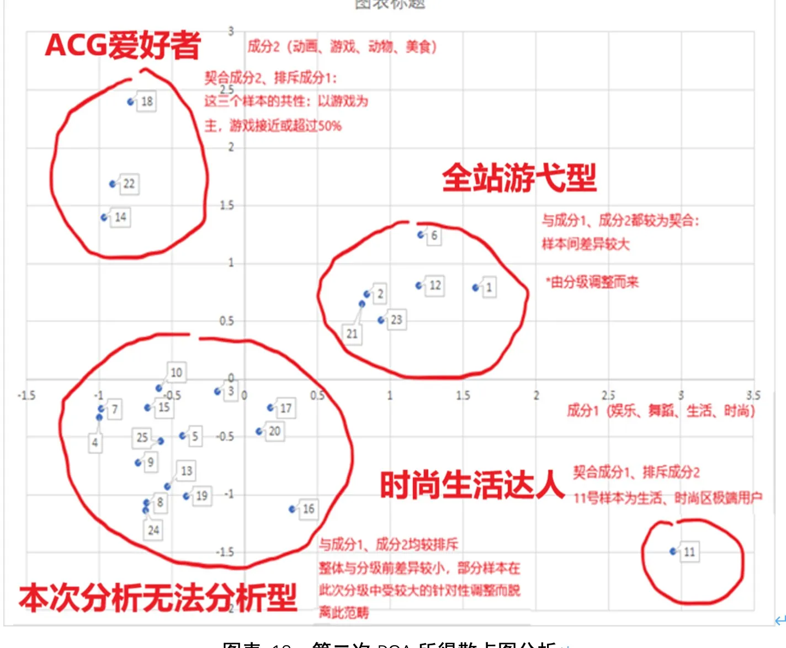

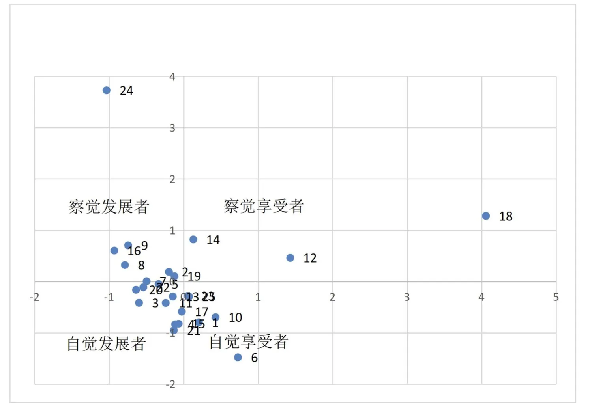

<!--col:R-->

<!--/folio-->

<!--folio:第34页-->

<!--col:L-->

<!--col:M-->
#### How to exploit value from raw data
Data mining
Discovery of useful, possibly unexpected, patterns in data
Non-trivial extraction of implicit, previously unknown and potentially useful information from data
Exploration & analysis, by automatic or semi-automatic means, of  large quantities of data in order to discover meaningful patterns

<!--col:R-->

<!--/folio-->

<!--folio:第35页-->

<!--col:L-->

<!--col:M-->
#### Classification
Given a collection of records (training set )
Each record contains a set of attributes, one of the attributes is the class.
Find a model  for class attribute as a function of the values of other attributes.
Goal: previously unseen records should be assigned a class as accurately as possible.
A test set is used to determine the accuracy of the model. Usually, the given data set is divided into training and test sets, with training set used to build the model and test set used to validate it.

<!--col:R-->

<!--/folio-->

<!--folio:第36页-->

<!--col:L-->

<!--col:M-->
#### Decision Trees
Example:
Conducted survey to see what customers were
   interested in new model car
Want to select customers for advertising campaign
36
training
set

<!--col:R-->

<!--/folio-->

<!--folio:第37页-->

<!--col:L-->

<!--col:M-->
#### Clustering
37
age
income
education

<!--col:R-->

<!--/folio-->

<!--folio:第38页-->

<!--col:L-->

<!--col:M-->
#### Five moral dimensions of the information age
Information rights and obligations
Property rights and obligations
Accountability and control
System quality
Quality of life

<!--col:R-->

<!--/folio-->

<!--folio:第39页-->

<!--col:L-->

<!--col:M-->
#### Information rights: privacy and freedom in the Internet age
Privacy
Claim of individuals to be left alone, free from surveillance or interference from other individuals, organizations, or state; claim to be able to control information about yourself
In the United States, privacy protected by
First Amendment (freedom of speech)
Fourth Amendment (unreasonable search and seizure)
Additional federal statues (e.g., Privacy Act of 1974)

<!--col:R-->

<!--/folio-->

<!--folio:第40页-->

<!--col:L-->

<!--col:M-->
#### Fair information practices
Set of principles governing the collection and use of information
Basis of most U.S. and European privacy laws
Based on mutuality of interest between record holder and individual
Restated and extended by FTC in 1998 to provide guidelines for protecting online privacy

<!--col:R-->

<!--/folio-->

<!--folio:第41页-->

<!--col:L-->

<!--col:M-->
#### FTC FIP principles
Notice/awareness (core principle)
Web sites must disclose practices before collecting data.
Choice/consent (core principle)
Consumers must be able to choose how information is used for secondary purposes.
Access/participation
Consumers must be able to review and contest accuracy of personal data.

<!--col:R-->

<!--/folio-->

<!--folio:第42页-->

<!--col:L-->

<!--col:M-->
#### FTC FIP principles (cont.)
Security
Data collectors must take steps to ensure accuracy, security of personal data.
Enforcement
Must be mechanism to enforce FIP principles.

<!--col:R-->

<!--/folio-->

<!--folio:第43页-->

<!--col:L-->

<!--col:M-->
#### Extended FIP doctrine to address behavioral targeting in 2012
The FTC held hearings to discuss its program for voluntary industry principles for regulating behavioral targeting.
Network Advertising Initiative published its own self-regulatory principles that largely agreed with the FTC.
However
Disagreement:
opt-in -Privacy advocates
opt-out-The industry
Although there are many studies of privacy issues at the federal level, there has been no significant legislation in recent years.

<!--col:R-->

<!--/folio-->

<!--folio:第44页-->

<!--col:L-->

<!--col:M-->
#### 国内相关法律
《网络安全法》
2016年11月7日十二届全国人大常委会第24次会议通过
《关键信息基础设施安全保护条例》：2021年4月27日 国务院第133次常务会议通过，根据《网络安全法》制定本条例
《数据安全法》
2021年6月10日 十三届全国人大常委会第29次会议通过
2021年9月1日正式施行
《个人信息保护法》
2021年8月20日十三届全国人大常委会第30次会议通过
2021年11月1日正式施行

<!--col:R-->

<!--/folio-->

<!--folio:第45页-->

<!--col:L-->

<!--col:M-->
#### 共通点
一、立法的时代背景基本相同
三部法律均产生于5G、区块链、大数据、人工智能等信息与通讯技术高速发展的时代背景，对于这些新兴科技与技术予以立法，是回应时代发展的需要。
二、立法的价值取向基本一致
虽然从发展的角度，仍然是以“效率”优先，但“效率”不能像脱缰的野马，恣意“裸奔”。因为现在如果以牺牲“安全”为代价所换来的“效率”是得不偿失的。
三、法律关系中的客体的核心基本一致
所要规范的客体虽然有所区别，但总体上是围绕数据与信息的生产与经营行为，网络是搭载信息的基础，信息的交互与传递是网络所要实现的目的，而信息天然的无形与溢散性需要加以管制，管制的核心又是围绕政府与个人信息。

<!--col:R-->

<!--/folio-->

<!--folio:第46页-->

<!--col:L-->

<!--col:M-->
#### 差异
一、三者的立法目的有所不同
《网络安全法》更强调的是网络安全与网络空间的国家主权
《数据安全法》更侧重于数据安全以及基于数据安全所体现的国家安全
《个人信息保护法》则集中于个人信息的保护。
二、三者所调整的对象有所不同
《网络安全法》更侧重于房间的大门以及各个房门的安全
《数据安全法》指的是房子里面的东西的安全
《个人信息保护》相当于房子里面最值钱的东西的保险箱，你的身份证、银行卡、户口簿以及一些重要的私密文件存放的地方。
三者相互独立、各有侧重，但也你中有我我中有你。
《个人信息保护》既涉及网络安全部分，也涉及数据保护部分。《数据安全法》则既包含个人信息，还包含政务信息，还包含其他各行各业的信息，所以说，《数据安全法》采用的是“分级分类保护制度”。

<!--col:R-->

<!--/folio-->

<!--folio:第47页-->

<!--col:L-->

<!--col:M-->
三、三者的调整模式所有不同
《网络安全法》更侧重于按照网络运营所涉及的环节来进行规范与调整，其体例上主要是分为“网络运行安全”与“网络信息安全”两大部分来规范，而规范的对象主要是三类主体，网络运营者、网络产品与服务的提供者以及关键信息基础设施的运营者。
《数据安全法》并未按照数据的生产、加工、流转与使用的流程来进行规范，而是将其分为“数据安全制度”与“数据安全保护义务”进行规范与调整，调整的对象应该说更具有广泛性，即一切从事数据处理活动的主体都要受到该法的规范与约束。
《个人信息保护法》将事实上的一种私法行为（简单说是提供个人信息与获得各类服务）进行公法上的调整与保护，赋权的条款比较多，其中第四章是“个人在个人信息处理活动中的权利”，第五章是“个人信息处理者的义务”。
引用： 《数据安全法》《网络安全法》《个人信息保护法》的比较分析. https://www.lexology.com/library/detail.aspx?g=03b40cf6-ebcb-44d5-bae5-7ccee3f204e6

<!--col:R-->

<!--/folio-->

<!--folio:第48页-->

<!--col:L-->

<!--col:M-->
P62， P64 [美]W. Richard Scott，《制度与组织——思想观念、利益偏好与身份认同》（第四版），中国人民大学出版社，2020.4
分析者不应把法律的强制功能与法律的规范性与认知性层面混淆在一起。
很多法律远非以权威性的和外生性的方式运行，相反可能存在很大的争议或模糊性，因为它们没有为行为进行明确的规定。
把法律看作建构意义与集体理解的场合，并主要是依靠认知性和规范性要素而非强制性要素来实现其影响，则更恰当。

<!--col:R-->

<!--/folio-->
