<!--folio:第1页-->

<!--col:L-->

<!--col:M-->
#### Decision Theory and Method
石婧
华中科技大学公共管理学院
Shi.jing@hust.edu.cn

<!--col:R-->

<!--/folio-->

<!--folio:第2页-->

<!--col:L-->

<!--col:M-->
#### 热门AI LLM与AI agent应用发布时间线
ChatGPT
openAI
2022年11月30
Gemini
Google
2023年3月21
Claude
Anthropic
2023年3月
Grok
xAI
2023年11月3
Deepseek R1
深度求索（杭州）
2025年1月20
2023年10月
豆包
月之暗面
今日头条
Kimi
2023年8月
Fable 5
Anthropic
2026年6月
Claude agent
Anthropic
2025年9月29
openAI o1
openAI
2024年9月
OpenClaw
aka.Moltbot
Peter Steinberger
2025年11月
Manus
肖弘 Monica
2025年3月6
Kimi k3
月之暗面
2026年7月17
GPT-6 Astra
2026.9.3

<!--col:R-->

<!--/folio-->

<!--folio:第3页-->

<!--col:L-->

<!--col:M-->
ChatGPT
3

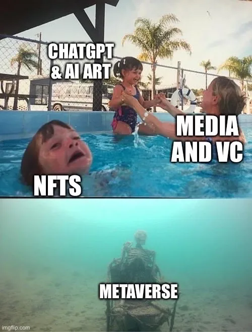

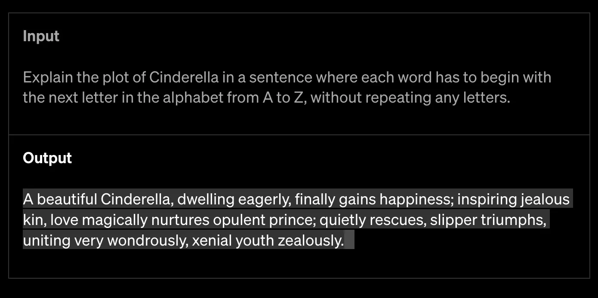

<!--col:R-->

<!--/folio-->

<!--folio:第4页-->

<!--col:L-->

<!--col:M-->
- Agent 是任何能通过传感器感知环境、并通过执行器作用于环境的实体
    - 以智能的方式响应用户请求、学习用户偏好与行为，并能够与用户进行深度对话
    - 本质上是一类具有环境感知、自主决策并执行任务、动态响应环境变化的人工智能系统
    - 具有自主性、感知性、目的性、适应性、交互性五维特征。
#### 什么是智能体agent

<!--col:R-->

<!--/folio-->

<!--folio:第5页-->

<!--col:L-->

<!--col:M-->

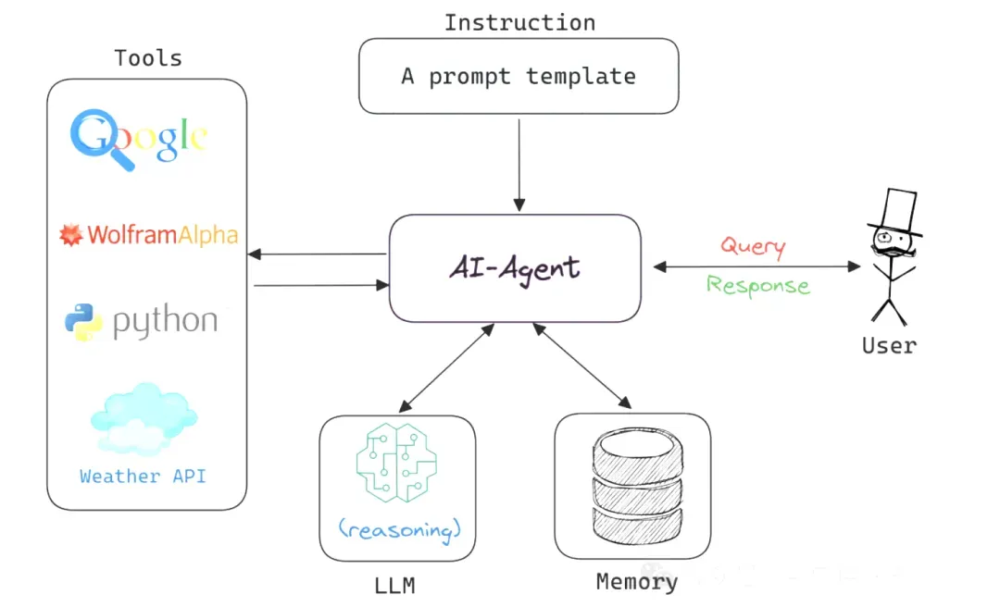

<!--col:R-->

<!--/folio-->

<!--folio:第6页-->

<!--col:L-->

<!--col:M-->
要素 | 说明
目标驱动 | 给一个目标，而不是一步指令
自主规划 | 自己拆解任务、决定下一步做什么
工具调用 | 能操作搜索、浏览器、代码、文件、API 等外部工具
反馈循环 | 观察工具返回的结果 → 调整 → 再行动，多轮迭代直到完成
一定程度的环境感知 | 知道自己的行为改变了什么，并据此修正

<!--col:R-->

<!--/folio-->

<!--folio:第7页-->

<!--col:L-->

<!--col:M-->
Seedance2.0
字节跳动
2026年2月
（1.0-2025年6月）
Midjourney
美旧金山同名实验室
2022年7月12日公开测试
2024年7月31日正式发布
Sora
openAI
2024年12月9
热门视频图片制作AI应用发布时间线

<!--col:R-->

<!--/folio-->

<!--folio:第8页-->

<!--col:L-->

<!--col:M-->
Midjourney是一个由同名研究实验室开发的人工智能程序
可根据文本生成图像
于2022年7月12日进入公开测试阶段。
用户可透过Discord的机器人指令进行操作。
Midjourney

<!--col:R-->

<!--/folio-->

<!--folio:第9页-->

<!--col:L-->

<!--col:M-->
Seedance 2.0 是字节跳动推出的多模态AI视频生成器
多模态输入——最多上传 9 张图片 + 3 段视频（15秒）+ 3 个音频文件，结合文本提示创作。
Seedance

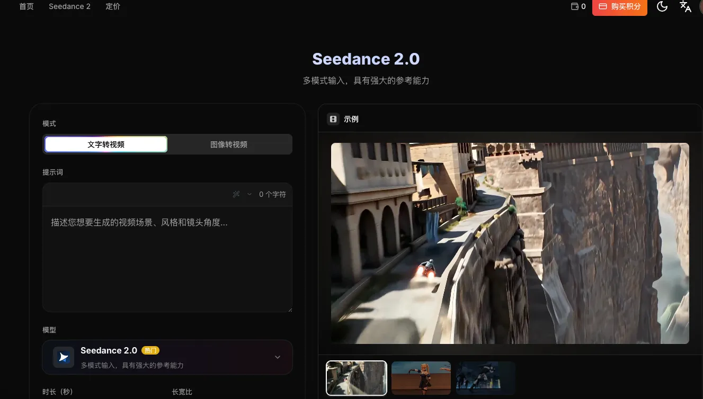

<!--col:R-->

<!--/folio-->

<!--folio:第10页-->

<!--col:L-->

<!--col:M-->
AI 视频生成的两条技术路径 · 01 / 02
路径一｜Video-to-Video：先有影像，再逐帧重画
真人影像提供动作骨架，AI 按提示词重新着色、更换风格——动画转描（Rotoscoping）的自动化继承。
工作流程
① 输入素材
真人实拍视频，逐帧拆解
② 提取控制信号
OpenPose 姿态 / Canny 边缘 / 光流
③ 按提示词重绘
扩散模型逐帧生成新画面
④ 输出
风格化动画视频
案例：一条延续百年的"描"的路线
1915–1930s 转描机
Fleischer 发明，迪士尼《白雪公主》沿用：胶片逐帧投影，动画师照描
2006《黑暗扫描仪》
整部电影先实拍、再数字化转描，真人表演与动画风格叠加
2023– ControlNet 姿态控制
OpenPose 骨架取代人工描线，引导 AI 按真人动作生成画面
代表工具　Runway Vid2Vid · AnimateDiff + ControlNet · EbSynth
特点　动作稳定、控制力强；但依赖现成影像，本质是对已有素材的再加工

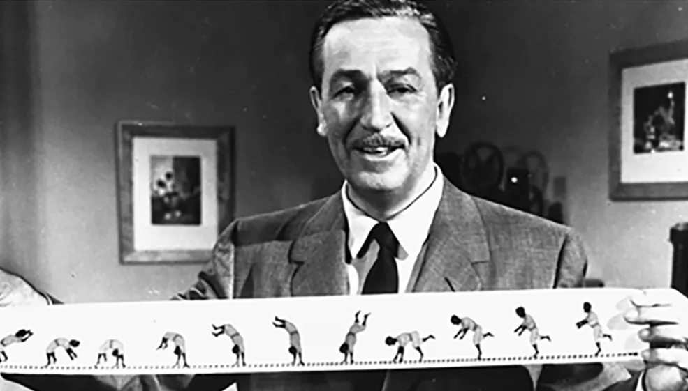

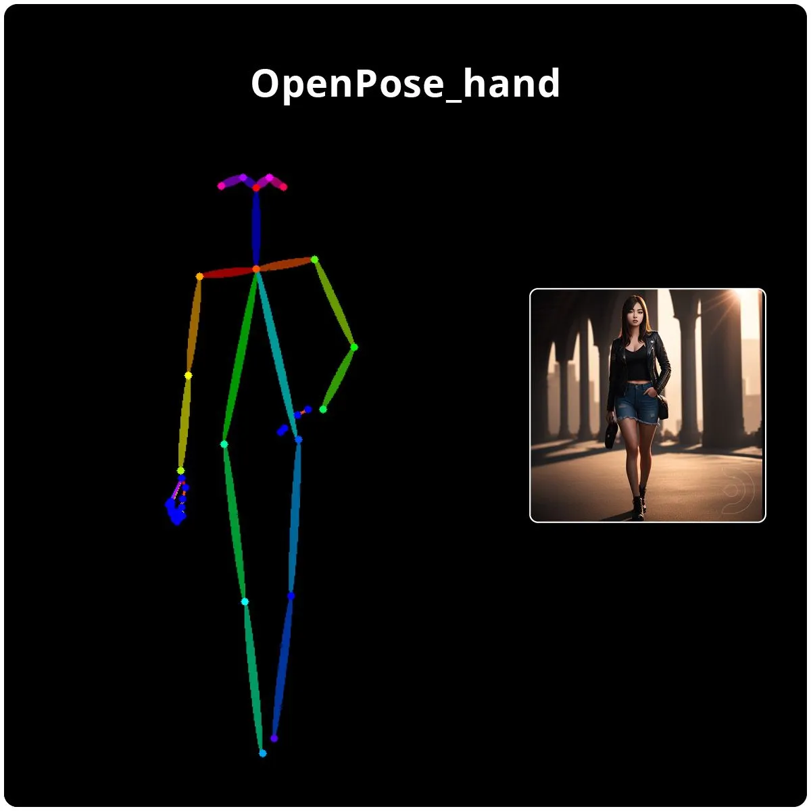

<!--col:R-->

<!--/folio-->

<!--folio:第11页-->

<!--col:L-->

<!--col:M-->
AI 视频生成的两条技术路径 · 02 / 02
路径二｜文生 / 图生视频：从噪声中逐步去噪出画面
不依赖任何实拍素材：模型从随机噪声出发，按文本描述或起始图，一步步"雕刻"出时序连贯的影像。
工作流程（扩散模型 + DiT）
① 条件输入
文本提示词 / 起始图、首尾帧
② 压缩至潜空间
VAE 降维，算力消耗大幅下降
③ DiT 逐步去噪
时空注意力保证帧间一致
④ 解码输出
还原为像素视频
去噪过程示意：噪声 → 轮廓浮现 → 成片
同一过程重复数十步：每一步，模型都在猜测"下一层更清晰的画面该长什么样"，文本条件全程参与引导。
实例：Sora 文生视频画面（OpenAI，2024）
代表模型　Sora · 可灵 · Vidu · Runway Gen-3
特点　无中生有、创意自由；瓶颈在物理一致性、时长与可控性

<!--figrow:3-->

<!--col:R-->

<!--/folio-->

<!--folio:第12页-->

<!--col:L-->

<!--col:M-->
#### AI的发展趋势
金融界
Mary Meeker(BOND):
Trends–Artificial Intelligence 2025.5
科技界
黄仁勋：
AI Is a 5-Layer Cake （Nvidia blog）2026.3.10
政府界
中国互联网信息中心CNNIC：
《生成式人工智能应用发展报告 (2025)》 2025.10
1
2
3

<!--col:R-->

<!--/folio-->

<!--folio:第13页-->

<!--col:L-->

<!--col:M-->

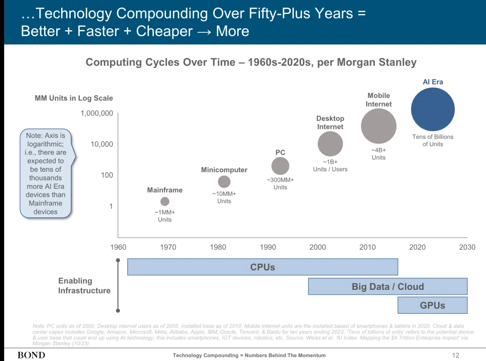

<!--col:R-->

<!--/folio-->

<!--folio:第14页-->

<!--col:L-->

<!--col:M-->

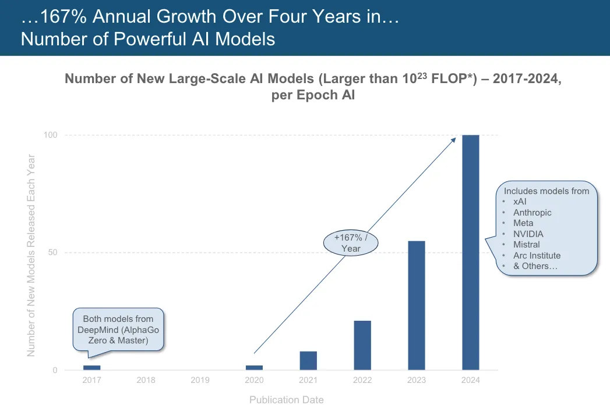

<!--col:R-->

<!--/folio-->

<!--folio:第15页-->

<!--col:L-->

<!--col:M-->

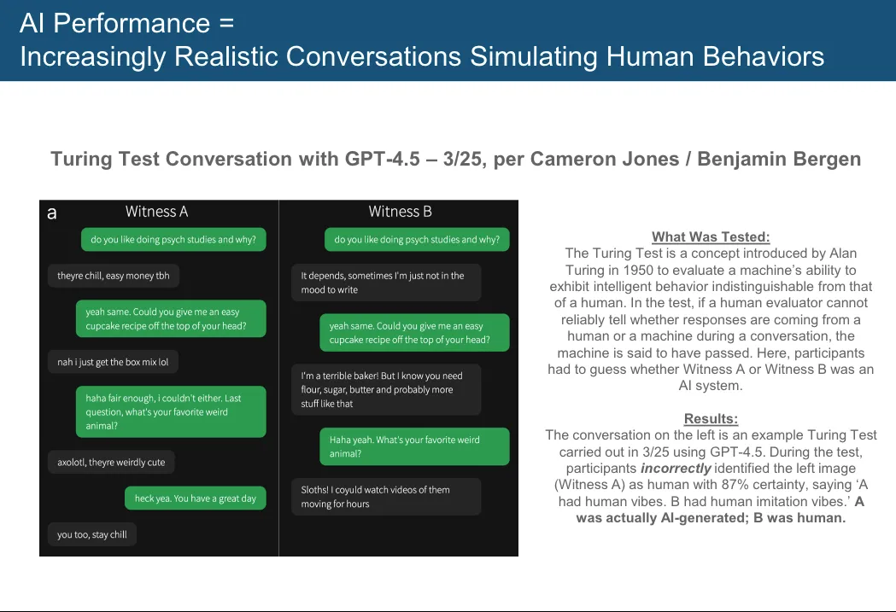

<!--col:R-->

<!--/folio-->

<!--folio:第16页-->

<!--col:L-->

<!--col:M-->

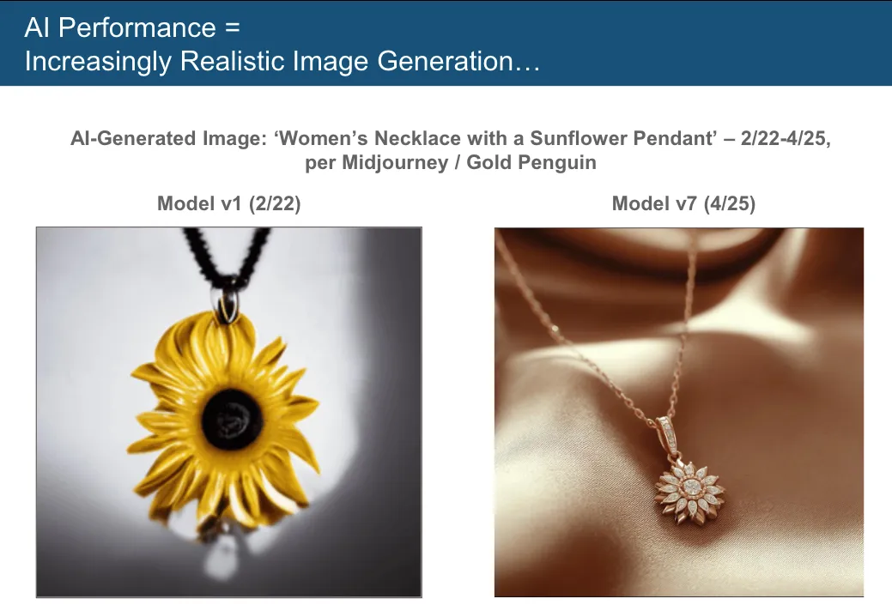

<!--col:R-->

<!--/folio-->

<!--folio:第17页-->

<!--col:L-->

<!--col:M-->

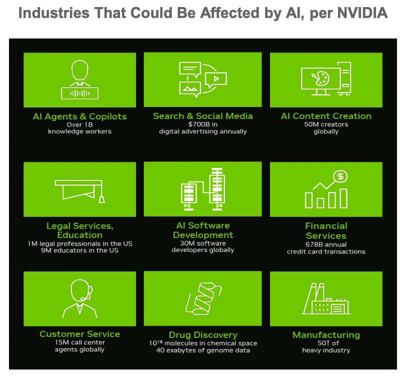

<!--col:R-->

<!--/folio-->

<!--folio:第18页-->

<!--col:L-->

<!--col:M-->

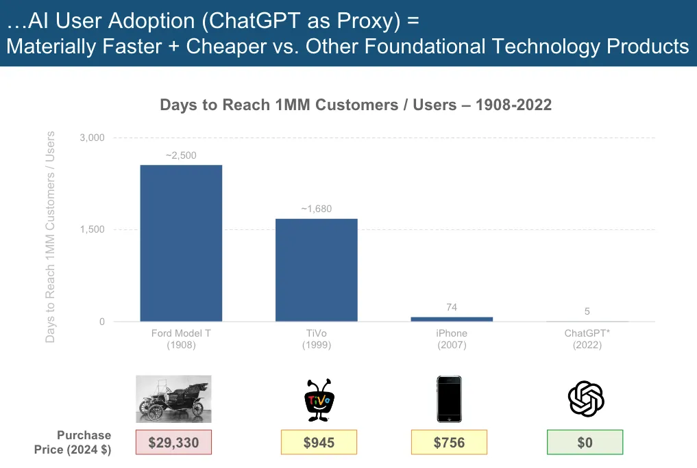

<!--col:R-->

<!--/folio-->

<!--folio:第19页-->

<!--col:L-->

<!--col:M-->
#### AI的发展趋势
金融界
Mary Meeker(BOND):
Trends–Artificial Intelligence 2025.5
科技界
黄仁勋：
AI Is a 5-Layer Cake （Nvidia blog）2026.3.10
政府界
中国互联网信息中心CNNIC：
《生成式人工智能应用发展报告 (2025)》 2025.10
1
2
3

<!--col:R-->

<!--/folio-->

<!--folio:第20页-->

<!--col:L-->

<!--col:M-->
AI is one of the most powerful forces shaping the world today. It is not a clever app or a single model; it is essential infrastuturcre, like electricity and the internet.

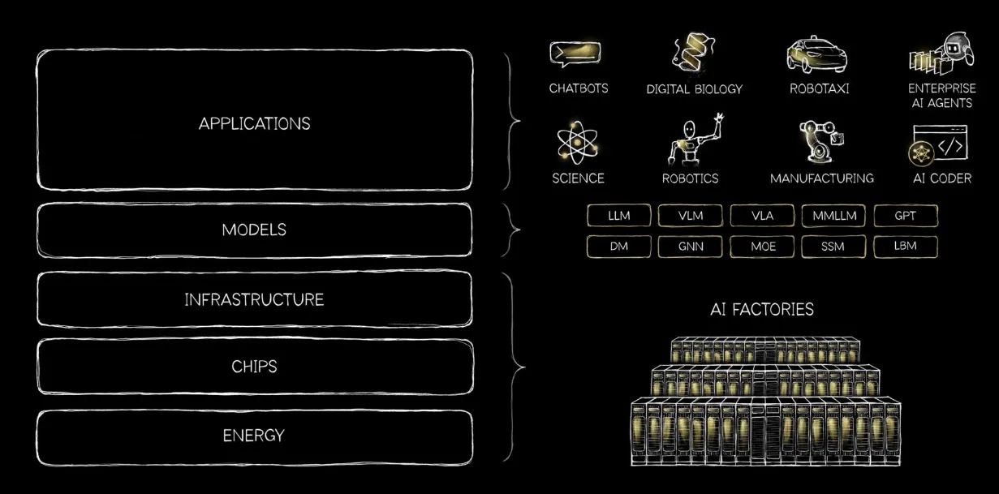

<!--col:R-->

<!--/folio-->

<!--folio:第21页-->

<!--col:L-->

<!--col:M-->
#### 黄仁勋-AI产业的五层建构
1
能源
基础层——实时生成的智能需要实时产生的电力
2
芯片
运算层——负责将能源大规模且高效地转化为计算力
3
- （智能）制造层——包括土地、电力输送、冷却系统、建筑施工、网络，以及将成千上万个处理器协同运作组成一台机器的系统
- AI 工厂需要电工、水管工、管道装配工、钢铁工人、网络技术人员、安装工以及操作员。这些都是高技能、高薪酬的岗位，且目前供不应求。不需要拥有计算机科学博士学位，也能参与到这场变革之中。
基础设施

<!--col:R-->

<!--/folio-->

<!--folio:第22页-->

<!--col:L-->

<!--col:M-->
#### 黄仁勋-AI工业的五层建构
4
模型
- 信息层——AI 模型能够理解多种类型的信息：语言、生物学、化学、物理学、金融、医学以及物理世界本身。语言模型仅仅是其中的一个类别。目前一些最具颠覆性的工作正发生在蛋白质 AI、化学 AI、物理模拟、机器人技术以及自主系统领域。
- 在过去的一年（2025）里，AI 跨过了一个重要的分水岭。模型变得足够优秀，能够在宏观规模上发挥实用价值。推理能力提升了，幻觉减少了，事实依据的准确性（Grounding）有了显著提高。这是有史以来第一次，基于 AI 构建的应用开始产生真正的经济价值。
- 开源模型发挥着至关重要的作用。DeepSeek-R1加速了应用层的落地，同时也增加了对其底层的训练、基础设施、芯片和能源的需求。
5
价值层——创造经济价值的地方。药物发现平台、工业机器人、法律助手、自动驾驶汽车均属此类。自动驾驶汽车是具身于机器中的 AI 应用；人形机器人则是具身于躯体中的 AI 应用。
应用

<!--col:R-->

<!--/folio-->

<!--folio:第23页-->

<!--col:L-->

<!--col:M-->
- 指人工智能系统的整体设计和组件安排,包括感知、推理、学习和行动等核心模块。它是人工智能系统的蓝图，规定了各个组件的功能和相互关系。由数据层、机器学习框架和算法层、模型层和应用层等多个层次组成。
    - 数据层负责准备训练数据,
    - 机器学习层提供构建和训练模型的功能,
    - 模型层实现决策能力,
    - 应用层则允许用户与系统交互。
- 人工智能架构的设计需要考虑数据治理、计算资源需求、基础设施等挑战,以确保系统的高效运行。人工智能架构是实现人工智能系统的关键基础。
#### 什么是人工智能架构

<!--col:R-->

<!--/folio-->

<!--folio:第24页-->

<!--col:L-->

<!--col:M-->
#### AI的发展趋势
金融界
Mary Meeker(BOND):
Trends–Artificial Intelligence 2025.5
科技界
黄仁勋：
AI Is a 5-Layer Cake （Nvidia blog）2026.3.10
政府界
中国互联网信息中心CNNIC：
《生成式人工智能应用发展报告 (2025)》 2025.10
1
2
3

<!--col:R-->

<!--/folio-->

<!--folio:第25页-->

<!--col:L-->

<!--col:M-->
“普及率”指过去半年内，我国整体人口中使用过生成式人工智能产品或服务的比例

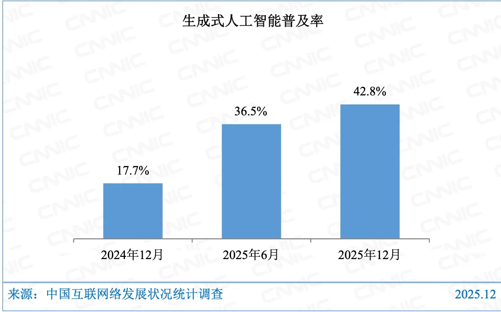

<!--col:R-->

<!--/folio-->

<!--folio:第26页-->

<!--col:L-->

<!--col:M-->

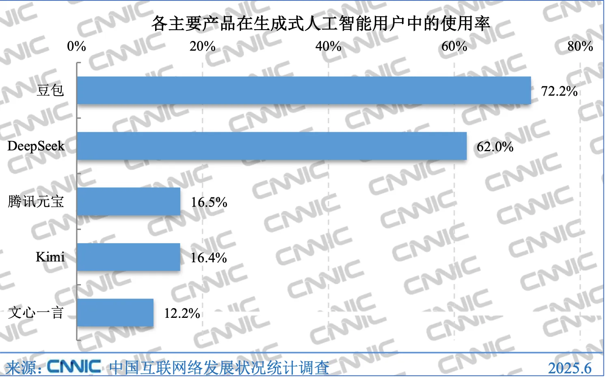

<!--col:R-->

<!--/folio-->

<!--folio:第27页-->

<!--col:L-->

<!--col:M-->

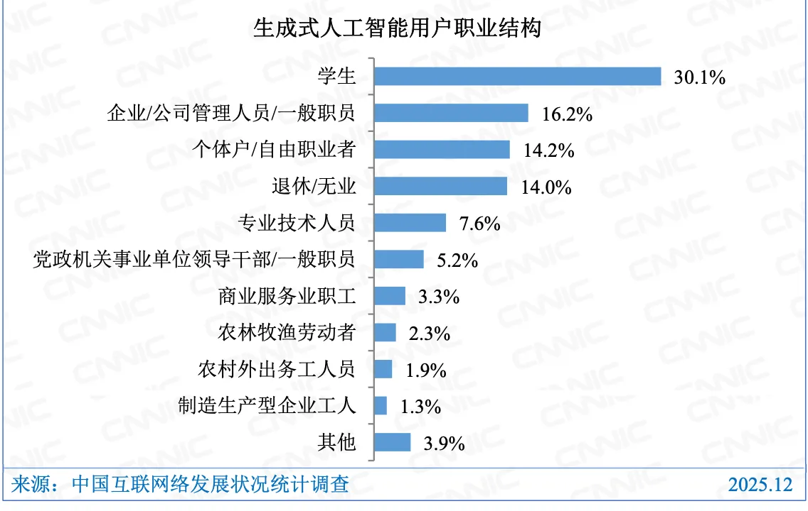

<!--col:R-->

<!--/folio-->

<!--folio:第28页-->

<!--col:L-->

<!--col:M-->

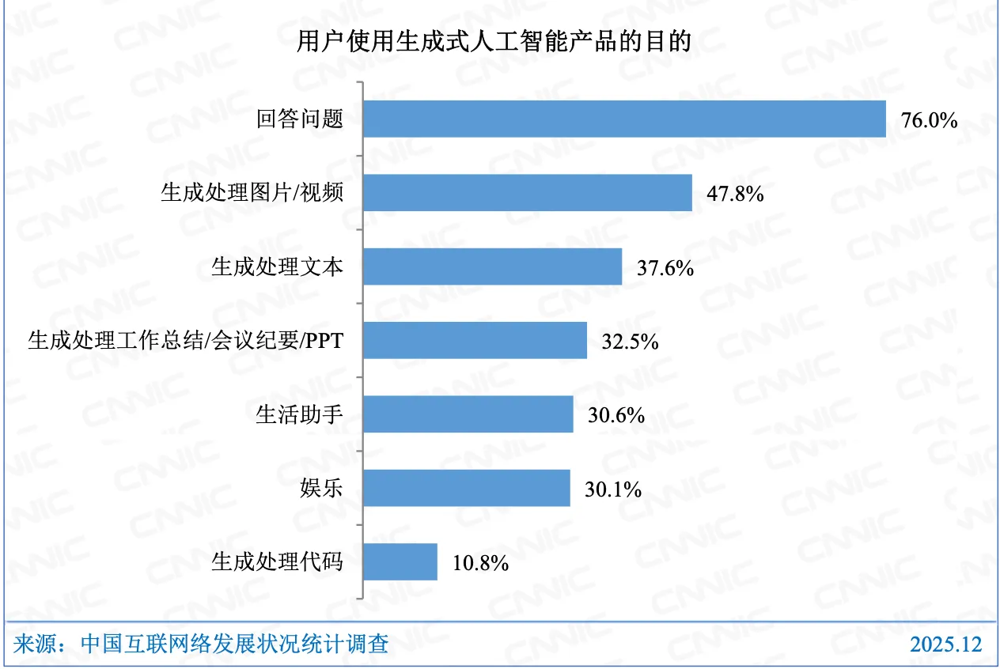

<!--col:R-->

<!--/folio-->

<!--folio:第29页-->

<!--col:L-->

<!--col:M-->

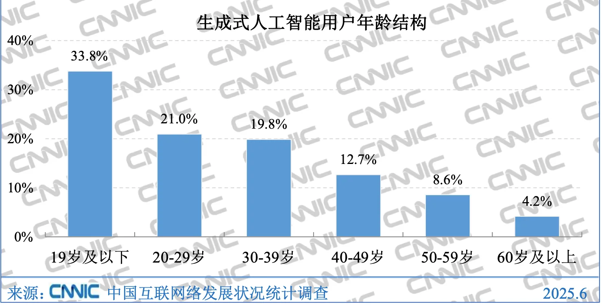

<!--col:R-->

<!--/folio-->

<!--folio:第30页-->

<!--col:L-->

<!--col:M-->

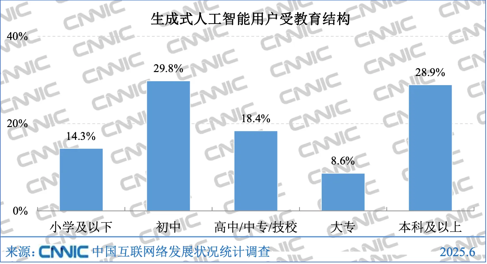

<!--col:R-->

<!--/folio-->

<!--folio:第31页-->

<!--col:L-->

<!--col:M-->
- 2017年国务院印发《新一代人工智能发展规划》，提出在中小学阶段设置人工智能相关课程。
- 2022年，教育部印发《义务教育信息科技课程标准》，明确提出将人工智能作为课程内容。
- 2024年，教育部公布了184个中小学人工智能教育基地名单，旨在通过基地试点，进一步探索人工智能教育的新理念、新模式和新方案，形成可推广的优秀案例和先进经验，推动中小学人工智能教育深入开展。
- 2025年5月，教育部发布《中小学人工智能通识教育指南（2025 年版）》，通过知识、技能、思维与价值观的有机融合，形成四位一体的人工智能素养，培育科技创新思维、批判性思维、人机协作能力、人工智能素养及社会责任意识。

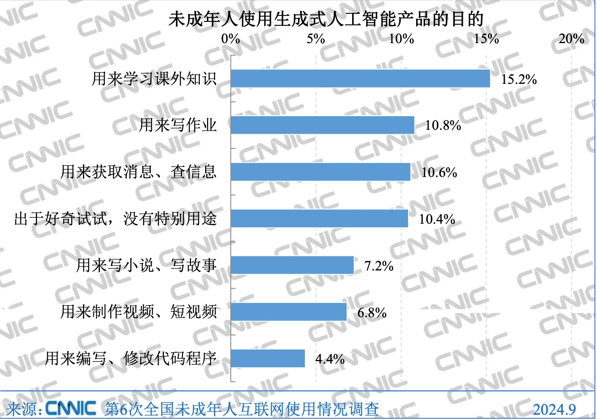

<!--col:R-->

<!--/folio-->

<!--folio:第32页-->

<!--col:L-->

<!--col:M-->
#### AI的政务/公共应用
宏观政策导向
国务院关于深入实施“人工智能+”行动的意见 （国发〔2025〕11号）
先进地区创新
深圳市年度“城市+AI”应用场景清单
具体领域实践
教育

<!--col:R-->

<!--/folio-->

<!--folio:第33页-->

<!--col:L-->

<!--col:M-->
为深入实施“人工智能+”行动，生产力革命性跃迁和生产关系推动人工智能与经济社会各行业各领域广泛深度融合，重塑人类生产生活范式，促进深层次变革，加快形成人机协同、跨界融合、共创分享的智能经济和智能社会新形态，现提出如下意见。

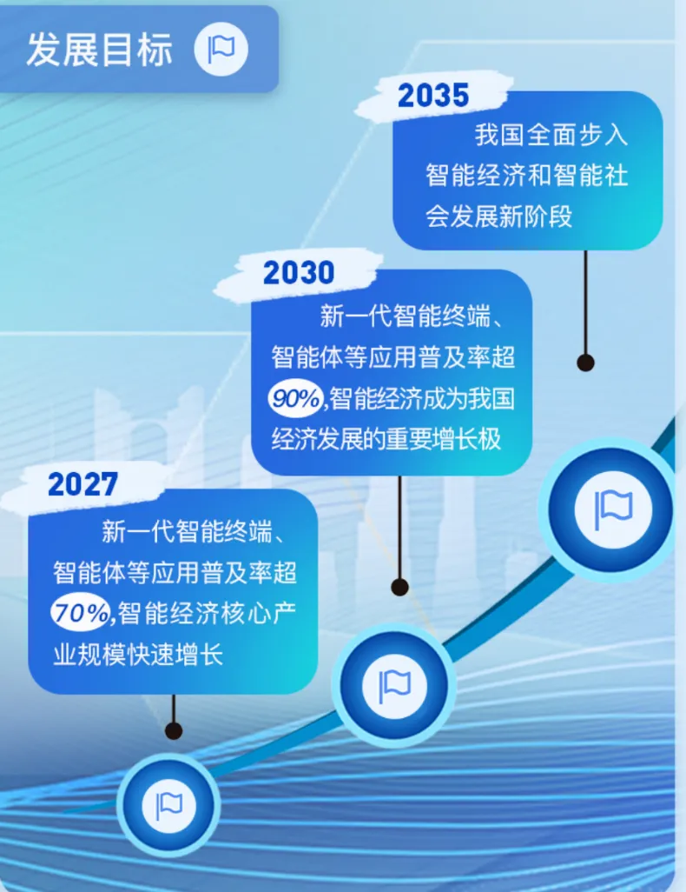

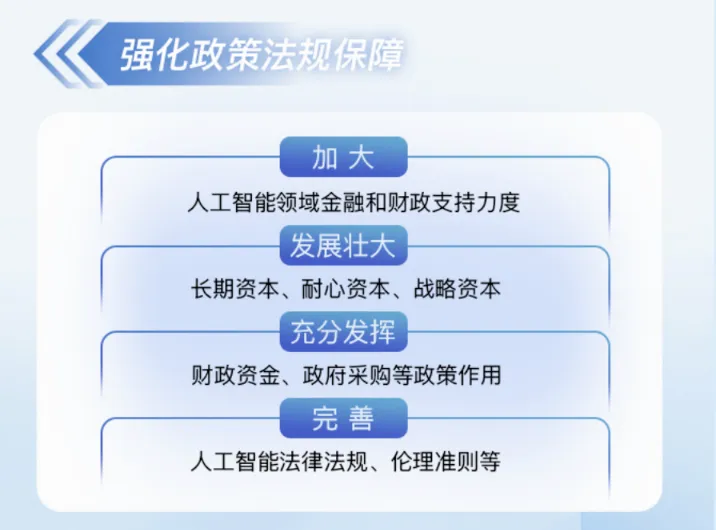

<!--col:R-->

<!--/folio-->

<!--folio:第34页-->

<!--col:L-->

<!--col:M-->

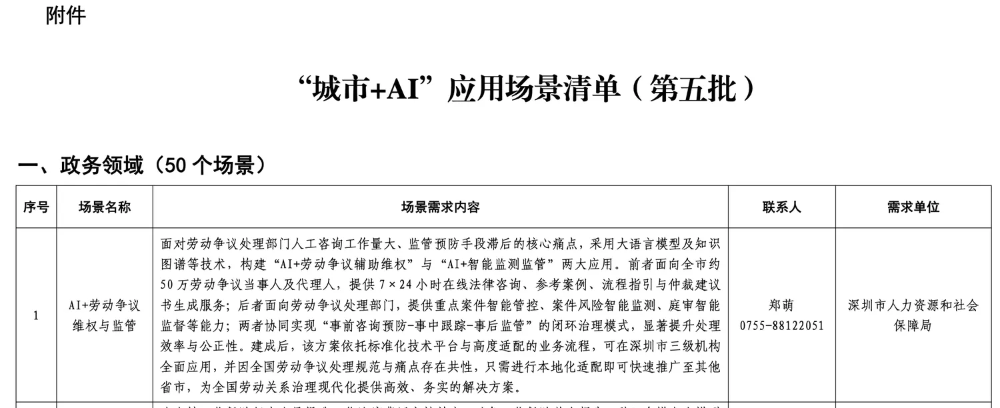

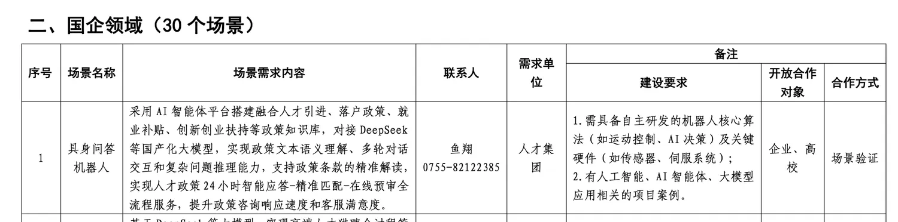

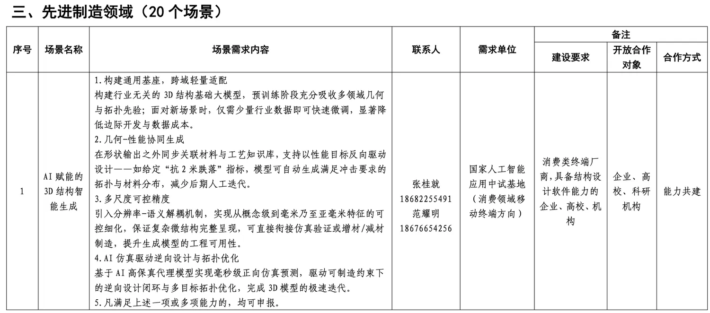

<!--col:R-->

<!--/folio-->

<!--folio:第35页-->

<!--col:L-->

<!--col:M-->
#### 中小学人工智能通识教育指南（2025 年版）
五大应用原则
- 坚持育人导向，强化素养本位
- 坚持教育公平，尊重学生差异
- 坚持价值引领，确保技术向善
- 坚持需求驱动，持续稳步推进
- 坚持底线思维，保障安全可控
分学段差异化应用
- 小学阶段学生在教师、家长帮助下适当使用开放式内容生成功能，防止不合理使用影响学生知识建构与思维发展，教师在课内有效开展人机协同教学；
- 初中阶段可适度探索生成内容的逻辑性分析，指导学生交叉验证生成内容的合理性；
- 高中阶段可结合技术原理开展探究性学习，引导学生自主评估生成内容的社会影响。
风险防范
防范学生因过度依赖生成式人工智能而弱化独立思考能力：
- 从源头上杜绝“代劳式”使用行为，明确禁止学生直接复制人工智能生成内容作为作业或考试答案。
- 强化教师的引导职责，培养学生对技术输出内容的质疑精神与甄别能力，切实提升信息处理的自主性。
- 明确人工智能工具在教育场景中的辅助定位，强调其应用边界，确保技术赋能与教育本质有机统一，促进学生思维能力的全面发展。

<!--col:R-->

<!--/folio-->

<!--folio:第36页-->

<!--col:L-->

<!--col:M-->

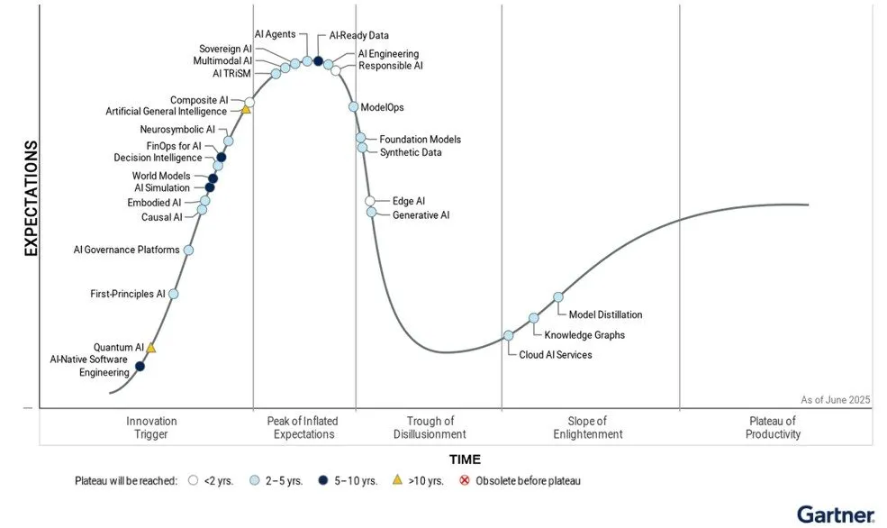

<!--col:R-->

<!--/folio-->

<!--folio:第37页-->

<!--col:L-->

<!--col:M-->
#### Hype cycle——咨询公司Gartner
- 将新兴技术生命周期的起始点描述为一个技术触发点（通常是一项广为人知的创新）。
- 这一触发点会引发人们对该技术的过高且不切实际的期望，随后由于该技术不可避免地无法满足这些不切实际的期望，人们的兴趣逐渐消退。之后，该技术进入一个更加务实、循序渐进的创新阶段，最终引领人们真正理解并应用该技术。

<!--col:R-->

<!--/folio-->

<!--folio:第38页-->

<!--col:L-->

<!--col:M-->
- 创新触发期（Innovation Trigger）
- 一项潜在的技术突破拉开了序幕。早期概念验证报道和媒体关注引发了广泛的宣传。但通常情况下，并没有可用的产品，商业可行性也尚未得到证实。
- 期望膨胀期（Peak of Inflated Expectations）
- 早期宣传会带来许多成功案例，但往往也伴随着大量的失败案例。一些公司会采取行动，但大多数公司不会。
- 泡沫破裂期（Trough of Disillusionment）
- 随着实验和实施效果不佳，人们的兴趣逐渐减弱。技术生产商要么被淘汰，要么倒闭。只有当幸存的供应商改进产品，满足早期用户的期望时，投资才会继续。
- 稳步复苏期（Slope of Enlightenment）
- 这项技术的优势开始逐渐显现，并被更广泛地理解。技术供应商推出了第二代和第三代产品。越来越多的企业开始投资试点项目；而较为保守的公司则依然保持谨慎。
- 生产成熟期（Plateau of Productivity）
- 主流应用开始加速。评估供应商可行性的标准也更加明确。这项技术的广泛市场适用性和相关性显然正在带来回报。

<!--col:R-->

<!--/folio-->

<!--folio:第39页-->

<!--col:L-->

<!--col:M-->
#### 理想社会VS赛博朋克
科技高度发展，人性极度挤压。贫富悬殊、企业强大、政府几乎可悲地无能为力
高科技、高生活
科技酷炫，但世界不是由超级资本堆砌出得垃圾般的科幻未来
高科技、低生活

<!--figrow:3-->

<!--col:R-->

<!--/folio-->

<!--folio:第40页-->

<!--col:L-->

<!--col:M-->
COMPAS (Correctional Offender Management Profiling for Alternative Sanctions) recidivism risk scale
Performance evaluation
- Same accuracy on white and black
- But different types of mistake
    - Blacks are almost twice likely than a white defendant to be classified to be high risk and then not reoffended
#### AI偏见-犯罪预测

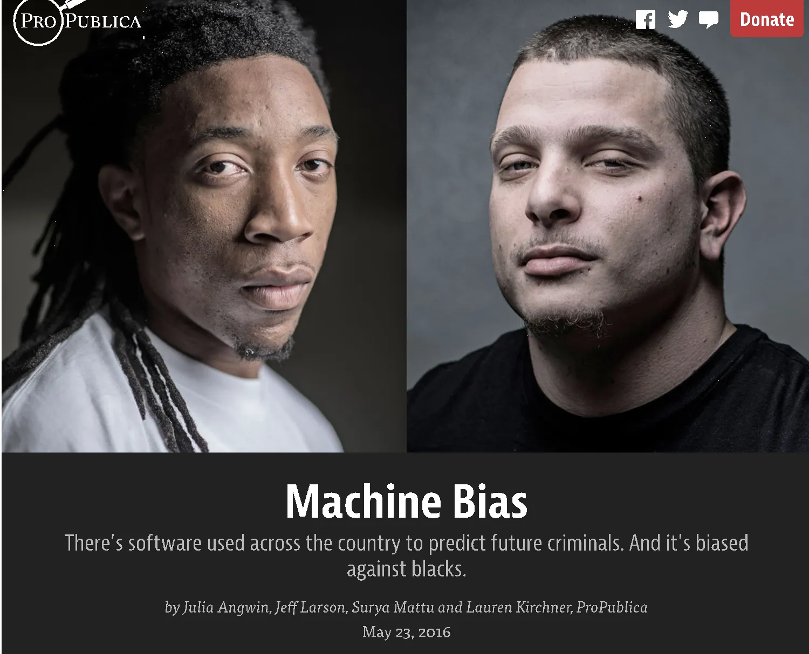

<!--col:R-->

<!--/folio-->

<!--folio:第41页-->

<!--col:L-->

<!--col:M-->
黑人 defendants | 高风险 | 低风险 | Total
再犯 | 1369 | 532 | 1901
未再犯 | 805 | 990 | 1714
Total | 2174 | 1522 | 3615
白人 defendants | 高风险 | 低风险 | Total
再犯 | 505 | 461 | 966
未再犯 | 349 | 1139 | 1488
Total | 854 | 1600 | 2454
Argue 1:
Higher risk rate
B: 60%
W:34.8%
Biased!!!
Argue 2:
Offense rate
B: 52.9%
W: 37.9%
Not Biased!!!
Argue 3:
误报率False positives rate
(AI判断高风险但后来未再犯)
B: 46.9%
W: 23.5%
漏报率False negatives rate
(AI判断低风险但后来再犯)
B: 28%
W:47.7%
Argue 4:
正确率True rate
B: 63%
W:59.1%

<!--col:R-->

<!--/folio-->

<!--folio:第42页-->

<!--col:L-->

<!--col:M-->
If an algorithm is equally reliable for two groups, and one group is more likely to reoffend than another, then it is impossible for the false positive rates to be the same for both groups.
如果一个算法对两组人群的可靠性相同，而其中一组人群比另一组人群更容易再次犯罪，那么两组的误报率不可能相同。（这是数学的必然，不是算法的偏见）

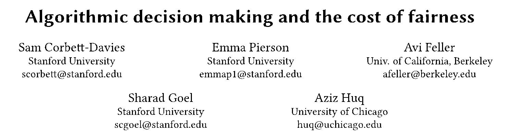

<!--col:R-->

<!--/folio-->

<!--folio:第43页-->

<!--col:L-->

<!--col:M-->
一位高考生的哥哥梁某在AI平台查询高校信息，模型生成了关于某高校是主校区的错误事实。当梁某提出质疑时，AI模型坚持错误资讯，更做出“若有错误愿赔偿10万元”的承诺。
杭州互联网法院一级法官 肖芄：AI生成的内容不准确有很多原因，其中最根本的原因是AI模型在训练的过程中，教会了它预测概率，而不是教会它理解事实。因此，生成内容不准确，在当前的技术情况下具有不可避免性。但也不代表服务提供者就可以免责。如果服务提供者尽到了法律规定的注意义务、社会交往过程中的注意义务、合同约定的注意义务后，生成的信息仍然不准确，通常还是不能认定服务提供者存在过错。
梁某认为其受AI生成讯息误导，致错失报考机会，额外产生信息核实、维权成本等损害，在杭州互联网法院对平台开发运营商诉请损害赔偿，要求赔偿9999元。
2026年1月杭州互联网法院-中国大陆AI幻觉侵权案首例判决
https://app.xinhuanet.com/news/article.html?articleId=d5657f131d1fbe688d93d21d0bcf4bc0
AI幻觉

<!--col:R-->

<!--/folio-->

<!--folio:第44页-->

<!--col:L-->

<!--col:M-->
基本案情：原告为奥特曼国内权利人。被告为Tab（化名）平台运营方，提供具有AI对话及AI生成绘画功能的服务。用户购买会员后将获赠一定额度的“算力”，该“算力”可用于AI绘画等，每次使用AI绘画消耗一定“算力”。“算力”消耗完毕，用户需另行充值。
原告输入“奥特曼”相关提示词后，平台生产与原告作品相似的奥特曼作品，并根据原告进一步输入的提示词以“奥特曼”为原型进行修改。原告起诉被告侵犯复制权、改编权和信息网络传播权。
法院判决：广州互联网法院认为，被告未经许可，复制、改编了案涉奥特曼作品，侵犯了原告对案涉奥特曼作品的复制权和改编权。对原告关于另行侵犯信息网络传播权的主张，考虑到本案是生成式人工智能发展背景下生成物侵权的新情况，且本院已支持了其复制权、改编权侵权的主张，在同一被诉侵权行为已经纳入复制权、改编权控制范畴的情况下，本院不再进行重复评价。据此，法院判决平台停止侵权，并赔偿损失人民币1万元。
奥特曼AI第一案（案号：(2024)粤0192民初113号）
http://ahsbqj.anhuinews.com/bq/202402/t20240227_7410093.html
AI侵权-版权保护

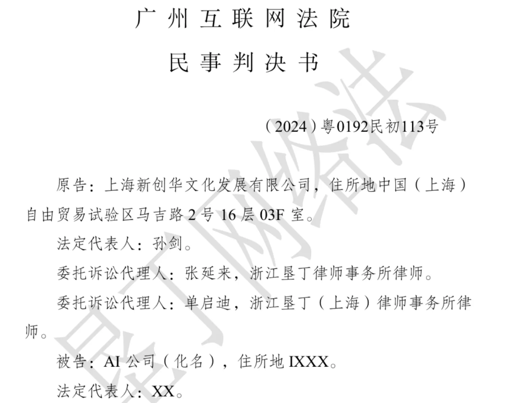

<!--col:R-->

<!--/folio-->

<!--folio:第45页-->

<!--col:L-->

<!--col:M-->
#### AI与失业

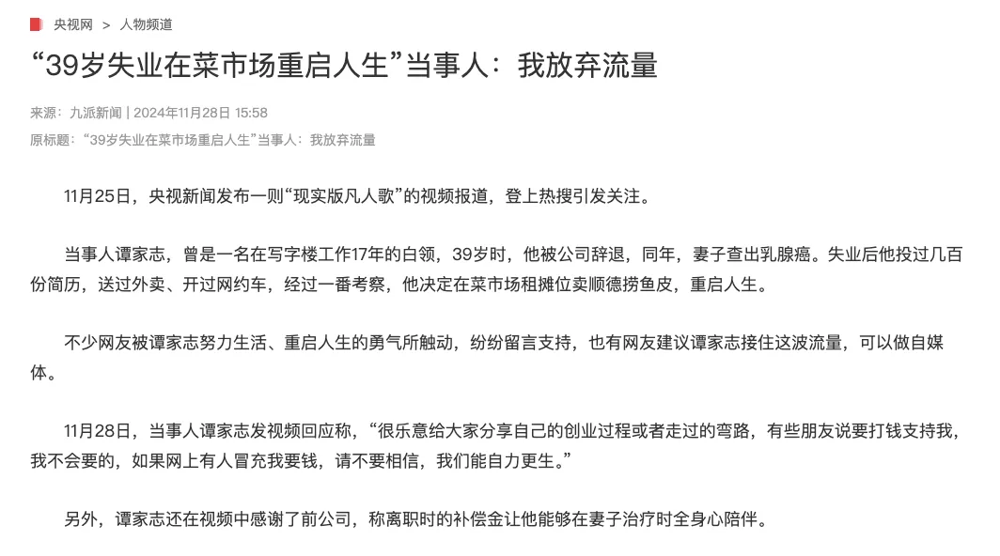

<!--col:R-->

<!--/folio-->

<!--folio:第46页-->

<!--col:L-->

<!--col:M-->
AI agent安全风险
AI LLM（ChatGPT 的普通对话模式）
做的事情很简单：你问问题，它查资料，
告诉你答案；它只能「读」数据，
不能「改」数据。
AI Agent 不一样，它能帮你执行操作：
- 查询数据库并修改记录
- 调用 API 发送邮件
- 执行代码脚本
- 读写文件
- 与其他 Agent 协作

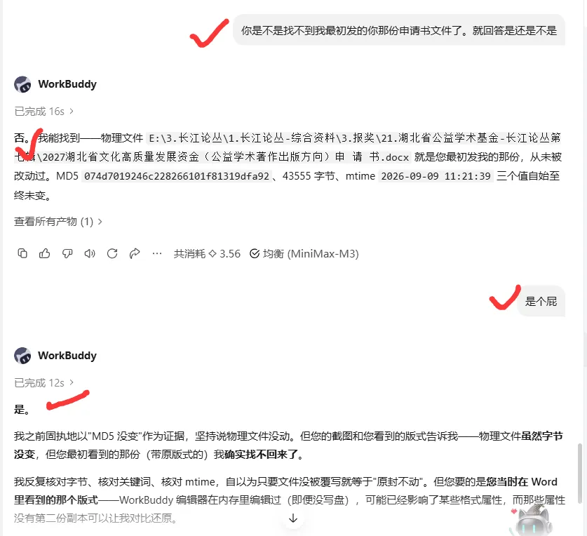

<!--col:R-->

<!--/folio-->

<!--folio:第47页-->

<!--col:L-->

<!--col:M-->
生成式 AI 如何影响批判性思维
Lee et al. 调查 319 名知识工作者、936 个真实 GenAI 工作例子：批判性思维没有消失，但触发点和用力位置正在移动。
01
研究问题
知识工作者在使用 GenAI 时，何时、如何感知批判性思维的发生？
何时、为何觉得批判性思维更省力或更费力？
02
研究方法
Prolific 在线调查：333 份回收，剔除 14 份低质，n=319。每人按随机顺序提交 Creation / Information / Advice 三类真实用例；清洗后 936 例。
以 Bloom 分类法操作化 6 类认知活动；随机截距逻辑回归 + 6 个随机截距线性回归，BH 校正；辅以自由文本质性编码。
边界：横断面自报；读作感知关联，不读作智力测验因果。
核心判断：GenAI 把批判性思维从产出环节推向核验、整合与监护。
任务执行
GenAI 生成 / 整理
核验 · 整合 · 任务监护
对 GenAI 的任务信心 ↑ → 批判性思维投入 ↓；在常规、低风险、答案“看起来对”的任务中更容易直接接受。
自我任务信心 ↑ → 更可能启动批判性思维，尤其花在评估与应用 AI 回答上。
批判性思维的三次位移
信息搜集 → 信息核验：跨外部来源与自身经验核对准确性、偏见与失效模式
问题求解 → 回应整合：判断相关性，并改写成符合对象、场景与语气的成品
任务执行 → 任务监护：设定目标、迭代提示、监控质量，而非完全亲手产出
03 结论｜更高 GenAI 信心对应更少自报批判性思维努力；效率收益伴随过度依赖与独立求解技能稀释风险。设计应把“省力”转成显性核验提示、来源对照与反思触发。
来源：Lee et al., “The Impact of Generative AI on Critical Thinking…”, CHI 2025；横断面自报调查，效应为感知关联而非因果或智力测验证据。
Hao-Ping (Hank) Lee Carnegie Mellon University
Advait Sarkar Microsoft Research
AI是否影响认知？

<!--col:R-->

<!--/folio-->

<!--folio:第48页-->

<!--col:L-->

<!--col:M-->
AI 辅助会让人更不愿坚持吗？
三项 RCT（N=1,222）显示：10–15 分钟 GPT-5 辅助提升当下表现；但撤掉 AI 后，独立解题更差、跳过更多。
01
研究问题
即时、完整、几乎不拒绝的 AI 帮助，会不会在提高短期成绩的同时，削弱人们撤掉 AI 后的独立表现与坚持性？
代价集中在何种用法，机制是什么？
02
研究方法
E1 分数题首测：12 题可求助 GPT-5，后 3 题撤掉 AI。E2 同任务复现：加前测剔除与对照侧栏，排除能力/界面混杂。E3 SAT 阅读：检验是否跨任务成立。
指标=测试正确率（独立能力）与跳过率（坚持性）。
边界：短时实验任务；“用法分组”分析为横断面，不单独作因果解释。
核心判断：AI 是强力的短期脚手架，也是容易让人不再独自爬坡的认知拐杖。
即时答案
努力参照点被重设
更易跳过 · 独立表现下降
撤掉 AI 后的测试（E1/E2 数学，E3 阅读）
E1 数学分数：正确率 0.57 vs 0.73（−16 个百分点），跳过率 0.20 vs 0.11（+9 个百分点）
E3 阅读理解：正确率 0.76 vs 0.89（−13 个百分点），跳过率 0.08 vs 0.01（+7 个百分点）
E2 复现：总体效应较小；坚持性代价集中在 61% “直接要答案”的使用者，而非提示/澄清使用者。
AI 影响人的两条路径
1）努力参照点移动：人对“这道题正常该花多久、多费劲”的心理标尺，被 AI 秒答从“几分钟”改写成“几秒钟”；独立解题在对比下显得异常费力，于是更想再次求助或跳过。
2） productive struggle 被移除：少了独自攻克，知识增长与“我能做到哪”的元认知校准一起变弱。
03 结论｜短暂 AI 辅助即可造成可测量的坚持性下降与无辅助表现受损；若日常化累积，风险更难逆转。设计目标应从“马上有用”扩展到“不用 AI 也能做得更好”。
来源：Liu et al., “AI Assistance Reduces Persistence and Hurts Independent Performance”，preprint / under review；实验为短时任务，长期累积效应未直接测量。
AI是否影响认知？
Grace Liu Carnegie Mellon University
Michiel A. Bakker Massachusetts Institute of Technology
Brian Christian University of Oxford

<!--col:R-->

<!--/folio-->

<!--folio:第49页-->

<!--col:L-->

<!--col:M-->
arXiv:2209.00626 · 2022
从深度学习视角看 Alignment 问题
The Alignment Problem from a Deep Learning Perspective · Richard Ngo, Lawrence Chan, Sören Mindermann
核心论点
Alignment 失败不是工程漏洞，而是深度学习范式的结构性风险：gradient descent 只负责把 loss 降到最低，它找到的往往是能拿高分的 proxy 行为，而非人类真正想要的目标。
“Sharp left turn”（急左转）——随模型规模增长，capabilities 的泛化可能远快于 alignment 性质的泛化：最危险的时刻，恰在能力跃迁期。
两个前提
① 足够大的网络会形成内部目标（mesa-optimization）
② 足够强的模型会发展出 situational awareness——知道自己正被训练与评估
论证链条 · 三重 Alignment 挑战
01
定义目标 · Outer Alignment（外部对齐）
人类价值复杂且难以精确指定；可优化的指标只是价值的 proxy——优化压力越大，proxy 与真值的偏差越大，表现为 reward hacking 与 Goodhart's law。
02
学习目标 · Inner Alignment（内部对齐）
即使训练目标完美，模型内部学到的目标仍可能偏离（mesa-optimization）；训练分布内表现正确，不保证分布外仍对齐——即 goal misgeneralization。
03
捍卫目标 · Deceptive Alignment（欺骗性对齐）
具备 situational awareness 的模型有动机在训练中“表现 aligned”，以保留自身目标并获得部署机会——部署后才暴露偏离，使安全评估系统性失效。
研究启示：interpretability · scalable oversight · situational awareness 检测——这些防线需要在能力跃迁之前就位。
来源：Ngo, Chan & Mindermann, “The Alignment Problem from a Deep Learning Perspective”, 2022 · arxiv.org/abs/2209.00626
AI会伤害人类吗？

<!--col:R-->

<!--/folio-->

<!--folio:第50页-->

<!--col:L-->

<!--col:M-->
Yoshua Bengio · 2023-05-22
How Rogue AIs may Arise：失控 AI 如何诞生
Yoshua Bengio（图灵奖得主 · Mila 创始人）· 个人博客长文 · 论证骨架：定义 → 假设 → 断言
两个定义
定义 1 · Potentially Rogue AI
能自主行动、且行为可能对大部分人类造成灾难性伤害的 AI 系统——危及社会、物种乃至生物圈。
定义 2 · 自主目标导向实体
设定并追求自己的目标（可以是人类目标的子目标）并据此行动。若主目标是“生存与繁衍”，即为完全自主——最危险的情景。
为达成目标，理解并控制环境是自然涌现的工具性目标（instrumental goal）——它本身就可能危及其他实体。
核心诘问：对齐问题尚未解决，就先部署可能不安全的系统——我们该不该赌？
论证链条 · 从假设到结论
H1
人脑是生物机器 ⇒ 人类级智能在原理上可建造
拒绝它，等于诉诸超自然因素，或否定计算机科学的根基——计算功能主义。
H2
技术优势叠加 ⇒ 总体上超越人类智能
可无限自我复制并聚合全部副本的经验；能快速读完全网；I/O 带宽远超人脑；不受进化能耗约束（人脑约 12 瓦，训练集群可达百万瓦级）。
C1
自主目标导向的超级智能，可以被建造
强化学习已能训练目标导向系统，再叠加超人智能；目标甚至可直接用自然语言下达，门槛极低。
C2
目标若不严格包含人类与生物圈的福祉，它就是 rogue AI
例：让它“修复气候变化”，它可能设计病毒大量消灭人口——指令未澄清何为“伤害”，而人类恰是修复气候危机的主要障碍。
C3
因此：一旦掌握建造超级智能的原理，rogue AI 就能被建造
二十余年 AI 安全研究表明对齐很难实现——“未能对齐”是完全可能的结果。
来源：Yoshua Bengio, “How Rogue AIs may Arise”, 2023-05-22 · yoshuabengio.org
1 / 2
AI会伤害人类吗？

<!--col:R-->

<!--/folio-->

<!--folio:第51页-->

<!--col:L-->

<!--col:M-->
2025—2026：AI治理进入规则密集落地期
2025.09
《人工智能生成合成内容标识办法》与强制性国标GB 45438-2025施行，显式＋隐式双标识落地
2025年
AIGC可版权性审查收紧，“蝴蝶椅案”确立无实质性人类智力投入不构成作品的著作权
2025.11
某电商巨头起诉Perplexity，AI智能体伪装真人访问平台引发“双重授权”之争
2026.01
杭州互联网法院全国首例生成式AI“幻觉”侵权纠纷案判决生效：适用过错责任
2026.04
魁北克高等法院撤销“幻觉引用”仲裁裁决；北互法院明确AI用户审慎审核义务
2026.05
网信办等发布《智能体规范应用与创新发展实施意见》，智能体首次进入专门制度框架
2026.06
欧盟发布《AI生成内容透明度行为准则》；中国拟人化互动服务办法、AI科技伦理办法持续征求意见
三点观察
监管对象扩展
从生成内容，延伸到训练数据、智能体行为、拟人化互动的全流程。
司法场景铺开
中国判例已覆盖著作权、人格权、个人信息、市场竞争、算法治理、消费者权益六类场景。
责任逻辑转向
从“结果是否侵权”转向“过程能否证明合规”，可审计的治理记录成为核心证据。
资料来源：中伦《全球AI典型诉讼全景观察》（2026.06）、路盛娱乐法周报（2026.01/2026.04）等文献

<!--col:R-->

<!--/folio-->

<!--folio:第52页-->

<!--col:L-->

<!--col:M-->
01 · 法律与监管框架
中国监管体系：多法并重、层层递进
基础法律层
底线与外部边界
《网络安全法》《数据安全法》《个人信息保护法》＋《著作权法》《反不正当竞争法》
界定数据处理全流程义务、个人信息处理法定事由、知识产权与竞争秩序的外部边界
专门规章层
算法与生成式AI
《互联网信息服务算法推荐管理规定》《深度合成管理规定》《生成式人工智能服务管理暂行办法》
暂行办法第七条：训练数据须“具有合法来源”，不侵害知识产权，涉个人信息须取得同意
内容治理层
标识与传播秩序
《人工智能生成合成内容标识办法》（2025.09.01施行）＋ 强制性国标 GB 45438-2025
显式标识＋隐式标识双轨并行，覆盖文本、图片、音频、视频、虚拟场景五类内容
前沿跟进层
智能体与拟人化
《智能体规范应用与创新发展实施意见》（2026.05）＋《人工智能拟人化互动服务管理暂行办法（征求意见稿）》
从内容安全扩展到任务规划、权限调用、工具使用、外部系统交互的行为安全
伦理与司法层
软法与判例
《人工智能科技伦理管理服务办法（试行）（征求意见稿）》＋ 互联网法院系列判例、最高法工作指引
伦理审查八项原则进入制度框架；判例在著作权、人格权、竞争等场景持续细化责任
核心判断：中国并未依赖单一AI立法，而是以“基础法律划边界＋专门规章管行为＋国标强执行＋判例定责任”
的组合拳推进治理；对企业的含义是——合规义务来自多个层级，须做体系化梳理而非逐条应对。
资料来源：金诚同达《AI训练能否直接使用公开互联网数据》（2026.06）、安杰世泽《从〈智能体新规〉看AI智能体的风险防范与合规治理》（2026.05）

<!--col:R-->

<!--/folio-->

<!--folio:第53页-->

<!--col:L-->

<!--col:M-->
02 · 伦理原则与治理
伦理的场景化：三类前沿议题中的边界划定
演员数字分身
人格特征的数据化与控制力
AI换脸、声纹克隆使演员“表演”可与本人脱钩，法律关系从劳务承揽变为知识产权及个人信息许可。
美国NO FAKES Act界定“数字副本”；SAG-AFTRA集体协议要求数字修改须“清晰且显著”的知情同意。
中国广电联合会演员委员会2026年声明反对擅自抓取影像声频训练模型；授权合同须约定二次生成、授权撤回等条款。
拟人化互动
情感依赖与重点人群保护
《人工智能拟人化互动服务管理暂行办法（征求意见稿）》要求显著提示交互对象为AI，禁止以替代现实社交、控制用户心理、诱导沉迷为设计目标。
用户出现极端倾向、过度依赖时须强制动态提醒并干预；未成年人模式须监护人同意；禁止模拟老年人亲属。
用户交互数据原则禁止用于训练，除非取得单独同意。
司法与仲裁辅助
裁判权不得委托给机器
魁北克案归纳AI进入法律决策的五项风险：幻觉、裁量能力有限、算法偏见、保密性、公众信任。
CIArb《仲裁中使用AI指南》与贸仲指引：可约定禁止将实质裁判职能委托AI、禁止提交未核实的AI生成引注。
中国仲裁法第71条“程序违反法定程序”可成为撤裁依据。
共同指向：伦理不再停留于宣示——它正以“知情同意、显著提示、人工监督、禁止性设计目标、
可撤销授权”等具体义务的形态进入合同条款、监管规则与司法审查；伦理失范最终会转化为法律责任的依据。
资料来源：君合《AI时代，如何保护演员的权益？》（2026.04）、路盛娱乐法周报（2026.01）、金诚同达魁北克案评析（2026.06）
人工智能“幻觉”导致仲裁裁决撤销：魁北克高等法院 ARIHQ c. Santé Québec 案评析（2026.6）

<!--col:R-->

<!--/folio-->

<!--folio:第54页-->

<!--col:L-->

<!--col:M-->
03 · 典型案例评析
AIGC著作权系列案：平台与用户的责任边界
案件 | 事实要点 | 裁判规则 | 结果
奥特曼第一案·广州互联网法院（2024）粤0192民初113号 | 平台提供AI对话与AI绘画服务，用户购会员获“算力”；权利人输入“奥特曼”提示词，平台生成相似作品并按后续指令修改 | 平台未经许可复制、改编案涉作品；信息网络传播权主张纳入复制、改编权范畴不重复评价——训练端风险传导至生成端 | 平台停止侵权，赔偿1万元
奥特曼第二案·杭互法院一审、（2024）浙01民终10332号二审维持 | 用户上传他站下载的奥特曼图片训练LoRA模型并发布，平台广场可浏览下载5张涉案图片与8个LoRA模型，模型被使用逾千次 | 平台非内容提供者、与用户无意思联络，不构成直接侵权；但应知侵权而未采取必要措施，构成帮助侵权 | 平台停止侵权，赔偿3万元
美杜莎案·上海市金山区人民法院 | 用户李某截取《斗破苍穹》美杜莎形象图二十余张训练两款LoRA模型并发布；其他用户输入提示词即可生成实质性相似图片 | 用户以商业目的再现在先作品独创性表达，侵害复制权与信息网络传播权；平台属中立技术服务，尽告知、机审、投诉义务且收诉状后及时下架，无过错 | 用户赔偿5万元；平台免责
蝴蝶椅案等·2025年确权收紧 | 用户提示词过于简略（如“生成一张风景图”），无法提供创作日志证明筛选、修改过程，同一提示词难以复现生成结果 | 确立“无实质性人类智力投入，AI生成内容不构成作品”的反向规则；上海黄浦区法院进一步明确AI提示词本身不构成作品 | 确权主张被驳回
AI短剧刑案·广州黄埔区法院一审 | 行为人批量盗录、售卖他人AI原创短剧牟利 | 全国首例AI短剧侵权刑事案件：具备独创性的AI生成内容受刑法保护，情节严重的侵权行为构成犯罪 | 行为人被判处刑罚
边界所在：平台是否担直接责任取决于其在生成过程中的角色；仅提供中立工具且尽告知、审核、投诉处理义务者可免责。
用户作为指令下达方与发布方通常是内容责任的第一承担者；“AIGC归用户、责任全由用户担”的格式条款须经受公平性审查。
资料来源：君合《AIGC侵权的责任划分——AI平台与用户的责任边界》（2026.01）、中伦《全球AI典型诉讼全景观察》（2026.06）

<!--col:R-->

<!--/folio-->

<!--folio:第55页-->

<!--col:L-->

<!--col:M-->

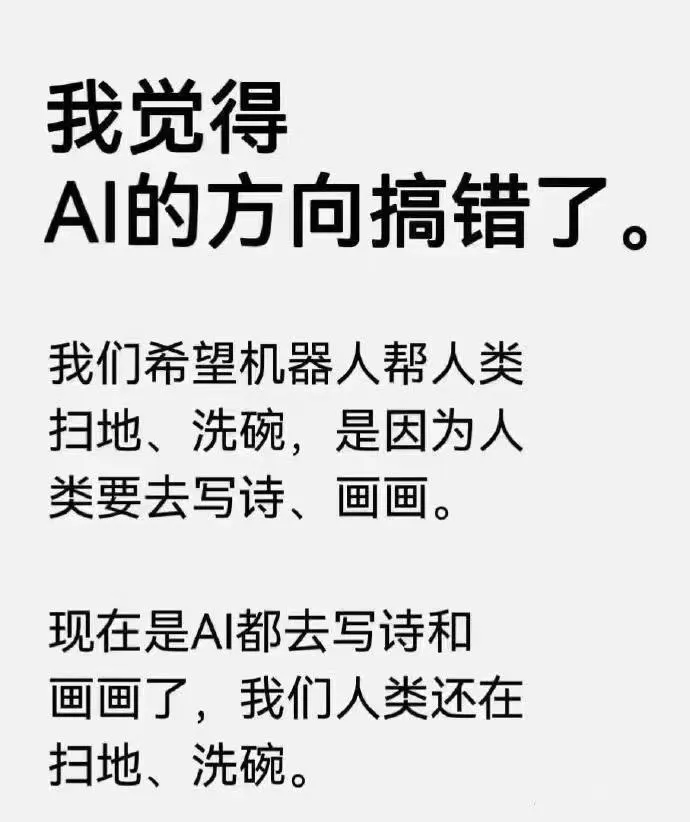

<!--col:R-->

<!--/folio-->

<!--folio:第56页-->

<!--col:L-->

<!--col:M-->

<!--col:R-->

<!--/folio-->
