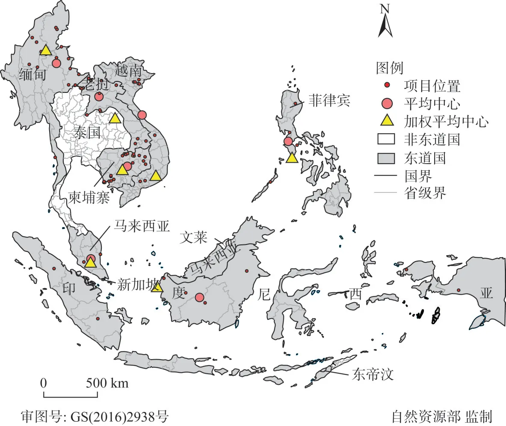
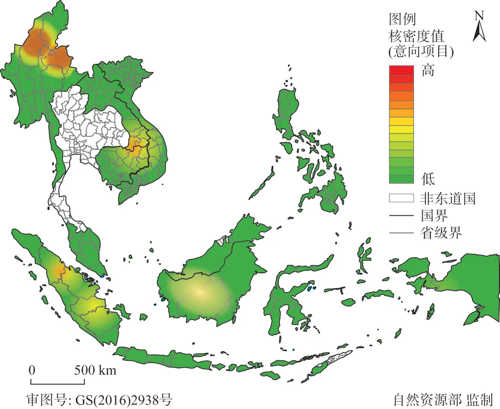
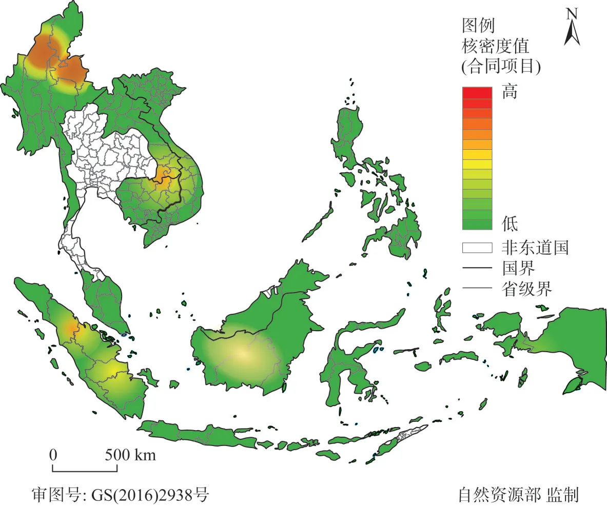
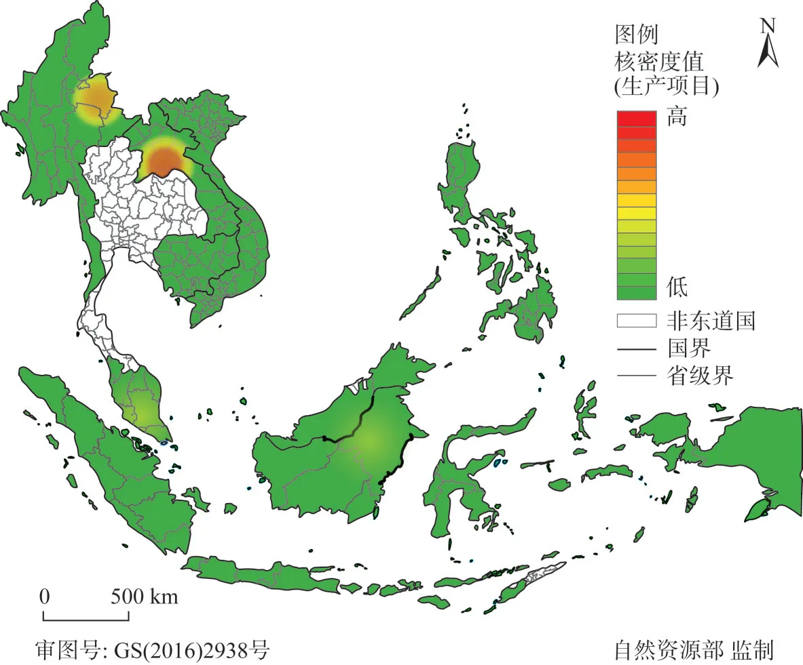

<!--folio:第1页-->

<!--col:L-->

<!--col:M-->

·《自然资源学报》2021年第36卷第6期·第1521–1534页·

<h3 class="doc-title">东南亚地区中国海外耕地投资项目的空间分布及影响因素分析</h3>

韩　璟1,2　潘子纯1　卢新海1,3

（1. 华中师范大学公共管理学院，武汉 430079；2. 东西方中心，美国檀香山 96848；3. 华中科技大学公共管理学院，武汉 430074）

<strong>摘　要：</strong>为探究中国在东南亚地区的海外耕地投资活动规律，利用文献资料法、空间分析法和灰色关联分析法，从空间分布和影响因素两方面进行分析。结果表明：（1）中国海外耕地投资项目多位于中南半岛，且有沿边分布特点；（2）中国在东南亚海外耕地投资意向项目、合同项目的空间分布相似性较高，而生产项目与前两者存在差异；（3）中国海外耕地投资受地缘经济、地缘文化、资源基础和地缘政治的影响且受影响程度依次减弱，其中年均进出口总值、年均中国对外直接投资存量等指标对中国企业的投资选择具有显著影响。东南亚地区作为当前中国海外耕地投资的重要区域，强化同东南亚国家间的经济、文化交流，对中国企业顺利开展海外耕地投资活动具有重要促进作用。

<strong>关键词：</strong>海外耕地投资；空间分布；影响因素；中国；东南亚　　<strong>DOI：</strong>10.31497/zrzyxb.20210613

收稿日期：2020-06-21；修订日期：2020-10-07。基金项目：国家自然科学基金项目（41501589）；中国国家留学基金（201806775054）；华中师范大学中央高校基本科研业务费项目（CCNU20QN035）。

作者简介：韩璟（1985—），男，河南邓州人，博士，副教授，研究方向为粮食安全与土地可持续利用，E-mail: dzhanjing1985@163.com。通讯作者：卢新海（1965—），男，湖北洪湖人，博士，教授，博士生导师，研究方向为土地管理与粮食安全，E-mail: xinhailu@163.com。

21世纪以来，全球人口增速加快，水土资源供需矛盾日益突出，尤其是2008年爆发的全球粮食危机，进一步激化了粮食供需矛盾[1,2]。联合国粮食与农业组织（FAO）认为，在当前消费水平下满足2050年人口增长和经济发展对农作物的需求，全球耕地需求量要从2012年的15.67亿 hm² 增长到17.32亿 hm²，而加大对发展中地区水土资源投资则是破解以上农业增长约束的关键[3]。因此，全球海外耕地投资规模急剧扩大，并形成了“Land Grab”“Land Rush”“Land Deal”“Overseas Land-based Investment”“Large-scale Overseas Land Acquisition”“Overseas Farmland Investment”等学术话题[4-6]。在实践上，形成了以日本、韩国、沙特等为代表的粮食安全型和美国、英国等金融机构为代表的投机型两种海外耕地投资动机[7-10]。据国际组织 Land Matrix 的统计，截至2019年8月，全球已完成的海外耕地投资项目共计1690个，主要分布于非洲、亚洲、东欧和拉丁美洲地区，总面积为4986.55万 hm²[11]。

中国政府始终将粮食安全问题视为治国理政的重大问题。然而，2000年以来中国粮食净进口量在波动中激增，2015年除大豆以外的谷物净进口量已达总供给量的6%[12]。谢高地等[13]认为，2015—2050年间中国国内农业资源开发潜力已接近极限，中国粮食安全的整体思路面临重构。拓展统筹“两种资源、两个市场”的战略视野，坚持贸易方式和农业“走出去”相配套，通过海外耕地投资增强在国际粮食市场的话语权、掌控力和调配力逐渐引起学术界和决策者的重视[14-17]。实际上，自农业“走出去”战略实施以来，已有大量中国企业自发参与到全球海外耕地投资潮流中，并形成了以东南亚地区为主要投资区域的投资格局[3,18]。商务部统计数据显示，截至2017年底中国共有717家企业在全球六大洲100多个国家和地区设置了851家涉农企业，投资存量高达173.3亿美元[19]。据 Land Matrix 统计，截至2019年8月中国企业已在全球49个国家中投资了260个海外耕地投资项目，其中位于东南亚7国的项目为111个，总面积218.44万 hm²[11]。

<!--col:R-->

<!--/folio-->

<!--folio:第2页-->

<!--col:L-->

<!--col:M-->

东南亚是“丝绸之路经济带”和“21世纪海上丝绸之路”中“中国—中南半岛经济走廊”“孟中印缅经济走廊”的关键区域。自中国与东南亚关系进入中国主动塑造阶段以来，“10+3”“10+1”、大湄公河次区域合作等机制应运而生，尤其在当前“一带一路”的框架下，中国与东南亚的交流合作更是形成了宽领域、多层次、全方位的新特征。其中，中国与东南亚地区在农业方面的合作尤其值得关注。2001年11月，中国与东盟领导人第5次会议就把农业确定为双边合作的重点领域，并于2002年签订了农业合作谅解备忘录。中国—东盟自贸区建立后，整合东盟国家土地资源、劳动力资源与中国农业技术和资本优势成为双方共同的农业合作诉求[20]。2009年中国政府发起了“东盟与中日韩粮食安全合作战略圆桌会”，作为区域粮食安全合作的长期对话平台，旨在推动区域农业政策沟通与协调、促进农业投资合作、提升地区粮食安全水平。至今，该战略圆桌会已进行9届，不仅有力推动了中日韩在东盟地区的农业投资，而且在农业技术扩散、病虫害防治和保障区域粮食安全方面发挥了重要作用。实施“一带一路”倡议是构建对外开放新格局的重大战略举措，稳定周边则是建立对外开放合作的战略基础。东南亚地区作为“一带一路”倡议的重要合作区域，与中国地缘优势明显，具有发展农业的良好自然条件，已成为中国企业进行海外耕地投资的首选区域[21,22]。学术界分别从产业协调、投资合作模式优化、保险法律制度特征、投资风险防范和技术合作优势等方面对中国投资东南亚国家的农业合作问题进行了分析[23-26]。目前，在东南亚地区已成为中国首要海外耕地投资区域和实现区域粮食安全重要着力地区的背景下，运用中国海外耕地投资案例数据，从相对微观的层面分析中国在东南亚诸国的海外耕地投资空间特征，探寻影响中国海外耕地投资的相关因素，不但对深化“一带一路”倡议、夯实区域经济一体化基础和显化东南亚国家的海外耕地投资发展规律具有一定的理论价值，并且对中国企业科学开展海外耕地投资、提高区域农业合作水平和保障区域粮食安全具有重要的实践价值。

1　研究方法与数据来源

<strong>1.1　平均中心与加权平均中心</strong>

平均中心（Mean Center）和加权平均中心（Weighted Mean Center）作为度量空间集中趋势的方法，主要用以表征空间点数据集合的中心位置。其中，平均中心的含义类似于事件的地理分布中心，本文利用海外耕地投资意向项目的地理坐标位置来计算平均中心，其计算公式为：

$$
(\bar x,\bar y)=\left(\frac{1}{n}\sum_{i=1}^{n}x_i,\ \frac{1}{n}\sum_{i=1}^{n}y_i\right)\tag{1}
$$

式中：$x_i$ 和 $y_i$ 为投资项目 i 的地理坐标；$n$ 为项目总量，即样本量（个）。

加权平均中心与平均中心最大的不同在于，其计算的过程将不同点数据重要程度进行了区分，并以数据集中点的某种属性为权重，通过加权方式计算求取最终数据集合的中心位置。本文以各海外耕地投资意向项目的投资面积为权重，计算海外耕地投资项目的加权平均中心，其计算公式为：

$$
(\bar x_w,\bar y_w)=\left(\frac{\displaystyle\sum_{i=1}^{n}w_i x_i}{\displaystyle\sum_{i=1}^{n}w_i},\ \frac{\displaystyle\sum_{i=1}^{n}w_i y_i}{\displaystyle\sum_{i=1}^{n}w_i}\right)\tag{2}
$$

式中：$w_i$ 是投资项目 i 的权重。

<!--col:R-->

<!--/folio-->

<!--folio:第3页-->

<!--col:L-->

<!--col:M-->

<strong>1.2　核密度估计</strong>

核密度估计是根据规则区域内样本点数据研究其空间分布特征的一种方法，其结果可以用地图展示样本数据集在一定区域内的集聚与分散特征。其计算公式为：

$$
f(x)=\frac{1}{nh}\sum_{i=1}^{n}K\!\left[\frac{x-x_i}{h}\right]\tag{3}
$$

式中：$f(x)$ 为核密度估计值；$h$ 为带宽，即圆域的半径（m）；$K$ 为核函数；$x-x_i$ 表示估值点到输出网格处的距离（m）。本文将不同类型的海外耕地投资项目位置抽象为点要素，并以不同类型项目的面积为权重计算各项目类型的核密度值，最终用 ArcMap 组件制作核密度图，核密度值的高低反映了一定区域内海外耕地投资项目某种属性的高低。

<strong>1.3　灰色关联分析</strong>

灰色理论是20世纪80年代由邓聚龙教授[27]首创并发展的一种系统科学理论。灰色关联分析法是以灰色理论作为重要基础，研究系统内部各因素关联程度的定量分析方法。该方法的原理是依据各要素数列反映到图像中的曲线接近程度来判别要素间的关联程度。灰色关联分析法对数据样本大小要求不高，能较好地分析“部分信息已知，部分信息未知”的“小样本”“贫信息”不确定性系统。海外耕地投资因其投资标的物特殊，投资敏感性较大，受政治、经济、文化、地理等因素的影响突出，并且以上各种因素具有明显的不明确特征。本文以中国在东南亚地区的东道国为研究区域，涉及的项目数量虽然较多，但是东道国数量较少，在数据上具有明显的“小样本”特征。因此，本文将海外耕地投资活动视为一个灰色系统，通过构建中国在东南亚地区东道国海外耕地投资规模序列与影响因素指标序列之间的灰色关联模型，计算灰色相对关联度来完成不同因素对海外耕地投资规模的影响程度分析。灰色相对关联度的求取思想是，通过对不同数据序列组之间相对起始点间的变化速率来表征其相互关系，两组数据序列之间的变化速率越接近，其灰色相对关联度就越大，反之就越小。由于该方法较为常规，在此不对灰色相对关联度求解过程进行赘述。

<strong>1.4　数据来源与指标选取</strong>

海外耕地投资作为一项从传统农业对外投资中裂生出来的跨国自然资源利用与控制问题，在当前国际政治、经济背景下除了受资源禀赋的影响外，还深受投资国与东道国地缘关系的影响[28]。地缘关系通常指因地理位置、距离等产生的关系[29]，是以地缘要素为前提构成的人地相互作用的特殊社会关系[30]。现代国家尺度的地缘关系则主要是指以国家地缘重量、国家间地缘距离、地缘流量等地缘要素为基础的国家之间的地缘政治、地缘经济、地缘文化关系，这一构成在学术界已得到普遍认同[31-33]。地缘政治指的是国家间缘于地理条件或地理因素而进行的政治互动，以及由此形成的政治关系[34]；地缘经济则是基于地缘政治的前提下强调区际联系（主要指地区间的空间经济联系），其最终表现是区域经济一体化[35]；地缘文化则是基于特殊的历史、地理成因及民族关系发展规律而形成的国家间文化关系[36]。基于以上认知和当前可获得的国家间统计指标，并根据灰色关联分析法的数据要求，本文将中国在各东道国的意向项目面积作为初始参考序列，从资源基础、地缘政治、地缘经济和地缘文化四个维度构建灰色关联分析序列指标（表1）。

<!--col:R-->

<!--/folio-->

<!--folio:第4页-->

<!--col:L-->

<!--col:M-->

<strong>表1　灰色关联分析序列指标</strong>

| 子目标 | 指标 | 单位 | 数据时点/年 |
|---|---|---|---|
| 资源基础 | 耕地总面积 | hm² | 2016 |
| 资源基础 | 人均耕地面积 | hm² | 2016 |
| 资源基础 | 农用地比例 | % | 2016 |
| 资源基础 | 谷物单产 | kg/hm² | 2016 |
| 资源基础 | 人均淡水资源量 | m³ | 2014 |
| 地缘政治 | 首都距离 | km | 2018 |
| 地缘政治 | 建交时长 | 年 | 2018 |
| 地缘政治 | 高层交往总数 | 次 | 2013—2018 |
| 地缘政治 | 声明、宣言和公报总数 | 次 | 2013—2018 |
| 地缘政治 | 政府驻外机构总数 | 个 | 2018 |
| 地缘政治 | 主要双边条约总数 | 个 | 2000—2018 |
| 地缘经济 | 年均进出口总值 | 万美元 | 2013—2018 |
| 地缘经济 | 进出口总值年均增长率 | % | 2013—2018 |
| 地缘经济 | 年均对外承包工程完成营业额 | 万美元 | 2013—2017 |
| 地缘经济 | 年均中国对外直接投资存量 | 万美元 | 2013—2018 |
| 地缘经济 | 对中投资合作政策数量 | 个 | 2017 |
| 地缘文化 | 领事磋商总数 | 次 | 2013—2018 |
| 地缘文化 | 年均接收外国留学生人数 | 人 | 2013—2017 |
| 地缘文化 | 年均入境游客人数 | 人 | 2013—2017 |
| 地缘文化 | 入境游客人数年均增长率 | % | 2013—2017 |
| 地缘文化 | 孔子学院数量 | 个 | 2019 |

相关案例数据均源于 Land Matrix 数据库，各指标值最终由笔者整理汇总获取。考虑到本文的研究主题，数据汇总的主要原则如下：（1）中国海外耕地投资项目是指投资目的地在中国以外的跨国土地交易项目；（2）最早接受中国投资年数由统计可知的最早中国投资项目年份计算所得；（3）独立投资的相关指标为剔除了有合作伙伴的中国海外耕地投资项目后汇总得到。地缘关系四个维度的指标数据主要来自于 FAO 数据库、CEPII 数据库、《中国外交》《中国贸易外经统计年鉴》和孔子学院总部官方网站。数据时点和时段的选取主要考虑到中国新一届政府成立后的新时代外交特征、统计数据的可获得性和指标内涵，普遍以2013—2018年作为主要数据采集时段标准，其中双边条约总数的数据采集时段从2000—2018年主要是基于农业“走出去”和中国加入世贸组织的考虑。矢量地图数据来源于哈佛大学 worldmap 数据库。

2　结果分析

<strong>2.1　东南亚地区中国海外耕地投资项目的空间分布格局</strong>

<strong>2.1.1　中国海外耕地投资项目的基本情况</strong>　据 Land Matrix 统计数据，在当前东南亚地区的11个国家中，除文莱、泰国、东帝汶和新加坡四国外，其他七国均为中国海外耕地投资东道国，中国企业在以上七国中有投资意向项目111个，面积218.44万 hm²，约占中国海外耕地投资项目总面积的20%（表2）。除中国外，东南亚地区接收海外耕地投资项目的前五大投资来源国依次为马来西亚、新加坡、越南、韩国和英国，投资面积分别为141.64万 hm²、107.31万 hm²、48.15万 hm²、36.65万 hm² 和21.63万 hm²。与之相比，中国在东南亚地区的海外耕地投资项目面积远超其他投资国。目前，中国投资面积占东南亚地区海外耕地投资项目总面积近30%。在中国项目中，共有合同项目108个，面积217.41万 hm²，分别占比97.30%和99.52%；共有生产项目29个，面积7.21万 hm²，分别占比21.13%和3.3%。从东道国方面看，中国在缅甸和印度尼西亚投资的意向项目面积均超过了50万 hm²，分别为85.53万 hm² 和62.31万 hm²；合同面积超过50万 hm² 的同样是以上两国，分别为84.54万 hm² 和62.31万 hm²；生产面积超过2万 hm² 的国家则是老挝和缅甸，分别为3.30万 hm² 和2.19万 hm²。在项目数量方面，老挝、柬埔寨和缅甸3国的意向项目数量均超过20个，合同项目比例为100.00%、100.00%和85.71%，生产项目比例分别为31.25%、13.79%和33.33%。

<!--col:R-->

<!--/folio-->

<!--folio:第5页-->

<!--col:L-->

<!--col:M-->

<strong>表2　中国在东南亚地区的海外耕地投资情况</strong>

| 编号 | 国家 | 意向面积/hm² | 意向数量/个 | 合同面积/hm² | 合同数量/个 | 生产面积/hm² | 生产数量/个 |
|---|---|---|---|---|---|---|---|
| 1 | 缅甸（MMR） | 855251 | 21 | 845386 | 18 | 21938 | 7 |
| 2 | 印度尼西亚（IDN） | 623057 | 13 | 623057 | 13 | 5015 | 1 |
| 3 | 老挝（LAO） | 300241 | 32 | 300241 | 32 | 32951 | 10 |
| 4 | 柬埔寨（KHM） | 276540 | 29 | 276540 | 29 | 7326 | 4 |
| 5 | 越南（VNM） | 71948 | 9 | 71948 | 9 | 597 | 3 |
| 6 | 菲律宾（PHL） | 50385 | 4 | 50385 | 4 | 200 | 1 |
| 7 | 马来西亚（MYS） | 6968 | 3 | 6568 | 2 | 4096 | 2 |

从区域分布方面看，中国在东南亚地区的海外耕地投资项目主要集中于中南半岛，该区域的意向项目共有91个，总面积为150.40万 hm²，其中合同项目数量88个，总面积149.41万 hm²，分别占投资总面积和总数量的99.34%和96.70%，生产项目数量24个，总面积6.218万 hm²，分别占投资总面积和总数量的26.37%和4.27%。从合作方式上看，独立投资是中国在东南亚地区进行海外耕地投资的主要方式，与他国进行联合投资的项目比例低于10%。在中国投资的111个意向项目中，有101个项目为中国企业独立投资，其中合同项目的数量高达98个。中国在该地区的投资伙伴比较多样，既有日本、韩国、澳大利亚等发达国家，也有泰国、菲律宾等东南亚国家。在投资目的上，中国企业的主要投资目的是种植业，也有部分项目涉及到林业、旅游业等。

<strong>2.1.2　中国海外耕地投资项目的空间分布特点</strong>　从平均中心和加权平均中心的计算公式可看出，前者反映的是点数据集的几何中心，而后者则反映赋予点数据集权重的几何中心。本文用意向项目的平均中心和基于意向项目面积的加权平均中心来反映中国海外耕地投资项目在东南亚诸国的空间特点。同时，通过对二者位置差异的比较，可明显看出各国海外耕地投资项目位置中心与面积中心的距离。根据 Land Matrix 统计的东南亚地区中国海外耕地投资案例坐标数据，利用前文计算公式和 ArcGIS 制图工具可得中国在东南亚地区海外耕地投资项目的空间分布如下（图1）。

注：本图基于自然资源部标准地图服务系统下载的标准地图制作，底图无修改，下同。

<!--col:R-->

<!--/folio-->

<!--folio:第6页-->

<!--col:L-->

<!--col:M-->

从中国海外耕地投资项目的分布可以看出，中国投资多位于中南半岛与中国距离较近的国家中，并且有一定的沿边分布特点，尤其在缅甸、老挝和越南三国的分布更为突出。印度尼西亚、马来西亚、菲律宾三国项目数量不多，并且有很大的分散性。柬埔寨的项目数量较多，主要分布于该国东北部地区和西南部沿海地区。此外，由于文莱、东帝汶和新加坡三个国家国土面积狭小，泰国土地制度严格禁止外国企业投资本国农地，所以中国在以上四国中尚未有海外耕地投资项目。

对中国在东南亚地区海外耕地投资东道国意向项目平均中心和加权平均中心的比较结果显示，项目位置中心和面积中心存在不同程度的差异。缅甸、柬埔寨、马来西亚、菲律宾四国的项目平均中心和加权平均中心距离较近，这反映出中国在以上国家投资的项目位置和面积具有较好的集中性，其中缅甸项目具有明显的沿中缅边境地区分布的特征，其主要原因是中国在中缅边界推出罂粟替代种植计划，为中国企业在该地区的投资提供了资金支持，缅甸方面已经同意将中缅边境100多万英亩土地租给中国企业使用。老挝、越南两国的项目平均中心位于北部，加权平均中心则位于南部，并且距离较远，反映出中国在以上两国南部地区投资的项目面积较大。印度尼西亚的项目平均中心位于加里曼丹岛，而其加权平均中心位于平均中心西侧，说明中国在该国加里曼丹岛西侧投资项目的面积较大。

<strong>2.1.3　中国海外耕地投资项目的空间集聚特征</strong>　核密度估计法的制图结果显示，中国在东南亚地区的海外耕地投资意向项目总体布局并不均衡，在空间上呈现出一定的空间集聚特征（图2）。从集聚区域来看，中国意向项目主要集聚在缅甸、老挝、柬埔寨和印度尼西亚四国。结合核密度值的高低，可以将以上集聚区域大致划分为三个等级：第一等级是核密度值最高的项目集中区，在缅甸北部形成了两个组团，主要位于该国的 Sagaing、Shan(N)、Kachin 地区；第二等级为核密度值较高的项目集中区，由两个独立的组团组成，一个位于老挝与柬埔寨交界位置，主要是柬埔寨北部的 Stung Treng、Preah Vihear、Ratanak Kiri、Kratie 地区及老挝南部的 Champasak、Attapu 地区，另一个是位于印度尼西亚苏门答腊岛的 Sumatera Utara 地区；第三等级为核密度值一般的项目集中区，也由两个独立的组团构成，一个位于苏门答腊岛的 Jambi 与 Sumatera Selatan 地区交界处，另一个位于印度尼西亚加里曼丹岛的 Kalimantan Tengah 与 Kalimantan Barat 地区交界地带。

<!--col:R-->

<!--/folio-->

<!--folio:第7页-->

<!--col:L-->

<!--col:M-->

中国在东南亚地区海外耕地投资的合同项目核密度分布图与意向项目核密度分布图具有很强的相似性和一致性，同样呈现出一种“小集聚、大分散”的空间特征，合同项目的聚集同样主要分散在缅甸、老挝、柬埔寨和印度尼西亚四国（图3）。合同项目的核密度值与意向项目相比，二者最大的不同在印度尼西亚 Sumatera Utara 地区，合同项目在该地区的核密度值比意向项目稍低。意向项目的核密度估计结果与合同项目的核密度估计结果共性明显大于差异性，究其原因主要是中国在该地区的东道国中投资项目的签约率较高，合同项目面积占意向项目面积平均值超过了99%，合同项目数量占意向项目数量的平均值超过了93%。

中国在东南亚地区海外耕地投资生产项目的核密度分布图显示，该地区有两个明显的组团和1个不太明显的组团，其中前者位于缅甸和老挝，后者位于柬埔寨东北部（图4）。从核密度值的高低水平看，可以将以上三个组团分为三种等级：第一等级是核密度值最高的项目集中区，位于老挝北部的 Vientiane、Louangphabang、Xiangkhouang 以及 Xaignabouli 地区；第二等级是核密度值较高的项目集中区，位于缅甸东北部与中国交界的 Shan(N) 和 Shan(E) 地区；第三等级核密度值一般的项目集中区，主要位于柬埔寨北部的 Stung Treng、Preah Vihear、Ratanak Kiri、Kratie 地区。此外，还有马来西亚的马来半岛和印度尼西亚加里曼丹岛的 Kalimantan Timur 地区也有集聚迹象的发生，但是这一变化尚不明显。

<!--col:R-->

<!--/folio-->

<!--folio:第8页-->

<!--col:L-->

<!--col:M-->

对中国在东南亚不同类型项目的核密度分布图比较后可以看出，意向项目、合同项目和生产项目之间的空间分布是一种共性与差异性共存的状态，其中意向项目与合同项目相似性较高，而生产项目与前两者存在较大的差异性。总体看来，中国海外耕地投资意向项目和合同项目的主要组团位于缅甸东北部和老挝、柬埔寨交界地区，即中国在以上地区具有较多的项目和投资面积。实际上，柬埔寨、老挝和缅甸三国均为农业是国民经济第一大产业的国家，也一直被认为是东南亚农业资源开发潜力较大的国家，三国人均耕地面积均超过世界平均水平。柬埔寨自然条件优越，非常适合种植水稻、木薯和天然橡胶等与中国互补性较强的农产品；老挝气候条件优越，极其适合粮食、热带水果的种植；缅甸是世界三大谷仓之一，是重要的禾谷类和豆类农产品出口国。然而从项目生产情况看，老挝北部地区则较为突出，即在当前中国在东南亚诸国的海外耕地投资项目中，老挝北部的项目生产情况较为突出。如，黑龙江北大荒商贸集团在老挝 Khammouan 省和 Pakse 省投资了2万 hm² 的农业种植项目，广西本地企业也在老挝 Pakse 省积极开展中国—老挝果蔬新品种示范项目等。

<strong>2.2　中国海外耕地投资项目分布的影响因素</strong>

灰色相对关联度计算结果显示，中国在东南亚诸国的海外耕地投资意向项目面积与东道国的资源基础、地缘政治、地缘经济和地缘文化存在密切的关联关系，在论文选定的21个指标中有15个指标的灰色相对关联度值在0.75以上，并且四个维度中灰色相对关联度值大于0.75的指标均值均大于0.80，四个维度的重要性表现为：地缘经济＞地缘文化＞资源基础＞地缘政治（表3）。

根据灰色关联分析结果，在资源基础、地缘政治、地缘经济、地缘文化四个维度中，地缘经济的重要性居于首位，高影响程度指标灰色相对关联度平均值高达0.9160。2002年中国—东盟农业合作谅解备忘录签订以后，中国企业对东南亚地区的农业投资力度明显加大，海外耕地投资活动也随之快速展开。2010年随着中国东盟自由贸易区的全面启动，东南亚地区各国与中国的经贸联系更加紧密，中国在东南亚各国的市场规模不断扩大，商品贸易便利性也不断提升，这都为中国企业在东南亚地区实施海外耕地投资奠定了有利条件。在指标层面，年均进出口总值、年均中国对外直接投资存量、年均对外承包工程完成营业额、进出口总值年均增长率四个指标的影响程度较高，尤其是前两个指标的灰色相对关联度值在0.98以上，说明良好的贸易关系和投资基础对中国企业选择海外耕地投资东道国具有强烈影响。

<!--col:R-->

<!--/folio-->

<!--folio:第9页-->

<!--col:L-->

<!--col:M-->

<strong>表3　灰色相对关联度计算结果</strong>

| 子目标 | 指标 | 灰色关联度 | 维度平均 |
|---|---|---|---|
| 资源基础 | 耕地总面积 | 0.8635 | 0.8641 |
| 资源基础 | 人均耕地面积 | 0.9690*** |  |
| 资源基础 | 农用地比例 | 0.6919 |  |
| 资源基础 | 谷物单产 | 0.7932* |  |
| 资源基础 | 人均淡水资源量 | 0.8306* |  |
| 地缘政治 | 首都距离 | 0.8667** | 0.8169 |
| 地缘政治 | 建交时长 | 0.7111 |  |
| 地缘政治 | 高层交往总数 | 0.6419 |  |
| 地缘政治 | 声明、宣言和公报总数 | 0.7671* |  |
| 地缘政治 | 政府驻外机构总数 | 0.7346 |  |
| 地缘政治 | 主要双边条约总数 | 0.6504 |  |
| 地缘经济 | 年均进出口总值 | 0.9882*** | 0.9160 |
| 地缘经济 | 进出口总值年均增长率 | 0.7467* |  |
| 地缘经济 | 年均对外承包工程完成营业额 | 0.9410** |  |
| 地缘经济 | 年均中国对外直接投资存量 | 0.9879*** |  |
| 地缘经济 | 对中投资合作政策数量 | 0.5767 |  |
| 地缘文化 | 领事磋商总数 | 0.9800*** | 0.9067 |
| 地缘文化 | 年均接收外国留学生人数 | 0.9320* |  |
| 地缘文化 | 年均入境游客人数 | 0.8899** |  |
| 地缘文化 | 入境游客人数年均增长率 | 0.8075** |  |
| 地缘文化 | 孔子学院数量 | 0.9241** |  |

注：* 表示灰色相对关联度值 [0.75, 0.85)；** 表示 [0.85, 0.95)；*** 表示 [0.95, 1.00]。

地缘文化高影响程度指标的灰色相对关联度平均值为0.9067，排名第二。中国与东南亚各国从历史上来讲就有传统的友好交往过程，尤其是改革开放以后随着中国经济的发展，中国政府还提出了“睦邻、安邻、富邻”的周边外交关系相处政策，在东南亚诸国建立多所孔子学院，加大对东南亚国家赴华留学生的资助力度，这些文化间的交流一方面增进了双方的互信及友谊，更为投资企业适应当地环境、法律等创造了条件。在指标层面，论文选定的五个地缘文化指标的灰色相对关联度值均超过了0.75，其中领事磋商总数、年均接收外国留学生人数、孔子学院数量三个指标的灰色相对关联度值超过了0.9，反映了良好的文化交流、国民之间的友好往来对中国海外耕地投资企业的东道国选择具有重要影响。

资源基础高影响程度指标的灰色相对关联度平均值为0.8641，排名第三。东南亚地区人口相对稠密，人均耕地面积不高，但是该地区具有较多的后备耕地资源，并且光热条件较好，耕地产出能力较强，部分农产品与中国具有较强的互补性，在良好的贸易条件下，大量中国企业到该地区投资稻米、棕榈油和天然橡胶项目。在指标层面，人均耕地面积、耕地总面积、人均淡水资源量、谷物单产四个指标的灰色相对关联度值在0.80以上，其中人均耕地面积的灰色相对关联度值为0.97，耕地总面积的值为0.86，说明在资源基础方面，中国企业在东道国选择过程中相对耕地总量而言，投资者可能更重视人均耕地面积情况。

<!--col:R-->

<!--/folio-->

<!--folio:第10页-->

<!--col:L-->

<!--col:M-->

地缘政治对海外耕地投资的影响程度最低，其灰色相对关联度平均值为0.8169。中国与东南亚各国对话关系的加强始于20世纪90年代，在2003年中国与东盟建立了战略伙伴关系，政治互信不断加深。然而，东南亚地区部分国家还存在着政治动荡、社会稳定性差、对中政策多变等问题，这些不利风险均会对海外耕地投资这种“固定成本高、回收周期长”的投资活动产生较强的抑制作用。此外，地缘政治属于一个极其复杂的影响层，东南亚地区各国形成的“平衡外交”战略以及美日同盟东南亚战略的倾斜都造成地区合理秩序难以生成，也使得地缘政治因素对中国在该地区海外耕地投资的发展存在障碍。在指标层面，只有首都距离和声明、宣言和公报总数两个指标的灰色相对关联度值大于0.75，并且两个指标的值均不高，这反映了政治氛围对中国企业选择东南亚海外耕地投资东道国的影响力较弱。

3　结论与讨论

东南亚不但是我国农业投资的重要区域，也是我国协同日本、韩国保障区域粮食安全水平的重要着力地区。本文利用 Land Matrix 的统计案例，对中国在东南亚地区的海外耕地投资空间分布特征和影响因素进行了分析，主要得到以下结论：（1）中国在东南亚七个国家进行了海外耕地投资，多数项目位于中南半岛国家，并且具有一定的沿中国与东道国边境分布的特点。缅甸、柬埔寨、马来西亚、菲律宾四国的海外耕地投资项目集中性较好，老挝、越南南部地区是中国海外耕地投资的重要区域，印度尼西亚的苏门答腊岛是中国在该国进行海外耕地投资的主要地域。（2）中国在东南亚地区海外耕地投资的意向项目、合同项目和生产项目之间的空间分布是一种共性与差异性共存的状态，其中意向项目与合同项目相似性较高，而生产项目与前两者存在较大的差异性。合同项目与意向项目的核密度分布图显示，二者呈现出一种“小集聚、大分散”的空间特征，主要集聚在缅甸、老挝、柬埔寨和印度尼西亚四国。中国海外耕地投资生产项目的集聚程度不如意向项目和合同项目，其主要集聚于缅甸北部和老挝北部。（3）利用灰色关联模型对中国在东南亚地区的海外耕地投资影响因素进行分析后发现，中国企业的海外耕地投资活动与东道国的资源基础、地缘政治、地缘经济和地缘文化存在密切的关联关系，其重要性表现为：地缘经济＞地缘文化＞资源基础＞地缘政治。（4）在指标层面，中国与东道国的年均进出口总值、年均中国对外直接投资存量、领事磋商总数和东道国人均耕地面积指标与中国海外耕地投资意向面积之间的灰色相对关联度均超过了0.95，即以上因素对中国企业选择海外耕地投资东道国具有强烈影响。

在区域经济一体化背景下，东南亚地区已成为中国海外耕地投资的重要区域。中国企业在东南亚地区的海外耕地投资项目以种植业投资为主，种植作物主要为热带作物。本文认为，中国相关部门可从以下五个方面规划和引导中国企业在东南亚的海外耕地投资活动：（1）在缅甸、老挝和柬埔寨三国进行战略性农产品投资，可根据三国本身的农业优势，鼓励中国企业在缅甸种植禾谷类和豆类作物，在柬埔寨种植水稻和木薯，在老挝种植粮食和热带水果；（2）在马来西亚、菲律宾、越南和印度尼西亚四国要利用技术优势提高种植业附加值，除投资棕榈油、天然橡胶、剑麻等农产品外，还可以适度开展农产品加工投资；（3）通过企业本地化战略强化地缘文化影响，加强与东道国社会组织、团体和中介机构等部门的沟通，减弱耕地投资的阻力，树立企业良好社会形象；（4）政府要根据中国农产品需求特征系统谋划企业在东南亚的投资领域，尤其是稻谷、甘蔗、木薯、天然橡胶等行业的投资，提升原材料贸易话语权；（5）利用东盟与中日韩粮食安全合作战略圆桌会议的平台推出综合性政策体系，从财政、金融、贸易、人才支持等方面对投资企业进行引导和支持，进行长远战略合作下的顶层设计。

<!--col:R-->

<!--/folio-->

<!--folio:第11页-->

<!--col:L-->

<!--col:M-->

海外耕地投资既是当前跨国农业资源利用与控制中的新潮流，也是农业基础薄弱的发展中国家解决贫困问题和保障粮食安全的重要选项。已有研究从农业合作开发、产业链一体化、产业协调、投资风险等方面对中国与东南亚地区的农业合作问题进行了分析[20-23]。论文立足中国与东南亚国家的外交关系，着重从地缘角度对中国海外耕地投资的影响因素进行了分析，可补充对该问题的研究认知。虽然，由于当前海外耕地投资活动敏感、项目投资的透明性较差，可能会使本文分析的案例还不完整，尤其缺乏时间维度的投资分析；并且，受国家间统计数据可获得性的限制，论文在构建四个维度指标体系中也受到了较多的限制，其科学性有待进一步提升。但是，东南亚地区作为当前中国“一带一路”倡议实施的重要节点和中国推行区域经济合作的重要区域，其良好的农业投资潜力已为中国企业所重视，并成为当前中国海外耕地投资的重要区域，科学分析中国在该地区的投资活动及其规律，不但对中国企业有效实施海外耕地投资活动具有实践价值，也对东南亚国家提升农业水平，维护地区粮食安全具有重要的现实意义。

参考文献（References）

[1] Robertson B, Pinstrup-Andersen P. Global land acquisition: Neo-colonialism or development opportunity?[J]. Food Security, 2010, 2(3): 271-283.

[2] Kristian Hoyer T. Are land deals unethical? The ethics of large-scale land acquisitions in developing countries[J]. The Journal of Agricultural and Environmental Ethics, 2013, 26(6): 1181-1198.

[3] FAO. The Future of Food and Agriculture: Alternative Pathways to 2050[R]. Rome: Food and Agriculture Organization of the United Nations, 2018: 1-228.

[4] Borras S M, Hall R, Scoones I, et al. Towards a better understanding of global land grabbing: An editorial introduction[J]. Journal of Peasant Studies, 2011, 38(2): 209-216.

[5] Lu X H, Ke S G, Cheng T, et al. The impacts of large-scale OFI on grains import: Empirical research with double difference method[J]. Land Use Policy, 2018, 76: 352-358.

[6] Hall D. Land grabs, land control, and Southeast Asian crop booms[J]. Journal of Peasant Studies, 2011, 38(4): 837-857.

[7] Hall D. Where is Japan in the global land grab debate?[C]. Yokohama: XVIII ISA World Congress of Sociology, 2014.

[8] 何安华, 陈洁. 韩国保障粮食供给的战略及政策措施[J]. 世界农业, 2014(11): 53-58. [He A H, Chen J. Strategies and policy measures to ensure food supply in South Korea[J]. World Agriculture, 2014(11): 53-58.]

[9] McMichael P. The land grab and corporate food regime restructuring[J]. Journal of Peasant Studies, 2012, 39(3-4): 681-701.

[10] 韩璟, 杨莼, 柯楠, 等. 中美对非洲海外耕地投资东道国的选择差异与影响因素分析[J]. 中国土地科学, 2018, 32(8): 37-43. [Han J, Yang C, Ke N, et al. Analysis of the spatial difference and impact factors of China and America's overseas farmland investment host country selections in Africa[J]. China Land Science, 2018, 32(8): 37-43.]

[11] Land Matrix. The online public database on land deals[EB/OL]. https://landmatrix.org/en/, 2019-10-06.

[12] 成升魁, 李云云, 刘晓洁, 等. 关于新时代我国粮食安全观的思考[J]. 自然资源学报, 2018, 33(6): 911-926. [Cheng S K, Li Y Y, Liu X J, et al. Thoughts on food security in China in the new period[J]. Journal of Natural Resources, 2018, 33(6): 911-926.]

[13] 谢高地, 成升魁, 肖玉, 等. 新时期中国粮食供需平衡态势及粮食安全观的重构[J]. 自然资源学报, 2017, 32(6): 895-903. [Xie G D, Cheng S K, Xiao Y, et al. The balance between grain supply and demand and the reconstruction of China's food security strategy in the new period[J]. Journal of Natural Resources, 2017, 32(6): 895-903.]

[14] 卢新海, 黄善林. 我国耕地保护面临的困境及其对策[J]. 华中科技大学学报: 社会科学版, 2010, 24(3): 79-84. [Lu X H, Huang S L. Barriers of and solutions to farmland conservation in China[J]. Journal of Huazhong University of Science and Technology: Social Science Edition, 2010, 24(3): 79-84.]

[15] 韩璟, 卢新海. 粮食安全视角下的中国海外耕地投资保障体系研究[J]. 中国软科学, 2017(2): 17-28. [Han J, Lu X H. China's overseas farmland investment supporting system: Perspective of food security[J]. China Soft Science, 2017(2): 17-28.]

[16] 姜小鱼, 陈秧分. 中国农业对外投资的研究进展与展望[J]. 世界农业, 2018(4): 4-9. [Jiang X Y, Chen Y F. On China's agricultural foreign investment[J]. World Agriculture, 2018(4): 4-9.]

[17] 普蓂喆, 吕新业, 钟钰. 产需张弛视角下粮食政策演进逻辑及未来取向[J]. 改革, 2019(4): 103-114. [Pu M Z, Lyu X Y, Zhong Y. Grain policy's evolutionary logic and future orientation from the perspective of production and demand's strain-relaxation relationship[J]. Reform, 2019(4): 103-114.]

[18] Chen Y F, Li X D, Wang L J, et al. Is China different from other investors in global land acquisition? Some observations from existing deals in China's going global strategy[J]. Land Use Policy, 2017, 60(1): 362-372.

[19] 中华人民共和国商务部. 2018年度中国对外投资发展报告[EB/OL]. https://www.ccpitcq.org/upfiles/201901/20190131090817850.pdf, 2019-12-21. [Ministry of Commerce of the People's Republic of China. 2018 China outward investment development report[EB/OL].]

[20] 张鑫. 中国—东盟农业产业链一体化合作研究[J]. 世界地理研究, 2017, 26(6): 22-30. [Zhang X. Study on the agricultural industry chain integration of China and ASEAN[J]. World Geographical Research, 2017, 26(6): 22-30.]

[21] 唐冲, 陈伟忠, 申玉铭. 加强东南亚农业合作开发的战略重点与布局研究[J]. 中国农业资源与区划, 2015, 36(2): 84-93. [Tang C, Chen W Z, Shen Y M. Strengthening agriculture cooperation in Southeast Asia in the perspective of the strategic focus and layout[J]. China Agricultural Resources and Regional Planning, 2015, 36(2): 84-93.]

[22] Mills E. Framing China's role in global land deal trends: Why Southeast Asia is key[J]. Globalizations, 2018, 15(1): 168-177.

[23] 曾文革, 周钰颖. 论我国对东盟农业投资政治风险的法律防范[J]. 经济问题探索, 2013(11): 103-106. [Zeng W G, Zhou Y Y. On China's legal prevention of political risks in ASEAN agricultural investment[J]. Exploration of Economic Issues, 2013(11): 103-106.]

[24] 翁鸣. 从产业协调看中国与东盟农业合作发展的新动力[J]. 国际经济合作, 2015(11): 67-69. [Weng M. New motive force of China-ASEAN agricultural cooperation and development from the perspective of industrial coordination[J]. International Economic Cooperation, 2015(11): 67-69.]

[25] 谭砚文, 曾华盛, 李丛希. 中国投资东盟农业的风险评价及国别优先序[J]. 农业经济问题, 2017, 38(8): 76-85. [Tan Y W, Zeng H S, Li C X. The risk evaluation and country priority sequence of China's investment in ASEAN agriculture[J]. Issues in Agricultural Economy, 2017, 38(8): 76-85.]

[26] 吕玲丽, 邓覃宇. “一带一路”背景下中国—东盟农业技术合作调研报告：基于东盟国家需求视角[J]. 世界农业, 2019(3): 84-89. [Lyu L L, Deng Q Y. The research report on China-ASEAN agricultural technical cooperation under the background of "the Belt and Road"[J]. World Agriculture, 2019(3): 84-89.]

[27] 邓聚龙. 灰色系统基本方法[M]. 武汉: 华中科技大学出版社, 2005: 6. [Deng J L. The Primary Methods of Grey System Theory[M]. Wuhan: Huazhong University of Science and Technology Press, 2005: 6.]

[28] 韩璟. 中国海外耕地投资：地域与模式选择[D]. 武汉: 华中科技大学, 2014. [Han J. China's overseas farmland investment: Choice of regions and modes[D]. Wuhan: Huazhong University of Science and Technology, 2014.]

[29] 乔敏健. 地缘经济关系对中国对外直接投资的影响分析：来自“一带一路”国家的经验证据[J]. 现代经济探讨, 2019(7): 81-89. [Qiao M J. An analysis of the impact of geo-economic relations on China's foreign direct investment: Empirical evidence from the "Belt and Road" countries[J]. Modern Economic Research, 2019(7): 81-89.]

[30] 沈伟烈. 中国未来的地缘战略之思考[J]. 世界经济与政治, 2001(9): 71-75. [Shen W L. Thinking on China's future geostrategy[J]. World Economy and Politics, 2001(9): 71-75.]

[31] 宋长青, 葛岳静, 刘云刚, 等. 从地缘关系视角解析“一带一路”的行动路径[J]. 地理研究, 2018, 37(1): 3-19. [Song C Q, Ge Y J, Liu Y G, et al. An analysis of the "Belt and Road" action path from the perspective of geographical relationship[J]. Geographical Research, 2018, 37(1): 3-19.]

[32] 潘忠岐. 地缘学的发展与中国的地缘战略：一种分析框架[J]. 国际政治研究, 2008(2): 21-39. [Pan Z Q. The development of geosciences and China's geostrategy: An analytical framework[J]. International Political Studies, 2008(2): 21-39.]

[33] 杜德斌, 马亚华. 中国崛起的国际地缘战略研究[J]. 世界地理研究, 2012, 21(1): 1-16. [Du D B, Ma Y H. Research on China's rising international geostrategy[J]. World Geographical Research, 2012, 21(1): 1-16.]

[34] 周平. “一带一路”面临的地缘政治风险及其管控[J]. 探索与争鸣, 2016(1): 83-86. [Zhou P. The geopolitical risks and control of the "Belt and Road"[J]. Exploration and Contention, 2016(1): 83-86.]

[35] 谢宝剑, 朱小敏. 地缘经济研究进展[J]. 社会科学, 2019(10): 29-41. [Xie B J, Zhu X M. Geo-economic research progress[J]. Social Sciences, 2019(10): 29-41.]

[36] 何跃. 中国与中南半岛国家地缘关系分析[J]. 上海师范大学学报: 哲学社会科学版, 2008(6): 108-114. [He Y. An analysis of the geo-relationship between China and the Indo-China Peninsula[J]. Journal of Shanghai Normal University: Philosophy and Social Sciences Edition, 2008(6): 108-114.]

<!--col:R-->

<!--/folio-->

<!--folio:第12页-->

<!--col:L-->

<!--col:M-->

Abstract（原文英文摘要）

<strong>Spatial distribution and influencing factors of China's overseas farmland investment projects in Southeast Asia</strong>

HAN Jing1,2, PAN Zi-chun1, LU Xin-hai1,3

（1. College of Public Administration, Central China Normal University, Wuhan 430079, China；2. East-West Center, Honolulu 96848, United States；3. College of Public Administration, Huazhong University of Science and Technology, Wuhan 430079, China）

<strong>Abstract：</strong><em>The paper uses the literature data, spatial analysis and grey correlation analysis to examine the spatial distribution and influencing factors of China's overseas farmland investment activities in Southeast Asia. The results show that:</em>

<em>（1）China's overseas farmland investment projects are mostly distributed in the Indo-China Peninsula along the border of China.</em>

<em>（2）The spatial distribution of China's overseas farmland investment intention projects and contract projects in this region is similar, while that of the production projects is different from the other two types of projects.</em>

<em>（3）China's overseas farmland investment is affected by geo-economy, geo-culture, resource conditions, and geo-politics, and the degree of impact decreases in succession.</em>

<em>Indicators such as the average annual total import and export value and the average annual stock of China's foreign direct investment have a significant impact on the choices of Chinese investment companies. Southeast Asia is an important area for China's overseas farmland investment, therefore strengthening economic and cultural exchanges with Southeast Asian countries will play an important role in promoting the smooth development of overseas farmland investment activities carried out by Chinese companies.</em>

<strong>Keywords：</strong>overseas farmland investment；spatial distribution；influencing factor；China；Southeast Asia

<!--col:R-->

<!--/folio-->
