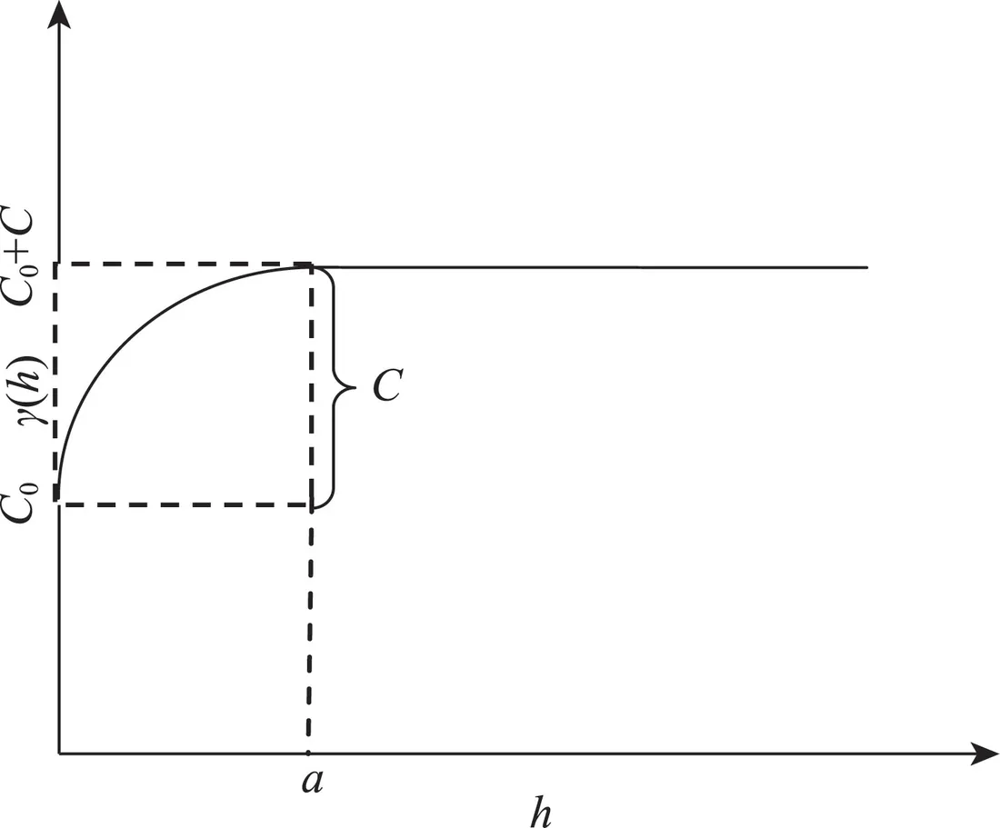
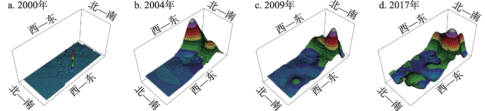

<!--folio:第1页-->

<!--col:L-->

<!--col:M-->

·《资源科学》2020年第42卷第9期·第1715–1727页·

<h3 class="doc-title">中国海外耕地投资发展的时空格局演变与影响因素</h3>

韩　璟1　陈泽秀1　卢新海1,2

（1. 华中师范大学公共管理学院，武汉 430079；2. 华中科技大学公共管理学院，武汉 430074）

<strong>摘　要：</strong>为探究中国海外耕地投资活动的发展规律，论文基于 GRAIN 和 Land Matrix 的案例统计数据，采用文献资料法、空间计量法，从投资规模的空间格局演变及其发展的影响因素两个方面进行了分析。结果表明：①2004年以后中国海外耕地投资的总体空间集聚效应开始显现，目前在局部已形成明显的空间分化，局部空间集聚效应的高高集聚区是俄罗斯和东南亚地区；②中国海外耕地投资活动的空间变异影响范围和影响程度经历了一个波动增强的过程，在西北至东南方向的空间变异最为显著，东道国的内部因素已成为影响中国海外耕地投资发展的重要因素；③中国海外耕地投资的发展受地缘政治、地缘经济和地缘文化因素的共同影响，其中东道国农用地比例，谷物单产水平，同中国的声明、宣言和公报总数，对华免签证件数量和驻华领事机构数量5个指标在统计上显著性较高。在中国海外耕地投资发展规模已呈现空间分异趋于稳定发展的情况下，相关机构应当重视对东南亚地区和俄罗斯的投资保护与规划。

<strong>关键词：</strong>海外耕地投资；空间格局；影响因素；空间回归；中国　　<strong>DOI：</strong>10.18402/resci.2020.09.07

<strong>引用格式：</strong>韩璟, 陈泽秀, 卢新海. 中国海外耕地投资发展的时空格局演变与影响因素[J]. 资源科学, 2020, 42(9): 1715-1727. [Han J, Chen Z X, Lu X H. Spatiotemporal change of China's overseas investment in farmlands and influencing factors[J]. Resources Science, 2020, 42(9): 1715-1727.] DOI: 10.18402/resci.2020.09.07

收稿日期：2019-10-08；修订日期：2020-08-30。基金项目：国家自然科学基金项目（41501589）；华中师范大学中央高校基本科研业务费项目（CCNU20QN035；CCNU20QN036）。

作者简介：韩璟，男，河南邓州人，副教授，主要从事粮食安全与土地可持续利用研究，E-mail: hanjing@mail.ccnu.edu.cn。通讯作者：卢新海，男，湖北洪湖人，教授，主要从事土地管理研究，E-mail: xinhailu@163.com。

1　引　言

基于对全球粮食安全形势恶化和国家粮食安全的担心，海外耕地投资正逐渐成为一些国际组织和国家增加全球农产品供给和保障国家粮食供给的一种措施[1,2]。海外耕地投资作为以农地权利获取和控制为显著特征的跨国农业投资活动，其与传统的跨国农业投资和农业合作开发已有显著区别，并在2007—2008年全球粮食危机后被进一步强化[3]。为应对全球人口激增和膳食结构改善所带来的粮食供应问题，联合国粮农组织（FAO）、世界银行（WB）和国际农业研究磋商组织（CGIAR）等机构一直呼吁进行跨国农业投资，从而达到提高全球农业资源利用效率和增加全球粮食供给的目的[4]。然而，2008年全球粮食危机所引发的粮食禁运、粮食出口管制和粮价高位波动等风险，使得部分跨国农业投资大国开始重视对海外农业资源的控制和利用问题[5]。在行动上，韩国提出要建立“海外粮食基地”，日本出台多项措施为本国海外耕地投资企业提供支持，沙特积极规划了27个海外耕地投资目标国，德国经济合作与发展部两次出台文件指导企业进行海外耕地投资。

针对海外耕地投资过程中的东道国土地制度缺陷、农民权利受损、小农经济被破坏、妇女权益被侵害等问题，规范海外耕地投资活动正逐渐成为国际共识。2010年 FAO 就联合世界银行、国际农业发展基金会等机构出台了《尊重权利、生计和资源的负责任农业投资原则》[1]。2012年 FAO 粮食安全委员会特别会议通过了《国家粮食安全范围内土地、渔业及森林权属负责任治理自愿准则》；2014年粮食安全委员会再次通过《农业和粮食系统负责任投资原则》，从而形成了规范全球海外耕地投资的基本政策框架[6,7]。据全球土地交易联机数据库（Land Matrix）和非政府组织 GRAIN 的统计，截至2018年12月，全球一共被纳入投资计划的海外耕地投资项目共计2208个，总面积为13106.66万 hm²，其中实际营运的项目面积为7749.13万 hm²，多数项目分布在非洲、拉丁美洲和东南亚地区的发展中国家。在全球粮食安全形势恶化趋势加剧，国内土地资源约束趋紧和国际粮食价格持续走高的时代背景下，利用海外耕地资源保障国家粮食安全的做法也逐渐进入国内学者视野[8,9]。

<!--col:R-->

<!--/folio-->

<!--folio:第2页-->

<!--col:L-->

<!--col:M-->

新中国对他国农业资源的利用最早可追溯到建国后的对外农业援助活动中，并大概可划分为纯农业援助、农业合作开发、农业“走出去”与海外耕地投资3个阶段。2000年以后，随着中国经济的发展和农业“走出去”战略的深入实施，海外耕地投资逐渐进入中国跨国农业企业的投资决策中，并开始受到学界关注[10]。实际上，利用海外农业资源保障中国粮食安全的做法最近几年也受到了最高决策层的关注。2015年中央一号文件就提出要“提高统筹利用国际国内两个市场两种资源的能力”“抓紧制定农业对外合作规划”“支持开展境外农业合作开发”。2016年，中共中央国务院在《关于落实发展新理念加快农业现代化实现全面小康目标的若干意见》中再次强调要充分“利用国际资源和市场，优化国内农业结构，缓解资源环境压力”。2018年和2019年，中央一号文件又提出要“积极参与全球粮食安全治理和农业贸易规则制定”，加强与“一带一路”沿线国家的农业国际合作。根据 GRAIN 和 Land Matrix 的统计，2000—2018年底，中国在全球45个国家一共投资了237个项目，总面积为1177.27万 hm²，其中已经营运的项目202个，总面积638.08万 hm²。

然而，纵观当前关于中国海外耕地投资问题的研究，国内外学术界将较多的视角投入在海外耕地投资模式、风险回避、对国家粮食安全的保障作用，以及相关东道国投资个案的研究方面，而对中国海外耕地投资空间格局及其演变方面的研究尚不多见[11-14]。因此，在国家“一带一路”倡议、农业“走出去”战略持续推进和中国海外耕地投资规模不断扩大的时代背景下，系统总结中国海外耕地投资活动的空间特征，归纳其时空格局演变规律和分析影响中国海外耕地投资选择的相关因素，对深化海外耕地投资问题研究，指导海外耕地投资活动和促进中国政府和企业科学规划海外耕地投资活动，将具有较强的理论和现实价值。

2　数据概况与处理

<strong>2.1　数据概况</strong>

本文的研究案例源于 GRAIN 和 Land Matrix 对全球海外耕地投资活动的案例统计数据库，该数据库主要对全球单个项目为0.02万 hm² 及以上的海外耕地投资案例进行了梳理，数据采集时点为2000—2018年。受数据库统计案例滞后性的限制，本文进行分析的数据截至2017年，由于新西兰、塞内加尔2国投资项目缺乏投资时间信息，古巴、纳米比亚、南非、哈萨克斯坦4国尚无营运的项目，故本文所分析的中国海外耕地投资案例为分布在38个东道国中的营运项目（表1）。

从地域分布上看，中国在非洲、亚洲、南美洲、欧洲、北美洲和大洋洲的东道国数量分别为17个、7个、6个、4个、2个和2个，分别占东道国总数的45%、18%、16%、11%、5%和5%。从投资的意向项目数量看，中国在亚洲、非洲、南美洲、欧洲、大洋洲和北美洲分别投资项目121个、63个、20个、14个、8个和2个，分别占意向项目总数的53%、28%、9%、6%、4%和1%。从项目面积上看，中国在亚洲、南美洲、非洲、欧洲、大洋洲、北美洲投资意向项目面积分别为592.75万 hm²、183.10万 hm²、169.24万 hm²、120.19万 hm²、55.64万 hm² 和31.80万 hm²，其中营运项目面积分别为245.89万 hm²、107.80万 hm²、61.09万 hm²、102.09万 hm²、52.14万 hm² 和31.80万 hm²，营运项目面积占意向项目面积比例分别为41%、59%、36%、85%、94%和100%。从东道国国别上看，老挝拥有的意向项目数量和营运项目数量最多，分别为29个项目和28个项目；而中国在菲律宾的意向项目总面积最多，共计254.44万 hm²；在缅甸的营运项目总面积最多，共计85.31万 hm²。

<strong>表1　2000—2017年中国的海外耕地投资概况</strong>

| 序号 | 被投资国 | 地区 | 意向数量/个 | 营运数量/个 | 意向面积/万hm² | 营运面积/万hm² | 最早投资年份 |
|---|---|---|---|---|---|---|---|
| 1 | 尼加拉瓜 | 北美洲 | 1 | 1 | 30.00 | 30.00 | 2013 |
| 2 | 牙买加 | 北美洲 | 1 | 1 | 1.80 | 1.80 | 2011 |
| 3 | 澳大利亚 | 大洋洲 | 4 | 2 | 3.95 | 0.45 | 2011 |
| 4 | 巴布亚新几内亚 | 大洋洲 | 4 | 4 | 51.69 | 51.69 | 2009 |
| 5 | 埃塞俄比亚 | 非洲 | 3 | 1 | 10.50 | 2.50 | 2008 |
| 6 | 安哥拉 | 非洲 | 3 | 2 | 52.15 | 2.15 | 2010 |
| 7 | 贝宁 | 非洲 | 4 | 3 | 2.96 | 1.96 | 2001 |
| 8 | 刚果（金） | 非洲 | 4 | 3 | 39.54 | 28.63 | 2007 |
| 9 | 加纳 | 非洲 | 2 | 1 | 3.65 | 0.05 | 2013 |
| 10 | 津巴布韦 | 非洲 | 4 | 3 | 15.57 | 1.39 | 2003 |
| 11 | 喀麦隆 | 非洲 | 2 | 2 | 2.01 | 2.01 | 2006 |
| 12 | 利比里亚 | 非洲 | 1 | 1 | 1.00 | 1.00 | 2010 |
| 13 | 马达加斯加 | 非洲 | 5 | 5 | 3.95 | 3.45 | 2005 |
| 14 | 马里 | 非洲 | 1 | 1 | 2.00 | 2.00 | 2009 |
| 15 | 莫桑比克 | 非洲 | 9 | 8 | 6.38 | 6.26 | 2000 |
| 16 | 尼日利亚 | 非洲 | 6 | 4 | 4.23 | 3.23 | 2006 |
| 17 | 塞拉利昂 | 非洲 | 6 | 5 | 17.82 | 4.15 | 2009 |
| 18 | 苏丹 | 非洲 | 2 | 2 | 1.67 | 1.17 | 2009 |
| 19 | 坦桑尼亚 | 非洲 | 3 | 1 | 0.13 | 0.06 | 2007 |
| 20 | 乌干达 | 非洲 | 4 | 4 | 5.24 | 0.58 | 2009 |
| 21 | 赞比亚 | 非洲 | 4 | 3 | 0.44 | 0.50 | 2003 |
| 22 | 阿根廷 | 南美洲 | 6 | 6 | 34.34 | 34.34 | 2010 |
| 23 | 巴西 | 南美洲 | 7 | 5 | 44.40 | 4.40 | 2007 |
| 24 | 玻利维亚 | 南美洲 | 1 | 1 | 1.25 | 1.25 | 2005 |
| 25 | 哥伦比亚 | 南美洲 | 1 | 1 | 40.00 | 40.00 | 2010 |
| 26 | 圭亚那 | 南美洲 | 1 | 1 | 62.71 | 27.41 | 2011 |
| 27 | 乌拉圭 | 南美洲 | 4 | 4 | 0.40 | 0.40 | 2008 |
| 28 | 白俄罗斯 | 欧洲 | 1 | 1 | 10.00 | 10.00 | 2017 |
| 29 | 保加利亚 | 欧洲 | 5 | 5 | 7.42 | 6.62 | 2008 |
| 30 | 俄罗斯 | 欧洲 | 5 | 5 | 101.33 | 84.33 | 2004 |
| 31 | 乌克兰 | 欧洲 | 3 | 2 | 1.44 | 1.14 | 2013 |
| 32 | 菲律宾 | 亚洲 | 8 | 4 | 254.44 | 5.64 | 2006 |
| 33 | 柬埔寨 | 亚洲 | 28 | 27 | 25.78 | 24.98 | 2000 |
| 34 | 老挝 | 亚洲 | 29 | 28 | 75.25 | 29.67 | 2002 |
| 35 | 缅甸 | 亚洲 | 23 | 21 | 94.82 | 85.31 | 2006 |
| 36 | 塔吉克斯坦 | 亚洲 | 4 | 3 | 11.89 | 11.09 | 2012 |
| 37 | 印度尼西亚 | 亚洲 | 15 | 14 | 94.02 | 62.65 | 2004 |
| 38 | 越南 | 亚洲 | 14 | 13 | 36.55 | 26.55 | 2005 |

注：俄罗斯横跨欧亚两洲，本文根据外交统计原则将位于俄罗斯的项目均计算为欧洲项目。

<!--col:R-->

<!--/folio-->

<!--folio:第3页-->

<!--col:L-->

<!--col:M-->

<strong>2.2　数据处理</strong>

海外耕地投资规模属于一个复合性概念。笔者获取的统计案例分别涉及到意向项目数量、意向项目面积、营运项目数量和营运项目面积、投资时长等多个指标。为更有效地表现海外耕地投资规模，本文采用熵值法对中国在各东道国的海外耕地投资规模进行测度。熵值法作为一种客观的评价方法，来源于 Shannon 的信息熵理论，具有克服主观因素偏差的优良特性，因此也成为德尔菲法、两两比较法、层次分析法之外的重要评价方法。具体而言，就是通过对反映投资成效更有效的营运项目面积和营运项目数量指标进行处理，从而计算熵值作为衡量海外耕地投资规模的表征指标。主要计算步骤如下：

①指标标准化。本文采用极值标准化法对指标进行标准化处理。正向指标：

$$
x'_{ij}=\frac{x_{ij}-\min\{x_{ij}\}}{\max\{x_{ij}\}-\min\{x_{ij}\}}\tag{1}
$$

逆向指标：

$$
x''_{ij}=\frac{\max\{x_{ij}\}-x_{ij}}{\max\{x_{ij}\}-\min\{x_{ij}\}}\tag{2}
$$

其中 $1\le i\le n$。

②计算第 j 项指标下第 i 个地区占该指标的比重（$i=1,2,\cdots,n$；$j=1,2,\cdots,m$）：

$$
f_{ij}=\frac{x_{ij}}{\displaystyle\sum_{i=1}^{n}x_{ij}}\tag{3}
$$

③计算第 j 项指标的熵值 $H_j$（其中 $k>0$，$k=1/\ln(n)$，$H_j>0$）：

$$
H_j=-k\sum_{i=1}^{n}f_{ij}\ln f_{ij}\tag{4}
$$

④计算第 j 项指标的熵权 $W_j$（其中 $0\le W_j\le 1$，$\sum W_j=1$）：

$$
W_j=\frac{1-H_j}{\displaystyle m-\sum_{j=1}^{m}H_j}\tag{5}
$$

式中：$x_{ij}$ 为第 i 个国家的第 j 个指标的值；$f_{ij}$ 为第 j 项指标下第 i 个地区占该指标的比重；$H_j$ 为第 j 项指标的熵值；$n$ 为国家个数；$W_j$ 为第 j 个指标值的权重，$j=1$ 时评价指标为海外耕地投资项目数量，$j=2$ 时为海外耕地投资项目面积；$m$ 为指标个数。

3　研究方法

<strong>3.1　空间格局演变分析方法</strong>

<strong>3.1.1　全局空间自相关</strong>　全局空间自相关主要用以反映某个属性在整个区域上面的相关性特征以及观测变量在整个研究区域内空间相关性的整体趋势，其主要表征统计量有 Moran's I 和 Geary'C。本文采用 Moran's I 统计量来衡量中国海外耕地投资规模的全局空间自相关程度，其公式为：

$$
\text{Moran's I}=\frac{\displaystyle\sum_{i=1}^{n}\sum_{j=1}^{n}w_{ij}(X_i-\bar X)(X_j-\bar X)}{S^2\displaystyle\sum_{i=1}^{n}\sum_{j=1}^{n}w_{ij}}\tag{6}
$$

式中：$S^2=\dfrac{1}{n}\displaystyle\sum_{i=1}^{n}(X_i-\bar X)^2$；$\bar X=\dfrac{1}{n}\displaystyle\sum_{i=1}^{n}X_i$；$X_i$ 表示第 i 地区海外耕地投资规模的观测值；$w_{ij}$ 为空间权重值矩阵。Moran's I 统计量的取值一般在−1和1之间，小于0表示负相关，等于0表示不相关，大于0表示正相关。Moran's I 的显著性用 Z 统计量进行检验，Z 值显著为正时说明区域间相似值趋于集聚，Z 值显著为负时说明区域相似值趋于发散，Z 值为0时说明区域相似值是随机的。

<strong>3.1.2　局部空间自相关</strong>　局部空间自相关主要用来描述一个空间单元与其领域的相似程度，能够表示每个局部单元服从全局总趋势的程度，反映了空间异质性，并说明空间依赖是如何随位置而变化的。本文采用空间联系的局部指标 LISA 集聚图来展现局部空间自相关，其中 LISA 包括局部 Moran 指数和局部 Geary 指数两个指标。局部 Moran 指数计算公式为：

$$
I_i=\frac{X_i-\bar X}{S^2}\sum_{j}w_{ij}(X_j-\bar X)\tag{7}
$$

$I_i>0$ 说明该空间单元与邻近单元的属性相似；$I_i<0$ 说明该空间单元与邻近单元的属性不相似。

局部 Geary 指数是一种基于距离权重矩阵的局部空间自相关指标，能探测出高值集聚和低值集聚，其计算公式为：

$$
G_i^*=\frac{\displaystyle\sum_{j}w_{ij}X_j}{\displaystyle\sum_{k}X_k}\tag{8}
$$

可将 $G_i^*$ 标准化得到：

$$
Z_i=\frac{G_i^*-E(G_i^*)}{\sqrt{\operatorname{Var}(G_i^*)}}\tag{9}
$$

显著的正 $Z_i$ 表示邻近单元的观测值高，显著的负 $Z_i$ 则表示邻近单元的观测值低。

<!--col:R-->

<!--/folio-->

<!--folio:第4页-->

<!--col:L-->

<!--col:M-->

<strong>3.1.3　空间变异函数</strong>　空间变异函数是描述随机场合和随机过程空间相关性的统计量，被定义为空间内两点之差的方差，该方法能通过数据本身的结构及其各项参数从不同的角度反映空间变异性，主要运用于对空间异质性特征的测度，并且用以刻画区域化变量的随机性和结构性。其计算原理如下：设有区域变化量 $Z(x)$ 满足二阶平稳条件，且有空间分隔距离为 $h$ 的两个样本点，则 $Z(x_i)$ 与 $Z(x_i+h)$ 分别是 $Z(x)$ 在空间位置 $x_i$ 和 $x_i+h$ 上的观测值，其中 $i=1,2,\cdots,N(h)$。空间变异函数可通过以下公式计算：

$$
\gamma(h)=\frac{1}{2N(h)}\sum_{i=1}^{N(h)}[Z(x_i)-Z(x_i+h)]^2\tag{10}
$$

式中：$\gamma(h)$ 为空间变异函数；$N(h)$ 是分隔距离（步长）为 $h$ 时的样本对数。最后，可以 $h$ 为横坐标、$\gamma(h)$ 为纵坐标绘制出空间变异函数曲线图（图1）。图1中，$C_0$ 为随机因素引起的块金值变量，主要反映变量的局部随机性大小引起的空间异质性；$C$ 为偏基台值，为自相关引起的变异；$C_0+C$ 是基台值，为 $Z(x)$ 在样点空间内的最大变异程度；$C_0/(C_0+C)$ 为块金系数，是随机因素引起的变异在总变异中占比；$a$ 为变程，即空间变异函数值到基台值间的距离，表示空间变异的影响范围。

<strong>3.1.4　空间回归分析</strong>　由于普通的线性回归模型未考虑到空间的相关性，从而假设变量之间相互独立，会在计算具有空间效应的分析时产生误差，因此本文拟采用空间回归模型分析海外耕地投资发展的影响因素。目前，空间回归模型主要包括空间滞后模型（SLM）和空间误差模型（SEM）两种，其中空间滞后模型主要考虑的是周围地区对本地区产生的空间溢出效应，而空间误差模型则主要考虑的是随机误差项对空间效应的干扰，其计算公式如下：

空间滞后模型：

$$
S=\rho Ws+\beta F+\varepsilon\tag{11}
$$

空间误差模型：

$$
S=\beta F+\varepsilon,\quad \varepsilon=\lambda W_{\varepsilon}+\mu\tag{12}
$$

式中：$S$ 为因变量东道国海外耕地投资规模；$F$ 为解释变量矩阵，即影响中国海外耕地投资发展的指标；$\rho$ 为空间效应系数；$\beta$ 为模型待估统计量；$Ws$ 为空间滞后因变量；$W_{\varepsilon}$ 为空间误差因变量；$\varepsilon$ 为随机误差项向量；$\lambda$ 为因变量的空间误差系数；$\mu$ 为正态分布的随机误差向量。

<strong>3.2　中国海外耕地投资发展的影响因素分析方法</strong>

对于海外耕地投资在全球扩张的动力，有学者认为是殖民主义在当代的复活，也有学者认为是全球化推进的必然结果[15-18]。东道国耕地资源数量、后备耕地资源数量、农业生产条件、社会治理状况等因素均被认为是影响企业进行海外投资的重要因素[19-23]。Visser 等认为海外耕地投资实际上是土地资源丰沛国家吸引外部投资的一种手段，也可以说是大型农业企业为谋求利润而在全球范围内所进行的土地积累（Land Accumulation）[24]。针对中国农业“走出去”战略下的海外耕地投资活动，保障粮食安全、利用外国农业资源、外交需求和开拓国际市场等因素对中国企业选择投资东道国的影响已受到关注[25-27]。同东道国良好的经济关系对跨国投资也同样具有重要影响，通过建立全方位、多层次的互联互通网络，加强投资国与东道国之间的文化交融，优化企业跨国投资环境也是提高企业投资效率的关键所在[28,29]。基于以上认知，论文认为可以从两个方面构建理论框架分析中国海外耕地投资发展的影响因素：一是相对较“硬”的资源基础；二是相对较“软”的地缘关系。海外耕地投资活动作为一种跨国土地资源利用活动，其区位选择除了受东道国耕地资源数量和质量影响外，还会受中国与东道国地缘关系水平的影响。既有研究表明，地缘关系大致可分为地缘政治、地缘经济和地缘文化3个方面[30]。

<!--col:R-->

<!--/folio-->

<!--folio:第5页-->

<!--col:L-->

<!--col:M-->

因此，本文拟从以上两个方面，从资源基础、地缘政治、地缘经济和地缘文化4个维度构建指标体系表征影响中国海外耕地投资发展的因素（表2）。具体而言，资源基础用耕地总面积（$C_1$）、人均耕地面积（$C_2$）、农用地比例（$C_3$）、谷物单产（$C_4$）、人均淡水资源量（$C_5$）等5个指标表征，反映了耕地的质量和数量特征；地缘政治用建交时长（$C_6$）、高层交往总数（$C_7$）、领事磋商总数（$C_8$）、声明宣言和公报总数（$C_9$）、免签证件数量（$C_10$）等5个指标表征，反映了东道国与中国的政治关系紧密程度；地缘经济用年均出口总额（$C_11$）、年均出口额增长率（$C_12$）、年均进口总额（$C_13$）、年均进口额增长率（$C_14$）、年均对外承包工程完成营业额（$C_15$）、对中投资合作政策数量（$C_16$）等6个指标表征，反映了东道国与中国的经济联系紧密程度；地缘文化用年均在华留学生人数（$C_17$）、年均赴华旅游人数（$C_18$）、人文合作交流总数（$C_19$）、驻华领事机构数量（$C_20$）等4个指标表征，反映了东道国与中国的文化联系紧密程度。相关指标取值时间段为2000—2017年，为提高模型精度，论文对相关数值型的指标均进行了对数化处理。

<strong>表2　2000—2017年中国海外耕地投资发展空间格局演变的影响因素</strong>

| 子目标 | 指标 | 单位 | 数据来源 |
|---|---|---|---|
| 资源基础 | 耕地总面积（C₁） | hm² | FAO数据库 |
| 资源基础 | 人均耕地面积（C₂） | hm² | FAO数据库 |
| 资源基础 | 农用地比例（C₃） | % | FAO数据库 |
| 资源基础 | 谷物单产（C₄） | kg/hm² | FAO数据库 |
| 资源基础 | 人均淡水资源量（C₅） | m³ | FAO数据库 |
| 地缘政治 | 建交时长（C₆） | 年 | 《中国外交》 |
| 地缘政治 | 高层交往总数（C₇） | 次 | 《中国外交》 |
| 地缘政治 | 领事磋商总数（C₈） | 次 | 《中国外交》 |
| 地缘政治 | 声明、宣言和公报总数（C₉） | 次 | 《中国外交》 |
| 地缘政治 | 对华免签证件数量（C₁₀） | 个 | 《中国外交》 |
| 地缘经济 | 年均出口总额（C₁₁） | 万美元 | 《中国贸易外经统计年鉴》 |
| 地缘经济 | 年均出口额增长率（C₁₂） | % | 《中国贸易外经统计年鉴》 |
| 地缘经济 | 年均进口总额（C₁₃） | 万美元 | 《中国贸易外经统计年鉴》 |
| 地缘经济 | 年均进口额增长率（C₁₄） | % | 《中国贸易外经统计年鉴》 |
| 地缘经济 | 年均对外承包工程完成营业额（C₁₅） | 万美元 | 《中国贸易外经统计年鉴》 |
| 地缘经济 | 对中投资合作政策数量（C₁₆） | 个 | 《中国外交》 |
| 地缘文化 | 年均在华留学生人数（C₁₇） | 人 | 《中国贸易外经统计年鉴》 |
| 地缘文化 | 年均赴华旅游人数（C₁₈） | 人/次 | 《中国贸易外经统计年鉴》 |
| 地缘文化 | 人文合作交流总数（C₁₉） | 次 | 《中国外交》 |
| 地缘文化 | 驻华领事机构数量（C₂₀） | 个 | 《中国外交》 |

中国海外耕地投资活动的发展具有系统性，也是多种因素综合作用的结果。对中国海外耕地投资发展的影响因素进行识别，不但可以显化各因素对中国海外耕地投资空间格局演变的作用机制，也可为后续科学设计和规划中国海外耕地投资政策提供依据。海外耕地投资作为一种空间活动，其较强的空间关联性事实使得普通回归中的样本独立性前提这一条件难以满足，所以从理论上讲空间回归模型更适合分析这一问题。为进一步凸显影响因素的分析效果，论文分别采用了普通回归模型（OLS）、空间滞后模型（SLM）和空间误差模型（SEM）进行分析和比较，相关计算采用 GeoDa 软件。

<!--col:R-->

<!--/folio-->

<!--folio:第6页-->

<!--col:L-->

<!--col:M-->

4　结果与分析

<strong>4.1　中国海外耕地投资规模的时空格局演变</strong>

<strong>4.1.1　总体变化趋势</strong>　对中国2000—2017年海外耕地投资规模进行全局自相关计算，结果显示在2000—2017年间的 Moran's I 统计量为负且 Z 值未通过显著性检验；从2004年开始，Moran's I 均为正值且 Z 值通过显著检验，这表明中国海外耕地投资规模从2004年开始表现为正相关并出现空间集聚效应（表3）。从全局 Moran's I 统计量的演变过程看，其总体呈上升趋势，并大致可分成2000—2003年、2004—2009年、2010—2011年、2012—2017年4个变化区间。在2000—2003年间，Moran's I 统计量没有通过显著性检验，这表明在该时期中国的海外耕地投资活动不存在明显的空间集聚效应。在2004—2009年间，Moran's I 统计量数值快速增大，并通过了显著性检验，这表明在该时期中国的海外耕地投资活动空间集聚效应快速增强，这与中国农业“走出去”战略的深入推进和2007—2008年全球粮食危机后海外耕地投资活动快速发展密切相关。2010—2011年间虽然 Moran's I 统计量为正值且显著，但其数值快速下降，说明中国海外耕地投资活动的空间效应有所弱化，其主要原因是全球粮食供给逐渐摆脱粮食危机影响，海外耕地投资规模的爆发增长期已过去，中国企业的海外耕地投资步伐开始减缓。2012—2017年间中国海外耕地投资规模的 Moran's I 统计量为正值且显著，并且其值开始处于一个稳定提升阶段，这说明中国海外耕地投资活动开始稳步开展，空间集聚效应也进一步增强。

<strong>表3　2000—2017年中国海外耕地投资发展程度的全局 Moran's I 指数</strong>

| 年份 | Moran's I | Z值 | P值 |
|---|---|---|---|
| 2000 | −0.0170 | 1.2452 | 0.1132 |
| 2001 | −0.0411 | 0.2855 | 0.4410 |
| 2002 | −0.0713 | 0.6835 | 0.2583 |
| 2003 | −0.0369 | 0.1106 | 0.4790 |
| 2004 | 0.2461 | 3.5586 | 0.0120 |
| 2005 | 0.3712 | 5.1180 | 0.0012 |
| 2006 | 0.4114 | 5.7002 | 0.0043 |
| 2007 | 0.4684 | 6.8745 | 0.0022 |
| 2008 | 0.5381 | 7.1604 | 0.0011 |
| 2009 | 0.5473 | 7.1715 | 0.0010 |
| 2010 | 0.4033 | 5.0061 | 0.0022 |
| 2011 | 0.3060 | 3.9024 | 0.0063 |
| 2012 | 0.3321 | 4.2150 | 0.0051 |
| 2013 | 0.3232 | 4.1461 | 0.0041 |
| 2014 | 0.3104 | 3.9976 | 0.0053 |
| 2015 | 0.3727 | 4.8210 | 0.0014 |
| 2016 | 0.3792 | 4.8981 | 0.0010 |
| 2017 | 0.4211 | 5.0013 | 0.0021 |

<strong>4.1.2　局部变化趋势</strong>　基于以上对中国海外耕地投资规模全局莫兰指数演变趋势的分析，本文分别选取了表征意义较为突出的2000年、2004年、2009年和2017年4个时点，通过 LISA 集聚图对其局部空间自相关情况进行了分析，结果如下：

（1）从空间维度看，中国海外耕地投资活动的空间分异特征逐步显现。截至2017年，俄罗斯、东南亚地区的印度尼西亚、越南、老挝、缅甸等国以及大洋洲的巴布亚新几内亚等国成为中国海外耕地投资规模的高高集聚区，而非洲地区则为中国海外耕地投资规模的低低集聚区，代表性国家有马里、塞拉利昂、加纳、埃塞俄比亚等，刚果（金）和莫桑比克则成为非洲地区中国海外耕地投资规模的高低集聚区。

<!--col:R-->

<!--/folio-->

<!--folio:第7页-->

<!--col:L-->

<!--col:M-->

（2）从时间维度来看，中国海外耕地投资活动的集聚有明显的时间效应。2000—2003年间，中国的海外耕地投资活动发轫于非洲，在初始阶段，局部集聚效应并不明显。2004年，中国海外耕地投资活动开始初具发展规模，在东南亚地区出现了一个呈高高集聚的中国海外耕地投资东道国群体，主要代表国家是印度尼西亚、老挝等。到2009年，中国海外耕地投资东道国的空间集聚性进一步提升，主要东道国集中在东南亚地区，如缅甸、老挝、越南等国。再到2017年后，随着中国海外耕地投资规模的扩大，中国海外耕地投资东道国的空间集聚性更加明显，在所有东道国中除南美洲地区、大洋洲地区不显著外，非洲地区除高低集聚的刚果（金）和莫桑比克外基本为低低集聚，东部亚洲地区和俄罗斯为主要的高高集聚区，主要国家有印度尼西亚、越南、老挝、缅甸和俄罗斯等。

（3）总体上，中国海外耕地投资规模发展的空间分化日益加重。在中国海外耕地投资东道国中，高高集聚区和高低集聚区中国家的个数明显少于低低集聚区和低高集聚区中东道国的数量，且多集中在亚洲地区。这说明即使经过多年的发展，中国海外耕地投资活动仍只是在部分地区呈现出了明显的集聚效应，主要集中区域在东南亚，这也反映出中国企业海外耕地投资活动的不平衡性。

<strong>4.1.3　时空变异趋势</strong>　本文将中国海外耕地投资发展程度得分赋予在各东道国的几何中心上，并利用 ArcGIS 软件提取出各国的几何中心点坐标，然后运用 GS+ 软件对各国在2000年、2004年、2009年和2017年的数据进行计算，并使用球面、指数、高斯和线性模型对变异函数进行拟合，最后以最优拟合结果计算以上4个年份的分维数，从而完成对空间变异特征的分析。

根据模型拟合效果可以看出，2000—2017年间反映中国海外耕地投资活动空间变异的相关统计量基本呈现出一种先增强再减弱进而再小幅增强的变化特征（表4）。具体而言：①变程和基台值在2000—2004年间逐渐变大，然后2004—2017年间先降低后再变大，说明海外耕地投资活动的空间变异影响范围和影响程度经历了一个快速增强后减弱进而稳步增强的过程。其原因在于中国在2004年之前的项目集中于非洲地区，2004年以后东南亚地区引起了中国投资企业的重视，并逐渐成长成为中国最重要的海外耕地投资区域，这一发展过程直接影响了中国海外耕地投资活动的空间变异特征。②块金值和残差平方和同样经历了一个快速增强后减弱进而稳步增强的过程，这说明中国海外耕地投资活动的空间格局变异随机性和结构性也经历了一个快速增加后减弱进而稳步增强的过程。③块金系数在2000—2017年则呈现出快速增大后逐渐减小的变化过程，这暗示了中国海外耕地投资活动在某一历史时期受到了外部环境的强烈影响，并且这种影响在后期逐渐减弱，即东道国内部因素成为当前影响中国海外耕地投资活动的重要方面。

<strong>表4　中国海外耕地投资格局变异函数模型拟合结果</strong>

| 年份 | 模型 | 变程 | 块金值 | 残差平方和 | 基台值 | 块金系数 | 判定系数 | 偏基台值 |
|---|---|---|---|---|---|---|---|---|
| 2000 | 高斯 | 1333.68 | 0.0000 | 3.91E-03 | 0.0302 | 0.000 | 0.166 | 0.0302 |
| 2004 | 高斯 | 22014.37 | 0.0140 | 1.25E-03 | 0.0634 | 0.221 | 0.556 | 0.0494 |
| 2009 | 高斯 | 14306.74 | 0.0054 | 1.59E-03 | 0.0538 | 0.100 | 0.683 | 0.0484 |
| 2017 | 高斯 | 14358.70 | 0.0063 | 1.73E-03 | 0.0717 | 0.088 | 0.781 | 0.0654 |

<!--col:R-->

<!--/folio-->

<!--folio:第8页-->

<!--col:L-->

<!--col:M-->

从中国海外耕地投资变异函数分维数的计算结果看，在全方向上的分维数值（D）呈现出先稍微增大后再逐渐减小的变化过程，然而拟合效果（R²）则在2004年后逐渐提升，这说明中国海外耕地投资活动的空间格局脱离均值分布较大，即空间分异特征明显，但是解释的信度则在2004年后逐渐增强（表5）。细化到不同方向上看，南—北方向的分维数拟合程度经历了一个“增大—减小—再增大”的变化过程，但分维数值整体呈下降状态，这说明中国海外耕地投资活动的空间格局在该方向上的变异性整体是增大的；东北—西南方向的分维数拟合程度是“先减小后增大”的变化过程，并且整体呈下降状态，这说明中国海外耕地投资活动的空间格局在该方向的变异性也是整体增大的；东—西方向的分维数拟合程度是“先增大后减小”的变化过程，并且整体也呈下降状态，这说明中国海外耕地投资活动的空间格局在该方向的变异性也是整体增大的；西北—东南方向的分维数拟合程度处于“逐渐变小”的变化过程，并且其分维数值最低，说明在该方向上中国海外耕地投资活动的均质性最弱，空间变异最显著，该方向也是中国海外耕地投资活动变异最突出的方向。

<strong>表5　中国海外耕地投资变异函数分维数</strong>

| 年份 | 全方向 D | R² | 南—北 D | R² | 东北—西南 D | R² | 东—西 D | R² | 西北—东南 D | R² |
|---|---|---|---|---|---|---|---|---|---|---|
| 2000 | 1.853 | 0.258 | 1.945 | 0.254 | 1.979 | 0.025 | 1.929 | 0.116 | 1.893 | 0.188 |
| 2004 | 1.857 | 0.196 | 1.947 | 0.005 | 1.710 | 0.119 | 1.983 | 0.001 | 1.561 | 0.416 |
| 2009 | 1.671 | 0.521 | 1.831 | 0.101 | 1.560 | 0.272 | 1.633 | 0.134 | 1.226 | 0.653 |
| 2017 | 1.609 | 0.734 | 1.871 | 0.050 | 1.641 | 0.188 | 1.502 | 0.353 | 1.244 | 0.728 |

基于同向变异拟合及异向克里金插值的结果显示，中国海外耕地投资活动在空间上具有延续性（图2）。在2000年，中国海外耕地投资活动整体为平原结构，空间变异特征并不明显，但是有一个“尖峰”较为明显，实际反映了当时中国海外耕地投资规模在非洲较为集中的状态；在2004年，中国海外耕地投资活动的空间格局开始出现西部平原东部突起的发展状态，并呈现坡形结构，这实际反映了当时中国海外耕地投资活动在东南亚地区的集中情况；在2009年，中国海外耕地投资活动的空间格局形成了东南部突起西部低洼的发展状态，这反映出东南亚地区成为中国海外耕地投资活动的绝对重心，但是非洲地区的发展也开始提速；在2017年，中国海外耕地投资活动的空间格局形成了东部高原西部丘陵的发展状态，反映出虽然中国海外耕地投资活动在全球范围内均有所发展，但是东南亚地区已成为中国海外耕地投资活动的绝对重心所在。

<strong>4.2　中国海外耕地投资发展的影响因素</strong>

从空间依赖性检验结果可以看出，LM(lag) 检验较 LM(error) 检验更加显著，R-LM(lag) 检验也较 R-LM(error) 检验更加显著，根据 Anselin 提出的判别标准，我们可以认定 SLM 模型更适合分析中国海外耕地投资发展的影响因素（表6）。综上，论文采用3种模型对中国海外耕地投资发展的影响因素进行了识别，回归结果如表7所示。

<strong>表6　空间回归模型的空间依赖性检验结果</strong>

| Test | MI/DF | Value | Prob |
|---|---|---|---|
| LM(lag) | 1 | 4.0454 | 0.04429 |
| R-LM(lag) | 1 | 5.7611 | 0.01638 |
| LM(error) | 1 | 0.1559 | 0.69296 |
| R-LM(error) | 1 | 1.8716 | 0.17129 |

<!--col:R-->

<!--/folio-->

<!--folio:第9页-->

<!--col:L-->

<!--col:M-->

从 SLM 模型的回归结果可以看出，在反映资源基础、地缘政治、地缘经济、地缘文化的指标中，均有2个指标通过了显著性检验（表7）。具体而言，在资源基础方面，农用地比例指标（$C_3$）在5%的统计水平上显著且系数为负数；谷物单产指标（$C_4$）在5%的统计水平上显著且系数为正。究其原因，这可能与海外耕地投资对落后农业国后备耕地资源开发的现实有关，FAO 和世界银行一直在优化农业落后国家的土地制度环境，并大力支持农用地比例较低的相关国家开发后备耕地资源，所以中国的海外耕地投资活动反映出对农用地比例较低国家的偏好性。谷物单产指标则反映出中国倾向于对耕地质量较好的国家进行投资，实际上在这一阶段的海外耕地投资活动中，优质耕地资源一直是相关投资企业投资的焦点，即中国企业偏好对耕地质量较好国家的投资。

在地缘政治方面，声明、宣言和公报总数（$C_9$）指标在5%的统计水平上显著且系数为正；对华免签证件数量（$C_10$）也在5%的统计水平上显著且系数为负。声明、宣言和公报总数实际反映了中国同海外耕地投资东道国的政治接触程度和效果，说明中国企业偏向投资与中国政治合作较多的东道国。免签证件数量也是影响中国海外耕地投资东道国选择的显著因素，根据免签证件的外交准则，一般发展与中国差距较大的国家会给予中国更多的免签证件数量，该指标系数为负反映出中国企业可能不太偏好于向落后地区投资的现实，实际上中国对东南亚地区的投资规模显著高于非洲地区的事实也能反映这一情况。

<strong>表7　中国海外耕地投资发展的影响因素回归结果</strong>

| 变量 | OLS | SLM | SEM |
|---|---|---|---|
| CONSTANT | −0.1974 | −0.4194 | −0.3593 |
| lnC₁ | 0.0145 | 0.0061 | 0.0266 |
| lnC₂ | −0.0315 | 0.0003 | 0.0479 |
| C₃ | −0.0025 | −0.0032** | −0.0043*** |
| lnC₄ | 0.0999 | 0.0833** | 0.1745*** |
| lnC₅ | −0.0203 | 0.0338 | 0.0448* |
| C₆ | −0.0030 | −0.0016 | −0.0025 |
| C₇ | −0.0006 | 0.0009 | 0.0008 |
| C₈ | −0.0240 | −0.0077 | −0.0135 |
| C₉ | −0.0098 | −0.0123** | −0.0077* |
| C₁₀ | 0.0182 | −0.0368** | −0.0136 |
| lnC₁₁ | −0.0030 | −0.0205 | −0.0214 |
| C₁₂ | −0.0041 | 0.0053* | 0.0057* |
| lnC₁₃ | 0.0182 | 0.0216 | 0.0191 |
| C₁₄ | 0.0006 | 0.0008 | 0.0008 |
| lnC₁₅ | −0.0319 | −0.0460* | −0.0615** |
| C₁₆ | −0.0016 | −0.0012 | −0.0008 |
| lnC₁₇ | 0.0081 | 0.0096 | 0.0107 |
| lnC₁₈ | −0.0514 | −0.0637* | −0.0883*** |
| C₁₉ | −0.0010 | −0.0008 | −0.0028 |
| C₂₀ | −0.0452 | −0.0451** | −0.0417** |
| ρ | — | 0.8654** | — |
| λ | — | — | 7.8271*** |
| R-squared | 0.6938 | 0.7290 | 0.5487 |
| LogL | 29.0833 | 31.0495 | 3.3681 |
| AIC | −16.1666 | −18.0990 | −18.7363 |
| SC | −18.2227 | −17.9279 | −15.6530 |

注：*、**和***分别表示在10%、5%和1%水平下显著。

<!--col:R-->

<!--/folio-->

<!--folio:第10页-->

<!--col:L-->

<!--col:M-->

在地缘经济方面，年均出口额增长率指标（$C_12$）在10%的统计水平上显著且系数为正；年均对外承包工程完成营业额指标（$C_15$）也在10%的统计水平上显著且系数为负。年均出口增长率实际反映了东道国的购买能力和中国商品在东道国的受欢迎程度，受粮食及其加工品敏感性的限制，当前中国海外耕地投资企业生产的农产品主要有本地销售和供给区域市场两种主要的流向，拉回国内销售并非主流，该指标的显著性可能反映了东道国较强的购买能力和中国商品良好的市场氛围，以及良好的经济联系趋势对中国海外耕地投资东道国选择的影响。值得关注的是，年均对外承包工程完成营业额指标的系数为负，究其原因可能与东道国基础设施状况和投资比较优势有关，一般来说中国的对外合作工程大多以基础设施建设为主，并且基建项目的比较收益显著高于农业投资，尤其是在农业基础设施落后的国家，因此该指标可能反映了工程项目对农业投资具有“挤出”效应。

在地缘文化方面，年均赴华旅游人数指标（$C_18$）在10%的统计水平上显著且系数为负，驻华领事机构数量指标（$C_20$）在5%的统计水平上显著且系数为正。赴华旅游人数指标一方面反映了中国与他国的国民交流程度，更重要的是另一方面实际反映了相关国家相对中国的经济发展程度，这说明目前中国海外耕地投资项目多发生于国民收入水平较低的国家。驻华领事机构作为服务国民的驻外机构，其实质反映了设馆国赴华、在华人口数量情况，实际是两国国民交流情况的体现，这说明中国对两国民交流较密切的东道国具有投资偏好。

5　结论与讨论

本文利用 Land Matrix 和 GRAIN 对中国海外耕地投资的案例统计数据进行统计，并借鉴空间计量经济学的相关理论和方法，对中国海外耕地投资发展的时空格局演变规律和影响因素进行了分析，主要得到以下结论：

（1）中国海外耕地投资活动经过多年发展已呈现出明显的空间分异特征。从总体趋势看，2003年以后中国海外耕地投资活动开始呈现出空间集聚特征，全局 Moran's I 指数为正值且显著，空间自相关特征明显，并在2009年达到高峰。但是2009年以后，中国海外耕地投资的空间聚集开始趋于平稳，呈波动提升趋势。从局部趋势看，中国最早开始进行海外耕地投资且东道国数目最多的非洲地区没有演变成中国海外耕地投资的集聚区域，2004年以后东南亚地区和俄罗斯逐渐成为中国海外耕地投资活动的高高聚集区。

（2）对中国海外耕地投资活动发展的时空变异趋势分析表明，中国海外耕地投资活动的空间变异经历了一个先增强再减弱进而稳定提升的变化过程。首先，中国海外耕地投资活动的空间变异影响范围和影响程度经历了一个快速增强后减弱进而稳步增强的过程；其次，中国海外耕地投资活动的空间格局变异随机性和结构性也经历这一变化过程；第三，当前外部环境已经不是影响中国海外耕地投资空间格局演变的重要因素，内部因素才是影响中国海外耕地投资活动空间演变的重要方面；最后，基于克里金插值图的分析显示，西北—东南这一方向是当前中国海外耕地投资活动空间变异最突出的方向，在地图区域上即东南亚地区和俄罗斯是中国当前海外耕地投资的绝对重心所在。

<!--col:R-->

<!--/folio-->

<!--folio:第11页-->

<!--col:L-->

<!--col:M-->

（3）中国海外耕地投资的发展是多种因素共同作用的结果，论文运用空间回归模型从资源基础、地缘经济、地缘政治和地缘文化方面的分析发现，东道国的谷物单产，东道国同中国的声明、宣言和公报总数，中国对东道国年均出口额增长率，东道国驻华领事机构数量等指标对中国海外耕地投资活动的发展影响显著，并可以促进海外耕地投资活动的开展；而东道国农用地比例、免签证件数量、中国对东道国的年均对外承包工程完成营业额、东道国年均赴华旅游人数对中国海外耕地投资活动的发展在统计上显示出抑制作用。

从以上结论可以看出，中国海外耕地投资规模经过2000—2009年间的爆发式增长阶段以后，目前相关投资活动已经进入稳步增长阶段，并且东南亚地区和俄罗斯已经成为中国海外耕地投资的重要区域，非洲和拉丁美洲地区的重要性已经减弱，并且内部因素已经成为影响中国海外耕地投资空间布局的重要方面。从影响因素的分析发现，东道国当前耕地数量的重要性没有耕地质量的重要性对中国投资企业影响大；与中国良好的地缘政治、经济和文化关系会对中国海外耕地投资的发展具有明显的促进作用。因此，在“一带一路”倡议深入推进的时代背景下，中国相关机构应当重视对东南亚地区的海外耕地投资规划，加大对相关投资企业的支持和帮扶，非洲和拉丁美洲地区可作为下一步开展海外耕地投资的战略区域。

论文利用相关国际机构的统计案例对中国海外耕地投资的空间特征进行了分析，但是受条件的限制还存在以下3个缺陷：一是海外耕地投资规模是一个复合概念，从相关案例中可提取的变量较少，采用信息熵理论衡量中国海外耕地投资规模是否合适需要深究；二是由于海外耕地投资案例透明性较差，根据笔者的相关调研，国际机构的相关案例统计可能遗漏了少部分中国海外耕地投资项目；三是受国际统计数据可得性的约束，本文构建的相关指标体系综合性和代表性还显得不足，精度有待进一步提升。

参考文献（References）

[1] FAO, UNCTAD, World Bank Group, et al. Principles for Responsible Agricultural Investment that Respects Rights, Livelihoods, and Resources[EB/OL]. (2010-02-22)[2019-10-08]. http://www.fao.org/fileadmin/templates/est/INTERNATIONAL-TRADE/FDIs/RAI_Principles_Synoptic.pdf.

[2] 黄善林, 卢新海. 当前国际上海外耕地投资状况及其评析[J]. 中国土地科学, 2010, 24(7): 71-76. [Huang S L, Lu X H. Status and comments on current overseas farmland investments throughout the world[J]. China Land Science, 2010, 24(7): 71-76.]

[3] Borras S M, Hall R, Scoones I, et al. Towards a better understanding of global land grabbing: An editorial introduction[J]. Journal of Peasant Studies, 2011, 38(2): 209-216.

[4] Hall R. Land grabbing in Southern Africa: The many faces of the investor rush[J]. Review of African Political Economy, 2011, 38(128): 193-214.

[5] 卢新海, 韩璟. 海外耕地投资研究综述[J]. 中国土地科学, 2014, 28(8): 88-96. [Lu X H, Han J. Review of studies on overseas farmland investment[J]. China Land Science, 2014, 28(8): 88-96.]

[6] Committee on World Food Security. Voluntary Guidelines on the Responsible Governance of Tenure of Land, Fisheries and Forests in the Context of National Food Security[EB/OL]. (2012-05-11)[2019-10-08]. http://www.fao.org/3/i2801e/i2801e.pdf.

[7] Committee on World Food Security. Principles for Responsible Investment in Agriculture and Food Systems[EB/OL]. (2014-10-16)[2019-10-08]. http://www.fao.org/3/a-au866e.pdf.

[8] 朱继东. 日本海外农业战略的经验及启示：基于中国海外农业投资现状分析[J]. 世界农业, 2014(6): 122-125. [Zhu J D. The experience and enlightenment of Japan's overseas agricultural strategy: Based on the analysis of the status quo of China's overseas agricultural investment[J]. World Agriculture, 2014(6): 122-125.]

[9] Chen Y F, Li X D, Wang L J, et al. Is China different from other investors in global land acquisition? Some observations from existing deals in China's going global strategy[J]. Land Use Policy, 2017, 60: 362-372.

[10] 孙侦, 贾绍凤, 吕爱锋. 中国海外耕地投资状况研究[J]. 资源科学, 2018, 40(8): 1495-1504. [Sun Z, Jia S F, Lv A F. The status of China's overseas farmland investment[J]. Resources Science, 2018, 40(8): 1495-1504.]

[11] Lu X, Li Y, Ke S. Spatial distribution pattern and its optimization strategy of China's overseas farmland investments[J]. Land Use Policy, 2019. DOI: https://doi.org/10.1016/j.landusepol.2019.104355.

[12] Dwyer M, Vongvisouk T. The long land grab: Market-assisted enclosure on the China-Lao rubber frontier[J]. Territory, Politics, Governance, 2019, 7(1): 96-114.

[13] Lu X H, Ke S G, Cheng T, et al. The impacts of large-scale OFI on grains import: Empirical research with double difference method[J]. Land Use Policy, 2018, 76: 352-358.

[14] Oliveira G. Chinese land grabs in Brazil? Sinophobia and foreign investments in Brazilian soybean agribusiness[J]. Globalizations, 2017, 15(1): 114-133.

[15] Large M, Ravenscroft N. A global land-grab[J]. The Ecologist, 2009, 39(2): 63-64.

[16] Schutter D O. How not to think of land-grabbing: Three critiques of large-scale investments in farmland[J]. Journal of Peasant Studies, 2011, 38(2): 249-279.

[17] Gonda N. Land grabbing and the making of an authoritarian populist regime in Hungary[J]. The Journal of Peasant Studies, 2019, 46(3): 606-625.

[18] Tura H A. Land rights and land grabbing in Oromia, Ethiopia[J]. Land Use Policy, 2018, 70(3): 247-255.

[19] Deininger K. Challenges posed by the new wave of farmland investment[J]. The Journal of Peasant Studies, 2011, 38(2): 217-247.

[20] Hak S, McAndrew J, Neef A. Impact of government policies and corporate land grabs on indigenous people's access to common lands and livelihood resilience in Northeast Cambodia[J]. Land, 2018. DOI: 10.3390/land7040122.

[21] Lanz K, Gerber J, Haller T. Land grabbing, the state and chiefs: The politics of extending commercial agriculture in Ghana[J]. Development and Change, 2018, 49(6): 1526-1552.

[22] Schoenberger L, Hall D, Vandergeest P. What happened when the land grab came to Southeast Asia?[J]. The Journal of Peasant Studies, 2017, 44(4): 697-725.

[23] Constantin C, Luminita C, Vasile A J. Land grabbing: A review of extent and possible consequences in Romania[J]. Land Use Policy, 2017, 62: 143-150.

[24] Visser O, Spoor M. Land grabbing in post-Soviet Eurasia: The world's largest agricultural land reserves at stake[J]. The Journal of Peasant Studies, 2011, 38(2): 299-323.

[25] Hofman I, Ho P. China's ‘Developmental Outsourcing’: A critical examination of Chinese global ‘land grabs’ discourse[J]. The Journal of Peasant Studies, 2012, 39(1): 1-48.

[26] Grindle M. Good enough governance: Poverty reduction and reform in developing countries[J]. Governance, 2004, 17(4): 525-548.

[27] Mills E. Framing China's role in global land deal trends: Why Southeast Asia is key[J]. Globalizations, 2018, 15(1): 168-177.

[28] 孔庆峰, 董虹蔚. “一带一路”国家的贸易便利化水平测算与贸易潜力研究[J]. 国际贸易问题, 2015(12): 158-168. [Kong Q F, Dong H W. Trade facilitation and trade potential of countries along “One Belt One Road” route[J]. Journal of International Trade, 2015(12): 158-168.]

[29] 谷媛媛, 邱斌. 来华留学教育与中国对外直接投资：基于“一带一路”沿线国家数据的实证研究[J]. 国际贸易问题, 2017(4): 83-94. [Gu Y Y, Qiu B. Foreign student education in China and China outward direct investment: Empirical evidence from the countries along “One Belt One Road”[J]. Journal of International Trade, 2017(4): 83-94.]

[30] 张晶, 刘建忠. 地缘体概念内涵及特征研究[J]. 世界地理研究, 2014, 23(4): 50-55. [Zhang J, Liu J Z. Research on attribute and concept of geo-entity[J]. World Regional Studies, 2014, 23(4): 50-55.]

<!--col:R-->

<!--/folio-->

<!--folio:第12页-->

<!--col:L-->

<!--col:M-->

Abstract（原文英文摘要）

<strong>Spatiotemporal change of China's overseas investment in farmlands and influencing factors</strong>

HAN Jing1, CHEN Zexiu1, LU Xinhai1,2

（1. College of Public Administration, Central China Normal University, Wuhan 430079, China；2. College of Public Administration, Huazhong University of Science and Technology, Wuhan 430074, China）

<strong>Abstract：</strong><em>The purpose of this study was to explore the development of China's overseas farmland investment activities. Based on the case statistics of GRAIN and Land Matrix, this study analyzed the change in spatial pattern and influencing factors of China's overseas farmland investment development by means of literature review and spatial measurement. The results show that:</em>

<em>（1）The overall spatial agglomeration effect of China's overseas farmland investment began to appear after 2004, and obvious spatial differentiation has been formed locally at present. Russia and Southeast Asia have become high-high agglomeration areas;</em>

<em>（2）The spatial variation range and degree of influence of China's overseas farmland investment activities have undergone a process of volatile increase. The spatial variation from northwest to southeast is the most significant, and internal factors of host countries have become the key;</em>

<em>（3）The development of China's overseas farmland investment is significantly affected by geopolitical, geo-economic, and geo-cultural factors, including the proportion of agricultural land in the host country, the level of grain yield, the number of statements, declarations, and bulletins jointly issued with China, the number of visa-free documents of China, and the number of consular agencies in China are the six statistically significant indicators.</em>

<em>In a situation that China's overseas farmland investment scale has been spatially different and stable, relevant institutions should pay more attention to the protection and planning of investment for Southeast Asia and Russia.</em>

<strong>Key words：</strong>overseas farmland investment；spatial pattern；influencing factors；spatial regression；China

<!--col:R-->

<!--/folio-->
