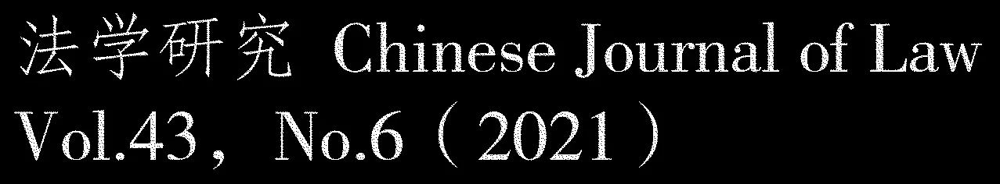

> [!abstract] 文献导读
> 中间宽栏为论文原文（黄色为原读者荧光高亮、红色波浪线为原读者下划线）；**左栏**为原读者写在左侧页边的引导问题与结构标记，**右栏**为原读者红色手写批注的工整转录。

<!--folio:第 1 页-->

<!--col:L-->

0 - 提要

1 - 前言

> [!question] 引导问题
> 1. 这篇文章要解决什么问题？
> 2. 它分了几步来解决？
> 3. 最后它给出的答案是什么？

<!--col:M-->

图 1　《法学研究》Chinese Journal of Law，Vol.43, No.6（2021）期刊刊头。

#### ·2021 年《法学研究》论坛专题·

编者按: 2021 年《法学研究》论坛以“创新驱动与国际博弈下的知识产权法研究” 为题，于6 月19 －20 日在贵阳召开，得到了贵州大学法学院的鼎力支持。《法学研究》期待以此选题为契机，积聚一流学术人才，形成一流思想成果，在创新驱动和国际博弈两个大局之下，推动我国知识产权研究学术体系和话语体系的建设。当今世界正处于百年未有之大变局，人类“地球村” 面临诸多挑战。和平稳定的国际环境需要有力维护，国际分歧和敏感问题需要建设性管控，更为公正合理的国际秩序需要引领建构。时代是理论创新的驱动和源泉。《法学研究》殷切期盼学界同仁洞察世事，具有世界眼光、全球格局、天下情怀，无愧使命担当，研究回答时代之问，为人民幸福和国家昌盛贡献更多的优秀成果。

### 全球知识产权治理博弈的深层话语构造:中国范式和中国路径

#### 邵科

内容提要: 全球知识产权治理不是比较法或私法视角能够完整洞照的领域，而是社会学及国际关系学视角下理念、框定、行动论的真切投影。唯有从细节上呈现全球知识产权治理冲突、变革、造法的内在原理，方能开辟中国方案平视西方、会通而超胜的建构式超越之路。<mark>肇建以中国文化之深层话语构造为本源的、直指全球知识产权治理变革根本困境的中国范式和中国路径，能够推动国际法律规范的重构。</mark>它符合世界文化多样性的普遍诉求，也是对海外知识产权主流学派期待“新路径”、消解西方“一元轴心” 的充分回应。在当前大国竞争的形势下，它可以成为包容产业创新与世界均衡发展的最大公约数，从而进一步颠覆美国全球知识霸权的“合法性”，并取得“义利兼顾、万物并育” 之至诚公理在世界范围内的深层共鸣。**关键词：**全球知识产权治理；知识公域；理念框定；中国范式；中国路径

#### 前言

全球知识产权治理是一个构造繁复的体系，比较法与私法的视角只是该体系中一个局部的<u>存在。</u>当前国际大势表明，倘要应对诡谲汹涌的逆全球化阴霾及遏制中国的丛林法则、为中国

邵科，南京大学法学院教授。

<!--col:R-->

> [!hand] 手写批注
> *（提要右侧，概括全文最终目的）*
> 本文最终目的，从中国文化里找资源，提出一套能改写国际规则的中国方案。

> [!hand] 手写批注
> *（前言"比较法与私法……局部的存在"红线旁，二字提示）*
> 背景

> [!hand] 手写批注
> *（页脚左下方，总括作者立场）*
> 作者说，不能只从法律角度看知识产权，得从更大的国际博弈角度看，目的是为中国找一条路。

<!--/folio-->

<!--folio:第 2 页-->

<!--col:L-->

2 - 理念力量

<!--col:M-->

全面复兴和人类命运共同体的建构提供行动支撑，则亟待深入揭示全球知识产权治理博弈的确切生态，并在其深层话语构造上提出精准有效、平视西方的中国范式和中国路径。为达此目的，实先要在细节上呈现全球知识产权治理冲突、变革、造法的运行规律。以表象而论，全球<mark>知识产权治理的博弈生态，似乎就是美国等发达国家恩威并施的贸易胁迫手段与全球其余地方的生存发展诉求在实力和技巧上的不断对峙。然而，这还不是全球知识产权治理冲突</mark>“前线”的深层样貌。〔1 〕20 世纪末以来，这个“前线” 逐渐形成了高度复合的“阵法” “兵法”，包含着支持及反对西方全球知识霸权行动的具体施动原理，特别是其背后话语构造的深层思维方式、社会习俗及历史源流。因此，如欲开辟全球知识产权治理革新理念的中国范式和中国路径，则首当在细节上、微观上洞察此“前线兵法”，然后取其精要、补其阙略。恰如明末实学<u>重臣徐光启所云，“欲求超胜，必须会通”。〔</u>2 〕

<u>有鉴于此，本文意在呈现全球知识产权治理冲突</u>“前线兵法” 之根本格式，并探求会通而超胜的中国范式和中国路径。这一视角绝非天马行空，而是对社会学及国际关系学领域极为关注的“理念力量” ( ideational<u> power)</u>

<u>的拓展，在中国特色大国外交思想中也有深厚的根砥。</u>为明斯道，亦须进行样本考察。二十年来，海外知识产权主流学派对全球知识产权治理博弈的研究，不论是实例考察抑或研究方法，产出均已浩繁。〔3 〕不过，这些研究的样本多是南方或<u>第三世界国家</u>。<u>对于复兴崛起的东方大国而言，弱国样本实难就当前全球大势提供充沛的灵</u>感。而本文例证部分所发掘者，是记录美澳双边协定中知识产权重大理念冲突之官方档案。<u>〔</u>4 〕这些档案是翔实权威的一手资料，能充分反映美国超TＲIPS 新霸权部署在主要国家之间的变局。本文对这些新样本作了文本分析( textual analysis)

研究，以洞彻西方知识产权深层话语构造与“前线兵法” 更为丰富的内在关系。通过对全球知识产权治理的真实样貌作此等细节呈现，本文所倡之以肇建东方话语构造为根本的中国范式和中国路径，方能了然。

#### 一、理念力量:

#### 全球知识产权治理变革的根本途径

探索中国范式和中国路径，不可能绕开海外知识产权主流研究的一大核心议题:

如果美、日、欧等主要创新经济体的产业与政治私利在经济、法律、商业、外交上展示的全球强权不能解释过去二十多年间全球知识产权治理冲突、变革及造法的完整现象，那么究竟是什么力量在推动这个过程? 如前所述，海外知识产权主流学派对全球知识产权治理博弈的研究，在过去二

本页注释
“前线” ( fronts) 一词，较早见于Peter Drahos，Four Lessons for Developing Countries from the Trade Negotiations over Ac-cess to Medicines，28 Liverpool Law Ｒeview 11，27 ( 2007) 。( 明) 徐光启: 《历书总目表》，载《徐光启集》卷八·治历疏稿二，中华书局1963 年版，第374 页。本注对该方面海外重要研究略举数例，其余则见下文引注。See Carolyn Deere，The Implementation Game: The TＲIPSAgreement and the Global Politics of Intellectual Property Ｒeform in Developing Countries，Oxford: Oxford University Press，2009; Keith E．Maskus et al．( eds．) ，Intellectual Property Ｒights: Legal and Economic Challenges for Development，Oxford:Oxford University Press，2014; Carlos Correa et al．( eds．) ，Intellectual Property and Development: Understanding the Inter-faces，Singapore: Springer，2019．在国际法中，条约( treaty) 与协定或协议( agreement) 二词经常互用。如《联合国宪章第一百零二条施行细则》第1 条第1 款之定义及澳大利亚外交部将自由贸易协定称为国际条约( treaty) 。见联合国官网https: / /trea-ties．un．org /pages/Ｒesource．aspx? path = Publication /Ｒegulation /Page1 _en．xml 及澳大利亚外交部官网https: / /www．dfat．gov．au /trade /agreements/trade －agreements ( 两网址均于2021 年5 月1 日最后访问) 。

<!--col:R-->

> [!hand] 手写批注
> *（左上，概括全文任务）*
> 本文要干两件事 1. 拆穿西方的玩法——在全球知识产权博弈中的实际 2. 提出中国的方案——怎么"会通而超胜"（先学透再超越）

> [!hand] 手写批注
> *（左侧，说明样本选择理由）*
> 别人都研究穷国，作者研究澳大利亚，因为中国现在面对的是大国竞争，穷国的经验不够用。

> [!hand] 手写批注
> *（"理念力量（ideational power）"右侧）*
> 研究视角

> [!hand] 手写批注
> *（"样本多是南方或第三世界国家"右侧）*
> 研究样本

> [!hand] 手写批注
> *（"本文对这些新样本作了文本分析"右侧）*
> 作者用的研究方法是"文本分析"，分析美澳协定的官方档案文本，不是空谈理论。

> [!hand] 手写批注
> *（"那么究竟是什么力量在推动这个过程？"右侧）*
> 发问

> [!hand] 手写批注
> *（右下方）*
> 研究目的

> [!hand] 手写批注
> *（右下角）*
> 文献综述

<!--/folio-->

<!--folio:第 3 页-->

<!--col:L-->

<!--col:M-->

十年间已形成丰硕的成果。这些著述都高度关注自1994 年《与贸易有关的知识产权协议》( TＲIPS 协议)

确立以来全球知识产权治理的失道与变革。它们发轫于21 世纪初全球知识产权治理领域主要人物彼得·达沃豪斯和美国国际关系专家苏珊·赛尔的开创性研究。〔5 〕通过用<u>田野考察等研究方法而掌握的大量翔实资料，两位学者在国际关系的视角下清晰勾出了两条跌</u>宕的主线:

<u>一条是对西方产业集团推行强势的TＲIPS</u> 知识产权体系之精彩还原，另一条则是对反知识产权强权跨国行动主义初步兴起的洞察。<u>〔</u>6 〕

过去二十年间，全球知识产权治理的冲突、变革及造法现象，从未摆脱过这两条主线。时至今日，知识产权学者均已熟悉达沃豪斯和赛尔的主要研究结论，即在总部大多位于美国的一小撮跨国公司的鼓动下，世界贸易组织( WTO)

架构中产生了名曰TＲIPS 协议的一整套高于<mark>以往知识产权国际条约体系的法律标准，以为美、日、欧等的全球商业利益护驾。</mark>〔7 〕比如，为匹配强国在世界数字、医药及生物技术方面的市场与技术优势，该协议的专利条款设立了远超《巴黎公约》( 1883 年)

<u>的要求，而其义务履行的强制性则胜过了先前世界知识产权组织</u>( WIPO)

的条约结构。此外，TＲIPS 协议通过合规监督、争端解决机制使被贸易捆绑的制裁报复合法化，它更是WTO 成员国入世必须签署的文本，故其全球覆盖率及影响力实非以往国际知识产权条约体系所能比拟。在铸造了TＲIPS 体系的产业集团和律师心目中，以及在WTO 争<u>端解决的早期案例里，该协议曾经被错误地视作凌驾于一国之上的</u>“超国家法”，而不是一个可由各国审度裁量的创造性架构。〔8 〕

虽然TＲIPS 协议包含的成员国立法灵活性及主权自主性仍可深入发掘，但它在总体上形成的西方产业集团主导全球化的法律模式，很快遭到发展中国家及西方社会内部的强烈反对。这支“后起之秀” 是学术、民间及新兴产业界等多元群体的组合，推动着全球反知识产权强权的跨国变革行动，二十年来略有所成、方兴未艾。由之，2001 年，世界贸易组织采纳了《TＲIPS 协议与公共健康多哈宣言》( 《多哈宣言》) <mark>，尽管局限仍多，却澄清了健康权与全球药品专利强制许可</mark>、权利穷尽等制度的关系，并给予TＲIPS 协议“不应阻碍成员国采取保障公共健康的措施” 且能够支持“成员国保障公共健康的权利，特别是增进所有人使用药品的权利” 的定位。〔9 〕2007 年，世界知识产权组织通过《WIPO 发展议程》，提出“在WIPO 规范性程序中考虑保存公有领域”、“在规范制定等活动中体认国际知识产权条约的灵活性” 及“促进遗传资源及传统知识保护进程”等内容，并将这些议程作为优先事项“纳入各项实质计划”。〔10〕

本页注释
See Peter Drahos with John Braithwaite，Information Feudalism: Who Owns the Knowledge Economy? ，London: Earthscan，2002; Susan K．Sell，Private Power，Public Law: The Globalization of Intellectual Property Ｒights，Cambridge: Cambridge U-niversity Press，2003．如达沃豪斯《信息封建主义》一书开宗明义即勾出了这两条主线。参见前引〔5 〕，Drahos 书，第16 页。另见前引〔5〕，Sell 书，第51 页以下。参见前引〔5〕，Sell 书，第1 页以下; 前引〔5〕，Drahos 书，第12 页。关于对TＲIPS 协议是否曾是凌驾于一国之上的“超国家法” 的重要分析，参见Graeme B．Dinwoodie ＆ＲochelleC．Dreyfuss，A Neofederalist Vision of TＲIPS: The Ｒesilience of the International Intellectual Property Ｒegime，Oxford: OxfordUniversity Press，2012，pp．7 －8。WTO，Declaration on the TＲIPS Agreement and Public Health，WT /MIN( 01) /DEC /2，adopted on 14 November 2001，ht-tps: / /www．wto．org /english /thewto_e /minist_e /min01_e /mindecl_trips_e．htm，last visited on 2021 －05 －10．《多哈宣言》的局限不只是内生性的，也与南方国家接受自贸协定超TＲIPS 标准等外部环境有关。另见相关权威研究:Carlos Correa ＆Duncan Matthews，The Doha Declaration Ten Years on and Its Impact on Access to Medicines and the Ｒight toHealth: Discussion Paper，UNDP，2011，p．21。WIPO，Development Agenda for WIPO，https: / /www．wipo．int/ip －development/en /agenda /，last visited on 2021 －05 －20．

<!--col:R-->

> [!hand] 手写批注
> *（"彼得·达沃豪斯和……苏珊·赛尔"右侧）*
> "初始人物"

> [!hand] 手写批注
> *（TRIPS 段落右侧，概括 TRIPS 本质）*
> TRIPS 不是自然而然形成的，是美国跨国公司推动的、服务于西方商业利益的规则。

> [!hand] 手写批注
> *（《多哈宣言》右侧）*
> 反霸权方的第一个重大胜利——多哈宣言，确认了公共健康优先于药品专利。

<!--/folio-->

<!--folio:第 4 页-->

<!--col:L-->

<!--col:M-->

2008 年，世界卫生组织启动《公共健康、创新和知识产权:

全球战略与行动计划》，提出了同时促进创新和药品可及性的并行思路，比如通过建立自愿专利池及奖励等多元激励方式，促使研发成本和药价脱钩。〔11〕

同时，TＲIPS 协议对可及性的挑战也受到联合国人权及粮农体系的关注，因之确立了一些与健康权、农民权利及农业植物遗传资源保护有关的国际义务，包括不得以政治或经济施压来限制药品及医疗设备之提供的义务，以及确保全球粮食和农业植物遗传资源的保护、交换、可持续利用和公平分享的义务等。〔12〕另外，在传统知识、遗传资源及生物多样性等方面，全球范围内多样化的造法活动也不断出现。在印度、巴西等发展中国家，产生了旨在限制外国专利权的法律创新及机制创新，一些跨国公司也因之并迫于人权的压力而在发展中国家降低药价或撤回专利侵权诉讼。〔13〕在西方国家内部，则出现了声势浩大的知识共享、开源软件等社会运动，对法律实务、产业发展及创新模式均有持久影响。要之，在过去二十年间，发展中国家及西方社会内部形成了不限于WTO—TＲIPS 及WIPO 体系的跨国治理变革行动，是条约、软法及行动策略的多元化结合。〔14〕

可见，过去二十年全球知识产权治理中“以弱胜强” 的变革现象，无法以“有钱说了算”的强权心态解释，也不符合经济和科技发展必然拥戴知识产权保护递增的通说，更推翻了源自西方经济学的公共选择理论。依此理论，政治行为或集体行动与经济行为无异，均由人的物质私利驱动。比如，美国制度经济学主要人物曼瑟尔·奥尔森认为，理性的个人不仅不会为消除社会通货膨胀而自减用度，因为他知道这是微不足道的，而且还会观望别人的动向。因此，他也不会在社会集体行动中为了松散的共同利益而为他人付出，何况协调、组织大型群体活动均非易事。〔15〕的确，在西方的决策程序中一向存在哈佛大学教授永才·班卡所说的偏袒知识产权扩张的“系统性失衡”，因为发展中国家等弱者群体的诉求、动机、能力是偏分散的，而利益较一致的西方产业集团则只需调动一小撮说客，就有望左右立法机构的决断。〔16〕

那么，究竟是何种力量令学术界、民间组织及发展中国家等原本分散的群体团结起来，且在全球知识产权治理变革中取得了阶段性成就呢? 近二十年来，海外知识产权主流研究的结论

本页注释
WHO，Global Strategy and Plan of Action on Public Health，Innovation and Intellectual Property，Elements 4．32 ( 4．3) and5．34 ( 5．3) ，2011，p．13，p．15．有关评述见WHO，Access to Medicines: Making Market Forces Serve the Poor，2017，p．21，https: / /www．who．int /publications/10 －year －review /chapter －medicines．pdf，last visited on 2021 －05 －10．2001 年，联合国粮农组织大会通过了《粮食和农业植物遗传资源国际条约》。人权与健康权则见UN Committee onEconomic，Social and Culture Ｒights，General Comment No．14: The Ｒight to the Highest Attainable Standard of Health( Art．12) ，UN Doc．E /C．12 /2000 /4，11 August 2000，Art．41，https: / /www．refworld．org /pdfid /4538838d0．pdf，lastvisited on 2021 －05 －10。哈佛大学学者露思·渥可德冀用“法律创新” 和“机制创新” 二词描述了后TＲIPS 时代印度及巴西的造法活动。Ｒuth L．Okediji，Legal Innovation in International Intellectual Property Ｒelations: Ｒevisiting Twenty-One Years of the TＲIPS A-greement，36 University of Pennsylvania Journal of International Law 191 ( 2014) ．我国有学者指出了WTO 体制外知识产权造法的多元现象。参见刘笋: 《知识产权国际造法新趋势》，《法学研究》2006 年第3 期，第146 页以下。有关同时期国际知识产权法的变革动向，参见吴汉东: 《知识产权国际保护制度的变革与发展》，《法学研究》2005 年第3 期，第132 页以下。See Mancur Olson，The Logic of Collective Action: Public Goods and the Theory of Groups，Cambridge，Mass．: Harvard Uni-versity Press，1971，p．46，p．166．See Yochai Benkler，Through the Looking Glass: Alice and the Constitutional Foundations of the Public Domain，66 Law andContemporary Problems 173，196 ( 2003) ．

<!--col:R-->

<!--/folio-->

<!--folio:第 5 页-->

<!--col:L-->

<!--col:M-->

是，唯有社会学上的框架行动理论方能解释这一现象。〔17〕框架( frame)

是美国社会学理论家<mark>厄文·高夫曼对社会运动所提出的定性研究的重要方法，是社会学、国际关系学及传媒学高度交叉的核心领域。高夫曼将框架定义为“诠释之图解” ( schemata of interpretation</mark>) ，即根据自我经验和社会背景而生的用以解释理念的认知结构。<mark>〔18〕</mark>此词怪异，不如中国文化所说的<mark>“各以其情而自得”</mark> 贴切。〔19〕换言之，人生境地悬殊，对事物的看法亦异，因而见一诗一画，不<mark>免各有分说。通常来讲，如果没有不同认知框架出现，人们甚至根本意识不到近乎不证自明的自身框架之存在，所谓</mark>“只缘身在此山中”。因此，选择框架或曰框定( framing) ，乃是一种意义上的建构、<mark>园林般的框景，多是对更大的理念乃至潮流的对焦，须与地域</mark>、风俗、文化、信仰等背景不同的受众在具体情事上产生共鸣，而绝对不能自说自话、一厢情愿。〔20〕它是推理说理、琢磨共识的对话或话语构造，有一定的辩论成分在内，也可能混淆视听，但却在根本上要基于对自我和受众处境的某种双向理解方能产生意义。

框架说高度符合当代西方社会之真实样态，是洞察因西方而起的全球知识产权治理冲突变革的明镜。西方产业集团认知结构中的TＲIPS 样板，绝不只是个人权利、尊重财产等西式名词的简单堆砌。它是西方传统价值观在美国三十年新自由主义潮流里的巧妙框定。〔21〕从20 世纪70 年代以来，凯恩斯经济学开始让位于新自由主义。新自由主义不易界定，但总体上它将市场和经济原理视为最重要的社会组织逻辑，认为“不受节制的资本制度或自由市场经济” 是实现个人自由、经济增长及分配正义的最佳途径。〔22〕它是全球化潮流里最极端的形式，金融全球化及知识产权全球最大化均是其主梁。〔23〕因此，西方产业集团及其说客不只是在TＲIPS协议形成过程中诉诸洛克财产权论及功利主义，更不只是四处争辩恐吓，而是使洛克财产权论及功利主义等西方法律传统在新自由主义坚信的“全球自由贸易” 时尚中引起美国政客、国会、律师、产业界乃至渴望繁荣的发展中国家等受众的某种共鸣。因为有这种共鸣，那些自觉或无意识构思的游说框架才会声称，全球知识产权的最大化不只符合美国经济的利益，也对发展中国家的民生及全球创新有益。〔24〕当然，西方产业集团的理念构造中，饕餮私欲与新自由主义信条长期纠缠不清，更一贯借助于其花言巧语、以偏概全的强大游说，惑乱世人不浅。

同样，反对西方知识产权强权的群体也自觉或无意识地规划了框定之法。这一群体绝不只是呐喊不公、争取发声，而是将其主张框定在当代西方反霸权社会运动的思潮之中。其根源是

本页注释
参见相关权威研究: Susan K．Sell ＆Aseem Prakash，Using Ideas Strategically: The Contest between Business and NGO Net-works in Intellectual Property Ｒights，48 International Studies Quarterly 143 ( 2004) ; John S．Odell ＆Susan K．Sell，Ｒefra-ming the Issue: The WTO Coalition on Intellectual Property and Public Health，2001，in John S．Odell ( ed．) ，NegotiatingTrade: Developing Countries in the WTO and NAFTA，Cambridge: Cambridge University Press，2006，pp．85 －114; AmyKapczynski，The Access to Knowledge Mobilization and the New Politics of Intellectual Property，117 ( 5 ) Yale Law Journal804 ( 2008) 。See Erving Goffman，Frame Analysis: An Essay on the Organization of Experience，London: Penguin Books，1974，p．21．引文出自( 明) 王夫之: 《薑斋诗话笺注》卷一《诗译》，人民文学出版社1981 年版，第4 页。西方知识产权界对高夫曼框架说及奥尔森理论的深入阐述，参见前引〔17〕，Kapczynski 文，第811 页以下。参见前引〔5〕，Drahos 书，第70 页; Joe Wills，Contesting World Order: Socioeconomic Ｒights and Global Justice Move-ments，New York: Cambridge University Press，2017，p．159。See Christine B．Harrington ＆Z．Umut Türem，Accounting for Accountability in Neoliberal Ｒegulatory Ｒegimes，in MichaelW．Dowdle ( ed．) ，Public Accountability，Designs，Dilemmas and Experiences，Cambridge: Cambridge University Press，2006，p．204; David Kotz，Globalization and Neoliberalism，14 Ｒethinking Marxism 64 ( 2002) ．赛尔对该背景作了回溯。参见前引〔5〕，Sell 书，第17 页以下。关于这种双向有益的框定话语，参见前引〔17〕，Kapczynski 文，第848 页。

<!--col:R-->

> [!hand] 手写批注
> *（左侧，对应"框架（frame）/诠释之图解"论述）*
> 每个人因为经历不同，看同一件事的角度不一样。

<!--/folio-->

<!--folio:第 6 页-->

<!--col:L-->

> [!question] 引导问题
> 1. 作者说推动全球知识产权变革的根本力量是什么？
> 2. "框架"和"框定"有什么区别？
> 3. 西方霸权方和反霸权方，各自用了什么理念框架？

<!--col:M-->

运用马克思主义理念来挑战新自由主义“剥夺性积累” ( accumulation by dispossession)

的构造，即认为新自由主义是通过对公共及个人土地与财产之掠夺来集中权力和财富。〔25〕在当代美国知识产权的学术语境里，这种剥夺性积累被称为“第二次圈地运动”，即信息领域的圈占、掠夺。〔26〕和强权一方略显肤浅的理论功底相比，反对一方由西方知识产权领域的重要学者领衔，深入构建了以西方法学传统之公域( the commons)

为内涵的一系列哲学体系，并以之形成了获取知识( access to knowledge)

特别是获取药品( access to medicines)

的全球运动。〔27〕在全球来讲，知识公域的框定过程还不限于此，它也在更普遍的去西方中心思潮中展开。比如，获取药品、农民权利和开源共享等三种主要诉求，分别与公共健康方面的人权、世界环保主义及信息自由等当代西方内部的思潮密切相合。〔28〕惟其如是，方才引起了西方社会内部及原属西方殖民地的部分发展中国家的广泛共鸣，亦使美国的政客、议员及产业巨头不能置之不闻。

<mark>框定了理念，才谈得上行动( 又称动员) ，乃指跨国地整合理念一致的群体，并通过框定的理念及主张来回应现实危机或问题，并最终促成全球变革。〔</mark>29〕这不是简单地说要团结起来，而是须理念和框架均能先在细处相合。西方学术界、国际民间组织及发展中国家等原本分散的群体，通过国际法架构下的人权及健康权等框架生起共鸣，进而形成了多元交互的国际行动。〔30〕国际民间组织如第三世界网络( TWN) 、科技消费者项目( CPTech) 、农业与贸易政策研究所( IATP)

及曾获诺贝尔和平奖的无国界医生组织( MSF) ，动员了世界银行、世界卫生组织、联合国开发计划署( UNDP)

等国际组织，以及仿制药商、原住民群体及部分发展中国家的政府，通过国际会议、公众教育、媒体舆论、网站邮件、公开信及在日内瓦形成的理念相似的专业群体等复合网络，使南北各国之决策者、立法者及公众意识到知识产权强权对发展和创新的危害，并因之取得了前述全球知识产权治理变革的阶段性成就。〔31〕

不过，从根本上说，框定行动之法还只是“前线兵法” 的外壳，理念力量才是内核。前述所谓框架，是人根据自我经验和社会背景而生的用以诠释理念的认知结构。理念的内涵很广，可以包括文化、哲学、准则、范式、理论及思想等，其中尤以哲学为根本，当然也包括自我利益。〔32〕归根到底，理念是对个体或群体所认为正当之利益、福祉的关切与维护。美国论述制度论( discursive institutionalism)

创始人芬雯·史孟特认为，理念力量是推动机制变革的

本页注释
关于全球知识产权领域的社会运动与反霸权潮流的关系，参见前引〔21〕，Wills 书，第163 页。See Yochai Benkler，Free as the Air to Common Use: First Amendment Constraints on Enclosure of the Public Domain，74 NewYork University Law Ｒeview 354 ( 1999) ; James Boyle，The Second Enclosure Movement and the Construction of the PublicDomain，66 Law ＆Contemporary Problems 33 ( 2003) ．“获取知识” 理念的重要里程碑是2006 年耶鲁大学举办的“获取知识” 学术会议。See Jack Balkin，What is Accessto Knowledge? ，https: / /balkin．blogspot．com /2006 /04 /what －is －access －to －knowledge．html，last visited on 2021 －05 －01．参见前引〔21〕，Wills 书，第165 页; 前引〔17〕，Kapczynski 文，第852 页以下。参见前引〔17〕，Sell 等文，第152 页以下。有关西方社会运动背景下民间组织如何通过框定人权观念而在WIPO 及WTO 等国际组织中推动知识产权规则革新的翔实研究，参见Duncan Matthews，Intellectual Property，Human Ｒights and Development: The Ｒole of NGOs and SocialMovements，Cheltenham: Edward Elgar，2011。参见前引〔3〕，Deere 书，第134 页以下; Duncan Matthews，NGOs，Intellectual Property Ｒights and Multilateral Institu-tions，Ｒeport of the IP-NGOs Ｒesearch Project，2006，p．18，https: / /qmro．qmul．ac．uk /xmlui /bitstream /handle /123456789 /179 /IP －NGOs% 20final% 20report% 20December% 202006．pdf; jsessionid = 7B887047BCF2294904F78DD5A59D952F? sequence = 2，last visited on 2021 －05 －12; 前引〔17〕，Sell 等文，第161 页以下。See John Campbell，Institutional Change and Globalization，Princeton: Princeton University Press，2004，p．90．

<!--col:R-->

> [!hand] 手写批注
> *（"框定了理念，才谈得上行动（又称动员）……"高亮段右侧，解释"行动"）*
> 行动：把理念一致的人组织起来，用统一的叙事去推动改变。光有理念不够，还得有人行动。

<!--/folio-->

<!--folio:第 7 页-->

<!--col:L-->

3 - 话语构造

> [!question] 引导问题
> 1. 作者说"真正的理念，当以道德为本，而真正的道德，不能是一己之说，而须是将心比心、中和周正之说。"
> 2. 怎么理解"将心比心、中和周正"？这和西方的"辩论式对话"有什么不同？

<!--col:M-->

根本原因，而不是偶尔起作用的因素。〔33〕这种力量是通过沟通、分析或论证来发挥作用，而不是诉诸武力、威胁、权势或资源的较量。因此，它类似于框定视角下的意义建构，不只是提供一些看法、论点，而是必须在特定的情境脉络或语境中组合形成一种深度力量。〔34〕不过，框定行动论似乎更强调话语选择和受众策略，而理念力量的重心终究在于理念，即理念为框定和行动之本。

<mark>赛尔曾有一根本之问:</mark>

<mark>在全球知识产权治理中，理念的框定和行动不必然取胜，那么何种理念会产生真正的说服力? </mark>赛尔说，国际关系学研究对此尚无太多启示，而她倾向于认为，<mark>“道德论说” 的作用最为重要</mark>。〔35〕这实际上也是对西方社会学范畴内理念框定视角的一个提<mark>醒，因为这个视角的侧重点是对受众的说服或与小群体既有立场或利益的共鸣，而不是内涵周</mark>全、启人良知的道德理念，久则不免各执一词。〔36〕各执一词的“博弈式对话” 是当代西方的社会风俗，遍见于其竞选议事及游说活动中，也出现在美国早期获取知识的社会运动中。〔37〕倘若对理念的框定在根本上是博弈的，频繁用于证明对方绝对错误、鼓动社会热点情绪并策略性地向受众部署观点，那么这种博弈式对话恐怕无法产生深远长久的共鸣。<mark>真正的理念，当以道德为本，而真正的道德，不能是一己之说，而须是将心比心、中和周正之说。</mark>

至此，前面所提之核心问题，其答案皆已了然。西方学术界、国际民间组织及发展中国家等原本分散的群体之所以能推动全球知识产权治理的变革，根本上在于理念力量的框定和行动。言之有理的共鸣框架，可以激发人们心中忽略的观念，使谈判、议事或立法过程的参与者认识到知识产权与自由贸易并不可专宠，其他价值同样珍贵。因此，唯有理念、框定、行动之法，才是全球知识产权治理“前线兵法” 之完整格式。不过，在这一“兵法” 之中，尚待厚植“万物并育” 的思想和论说风格，因为全球治理之良政，最终不能靠西方风俗里我是你非的辩论法，而要靠深层道德力量与天下苍生普有之良知的共鸣。

#### 二、话语构造:

#### 海外知识产权学派与治理变革的理念来源

理念力量既然是全球知识产权治理变革之根本途径，那么是怎样的理念推动了变革? 前已揭，这种理念植根于以知识公域为内涵的哲学体系，它是全球获取知识运动的基石。然而，倘欲昭示这一哲学体系的深层话语构造，还须呈现与其相关的思维方式、社会习俗及历史源流，以深层地映显出中国范式和中国路径建构式超越的登临之处。

以知识公域为中心的知识产权哲学体系，在法理论上，源自20 世纪末美国法学界对知识产权扩张主义的批判，以戴维·朗格和杰茜卡·里特曼为该研究的先驱。〔38〕此后，哈佛、杜

本页注释
See Martin B．Carstensen ＆Vivien A．Schmidt，Power through，over and in Ideas: Conceptualizing Ideational Power in Discur-sive Institutionalism，23 ( 3) Journal of European Public Policy 318，322 －324 ( 2016) ; Vivien A．Schmidt，Discursive In-stitutionalism: The Explanatory Power of Ideas and Discourse，11 Annual Ｒeview of Political Science 306，313 ( 2008) ．参见上引Schmidt 文，第311 页; 上引Carstensen 等文，第323 页。参见前引〔17〕，Odell 等文，第110 页。此种倾向可见芬雯·史孟特等将理念力量定义为“影响他人” 的力量，其中未显见道德一义( 参见前引〔33 〕，Carstensen 等文，第321 页) 。有关疑虑可参见Laurence Ｒ．Helfer，Mapping the Interface between Human Ｒights and Intellectual Property，in ChristopheGeiger ( ed．) ，Ｒesearch Handbook on Human Ｒights and Intellectual Property，Cheltenham: Edward Elgar，2015，p．12。See David Lange，Ｒecognizing the Public Domain，44 Law ＆Contemporary Problems 147 ( 1981) ; Jessica Litman，The Pub-lic Domain，39 Emory Law Journal 965 ( 1990) ．说。‡

<!--col:R-->

> [!hand] 手写批注
> *（"赛尔曾有一根本之问……"高亮段右侧）*
> 不是所有理念都能赢，赛尔认为关键是"道德论说"，真正有道德力量的理论才能打动人。

<!--/folio-->

<!--folio:第 8 页-->

<!--col:L-->

<!--col:M-->

克的法律学者如劳伦斯·莱斯格、永才·班卡、詹姆士·博义尔等，对此进行了深入考察，一批研究成果在2003 年由美国《法律及当代问题》学刊结集发表。博义尔更喊出了“反对第二次圈地运动” 的口号，将知识产权扩张主义比作15 世纪英国出现的圈占公地、据为私有的现象。〔39〕<mark>公域的概念，原是英美土地法上的，在知识产权领域，初指公有的公域(</mark> public do-main) ，后又包括共管之共域( the commons) 。<mark>公有的公域如语言、科学发现及思想本身等，而共管之共域则如自由软件等由特定群体治理的开放式创新</mark>。在相关研究中，此二词时有混用，故本文对此也不作明确区分。〔40〕

知识公域哲学的内容端绪较多，也渐渐涵括下文将涉及之诺贝尔经济学奖得主埃利诺·奥斯特罗姆( Elinor Ostrom)

的经济学分析遗产。然考其根本特性，均是主张保持充沛的、活跃的、不受西方知识产权<mark>“独占” 模式统治的知识保存、开发和应用，亦即开放、共享的自由取用( access</mark>) 。〔41〕与知识产权相比，知识公域希望通过自由取用实现更具参与性、合作性的知识治理模式。〔42〕<mark>在莱斯格看来，取用不必是无成本的，但却不应是由知识产权产生的成本，故而自由取用不是无财产权的反义，而是对独占权的反对，亦是对知识圈地妨碍取用的反</mark>对。〔43〕一言以蔽之，“取用” 一词是西方知识公域哲学的灵魂和核心，肇兴于对知识圈地的不满。因此，它坚决抵制知识圈地“对公民知情权的民主原则的破坏”，反对“围占”，主张“拿回” 知识公域，呼吁信息要“像风一样可以自由呼吸”。〔44〕而当该哲学形成之获取知识和药品的运动在西方内部及全球兴起后，自由取用的理念更变成了不受束缚压迫的代名词。〔45〕

取用与圈地之争，并非只是西方当代社会的局部思潮冲突。它的深层构造里，包含着西方法哲学史数百年的遗留问题。传统上，英美知识产权法的法理基础有二:

一是洛克财产权论，二是功利主义。前者源自英国著名哲学家约翰·洛克，以财产权为其学说之核心。洛克财产权<mark>论认为，人拥有自己的身体，所以只要他使任何东西脱离了自然状态，就</mark>“已经掺入了他的<mark>劳动，并已在此物上增加了他个人的东西，从而使之成为他的财产</mark>”。<mark>〔</mark>46〕值得注意的是，洛<mark>克财产权论之所以风靡于17 世纪的英国，并非因为洛克是圈地剥削者，而恰恰是因为他认为</mark>赋予个人财产权是反抗君主剥削的根本前提。〔47〕对洛克来说，个人财产权是身处17 世纪英国的他急于宣扬的价值。所以，在洛克的思维方式里，财产权具有自然法上的无上尊严，是凛然

本页注释
前引〔26〕，Boyle 文，第33 页以下。其混用情况参见前引〔38〕，Litman 文，第975 页。含义之重合见前引〔26 〕，Boyle 文，第62 页。两者之区别见Amy Kapczynski，Access to Knowledge: A Conceptual Genealogy，in Gaёlle Krikorian ＆Amy Kapczynski ( eds．) ，Access toKnowledge in the Age of Intellectual Property，New York: Zone Books，2010，pp．30 －32。关于公域与知识产权统治的互斥性，参见Lawrence Lessig，The Architecture of Innovation，51 Duke Law Journal 1783，1788 ( 2002) 。关于公域和独占权的互斥性，参见前引〔26 〕，Benkler 文，第362 页。关于公域的功能，参见Charlotte Waelde ＆Hector MacQueen ( eds．) ，Intellectual Property: The Many Faces of the Public Domain，Cheltenham:Edward Elgar，2007，pp．xi －xii。See Yochai Benkler，Coase’s Penguin，or，Linux and the Nature of the Firm，112 Yale Law Journal 369，375 ( 2002) ．See Lawrence Lessig，Free Culture: How Big Media Uses Technology and the Law to Lock Down Culture and Control Creativity，New York: Penguin，2004，p．xiv．有关引述见Nancy Kranich，Countering Enclosure: Ｒeclaiming the Knowledge Commons，in Charlotte Hess ＆Elinor Ostrom( eds．) ，Understanding Knowledge as a Commons: From Theory to Practice，London: The MIT Press，2007，p．86; 前引〔26〕，Benkler 文，第446 页; 前引〔26〕，Boyle 文，第33 页。参见前引〔17〕，Kapczynski 文，第32 页。John Locke，Second Treatise of Government，in Peter Laslett ( ed．) ，Two Treatises of Government，London，1821，p．209．See Justin Hughes，The Philosophy of Intellectual Property，77 Georgetown Law Journal 287，296 ( 1988) ．

<!--col:R-->

> [!hand] 手写批注
> *（"公有的公域……共管之共域"右侧，区分两种公域）*
> 公域分两种：①本来就是公有的（语言、科学发现）；②大家一起管理共享的（开源软件）。

> [!hand] 手写批注
> *（"开放、共享的自由取用（access）"右侧）*
> 知识公域的灵魂就是"自由取用"，知识不该被独占，应该开放共享。

> [!hand] 手写批注
> *（"自由取用不是无财产权的反义，而是对独占权的反对"右侧）*
> "取用"不是说完全免费，而是说不该因为知识产权垄断而人为抬高成本。反对的是"独占"，不是反对所有权利。

> [!hand] 手写批注
> *（"洛克财产权论"段右下方，梳理洛克逻辑链）*
> 洛克的逻辑：你劳动了 → 劳动成果就是你的财产 → 知识产权就是保护这种财产权。

<!--/folio-->

<!--folio:第 9 页-->

<!--col:L-->

> [!question] 引导问题
> 1. 作者说洛克财产权论和功利主义是美国霸权的"哼哈二将"。
> 2. 你觉得这两个理论各自的弱点是什么？为什么它们组合在一起会有这么大的说服力？

<!--col:M-->

而不可侵犯、不能被任何人剥夺的。此种强势的风格虽有无可厚非的历史成因，却早已成为英美知识产权霸权思维最根本的渊源。这种思维至今延续着19 世纪美国法理学家莱散德·斯坡纳的逻辑——— “没有什么比思想更适合独占权”，亦即“排除所有他人的独占、独掌及独享之权”。〔48〕

洛克并非没有论及公域。他认为，“在公域( common)

之内，只要给他人留下足够且良好的资源，则除他( 劳动者)

以外的任何人不得对之( 劳动果实)

享有权利”。这个思维方式实在不是为了保卫充沛开放的公域，而是为了证明“任何对土地的个人占有都不是对其他人的不公，因为自然界有着足够的土地和水源( 公域) ”。〔49〕洛克的学说里随处可见对立概念的并用，因此在西方哲学史上也从未停止过对洛克思想的诠释。〔50〕<mark>不过，以英美知识产权历史本</mark>身观之，或至少在主导了TＲIPS <mark>协议形成的美国产业巨头看来，洛克财产权论就是对神圣、排他的独占权的捍卫，而公域不过是一个永远充沛自足的隐形点缀</mark>。在美国政府及产业界日复一<mark>日对别国知识产权保护表达不满的文字里，充斥着这样的思维方式</mark>。比如对外国“大规模盗窃美国知识产权” 以致“偷走美国就业岗位和财富” 行为的不断鞭挞，以及誓言通过“包括贸易手段在内的一切法律职权”来确保“外国的知识产权盗贼” “再也无法获得不义之财”。〔51〕这些“理直气壮” 的思维方式中，从来不见知识公域的影子，也没有平等发展的权利。

在当代英美法中，功利主义对知识产权的影响似乎更深。然而，不能忽略洛克财产权论与功利主义的历史合流及其在司法中的并用。〔52〕功利主义认为，如果法律不能通过赋予独占权来禁止复制侵权所致之市场失效，人们就不可能产生创造、投资知识产品的动力。〔53〕这种思维的倾向是，只要授予了知识产权，充足的激励和创造力就会自然产生，社会因之也将不断获得新知识和福利的增长。<mark>然而，它关心的不过是知识产权的不断增加，而不是知识创造后的分配正义。〔</mark>54〕比如，在美国年度301 <mark>报告中，知识产权的正当性就被极度化约为最大经济回报的需要，且又与神圣的劳动一同构成了谴责别国的道德标准</mark>。事实上，洛克财产权论和功利主义的混搭，实是美国知识产权全球霸权的“哼哈二将”。它们导致了强势、绝对的“知识产权财产化”，亦即过去数十年间从美国发展出的“最具革命性的法律变迁”。〔55〕

可见，英美法哲学史数百年的遗留问题，是当前全球知识产权治理失道的观念之源。而西方学者最本能的第一反应，自然是回溯到上述“取用与圈地之争” 这个谱系上，为保卫被洛

本页注释
Lysander Spooner，The Law of Intellectual Property: An Essay on the Ｒight of Authors and Inventors to a Perpetual Property intheir Ideas，Boston: Bela Marsh，1855，p．15，p．58．前引〔46〕，Locke 书，第210 页，第214 页。See Peter Drahos，A philosophy of Intellectual Property，Canberra: Australian National University Press，2016，pp．51 －52．United States Intellectual Property Enforcement Coordinator，Annual Intellectual Property Ｒeport to Congress，2018，p．1，p．11，https: / /trumpwhitehouse．archives．gov /wp －content /uploads/2017 /11 /2018Annual_ IPEC _ Ｒeport _ to _ Congress．pdf，last visited on 2021 －05 －12．See Adam Mossoff，Ｒethinking the Development of Patents: An Intellectual History，1550 －1800，52 Hastings Law Journal1255，1297 ( 2001) ; William Fisher，Theories of Intellectual Property，in Stephen Ｒ．Munzer ( ed．) ，New Essays in the Le-gal and Political Theory of Property，Cambridge: Cambridge University Press，2001，pp．173 －174．See Edwin C．Hettinger，Justifying Intellectual Property，18 Philosophy ＆Public Affairs 31，34 －35 ( 1989) ．See Madhavi Sunder，IP3，59 Stanford Law Ｒeview 257，284 ( 2006) ．See Michael A．Carrier，Cabining Intellectual Property through a Property Paradigm，54 ( 1 ) Duke Law Journal 1，4 －7( 2004) ．关于财产权话语构造和美国当代知识产权扩张的关系，参见William Fisher，The Growth of Intellectual Prop-erty: A History of the Ownership of Ideas in the United States，in David Vaver ( ed．) ，Intellectual Property Ｒights: CriticalConcepts in Law，Vol．1，London: Ｒoutledge，2006，p．85。

<!--col:R-->

> [!hand] 手写批注
> *（洛克段右上方，指出美国对洛克理论的片面化）*
> 美国产业巨头把洛克理论极端化，只强调"独占权和排他"，完全无视洛克也提到的"要给他人留足够良好的公域"。

> [!hand] 手写批注
> *（功利主义段右侧，指出其盲区）*
> 功利主义只算"保护专利能不能激励更多创新"，不算创新成本分配公不公平；比如穷国的穷人吃不起，它不管。

> [!hand] 手写批注
> *（"哼哈二将"段右侧，概括美国策略）*
> 美国靠这两个理论组合，把知识产权变成了绝对的、神圣的财产权，推向全世界。

<!--/folio-->

<!--folio:第 10 页-->

<!--col:L-->

<!--col:M-->

克财产权论和功利主义侵占的知识公域寻找新的诠释。这种诠释还不只是西方法哲学内部的思潮涌动，它也得益于全球知识产权研究高度跨界的宏大体系。数十年来，这种宏大的视野在史学、社会学、经济学及国际关系学等领域不断拓展，对整个西方知识产权制度进行了深刻的解构和质疑。〔56〕如前述，知识产权国际关系的视角，其首要任务是对西方产业集团推行强势的TＲIPS 体系的角色作精彩还原，以揭示理念对全球治理变迁的影响。事实上，在TＲIPS 体系形成时，英美法哲学传统中的强势财产权思维弥漫于西方产业巨头及其说客的立场中，并融入新自由主义的潮流而成为说服各国的主要“理念力量”。〔57〕国际关系视角的洞照，使这种偏颇的强势理念及其游说辩术公之于众，为知识公域理念引起各方的深思共鸣廓开了空间。

为知识公域理念廓开共鸣空间的不止是国际关系研究。国际关系学揭示的西方强势知识产权的惯性思维，在欧美历史谱系中早就一脉相承，只不过前者是当代史，而后者是近世史。史学方面，数十年来已有一众名家对之作了条分缕析的解构，尤以1993 年欧洲文学出版史权威马克·罗斯之名著《作者和所有权人》为代表。〔58〕在这些研究面前，当代西方的全球知识霸权瞬间失去了合法性。人们不断追问，如果英美强势的知识产权制度模式只是西方近世和当代的———甚至不是西方更久远传统里的———为什么其他文明必须接受?〔59〕令这种合法性更受质疑的是西方主流经济学家对知识产权能否增进创造动能及世界均衡发展的保守态度，以及社会心理学家对不限于知识产权的多样化动力导向的深入考察。〔60〕奥斯特罗姆甚至运用特有的模型分析了代替知识产权的公域新规则与人的策略、行为选择之间的互动关系。〔61〕

上述海外知识产权研究高度跨界的、具有道德内涵的深层话语构造，为知识公域理念建立了一个广泛的共鸣框架。而且，这个框架又与西方内部及发展中国家反知识霸权、反新自由主义的广泛诉求深度契合，从而在人权及健康权等国际大框架内开创了范式转换。〔62〕知识公域的哲学体系将旨在保障健康权的获取药品行动框定为一项基本人权。相反，新自由主义更倾向于将医疗产品等视为神圣专利权供给的商品。〔63〕在南北医疗和财富水平悬殊的情况下，这种

本页注释
对这一体系的揭示，参见邵科: 《跨界的视域: 西方知识产权研究菁藻与东方观察》，载《人大法律评论》2019年第2 辑，法律出版社2020 年版，第69 页以下。关于洛克财产权论在形成TＲIPS 协议中的根本作用，参见A．Samuel Oddi，TＲIPS -Natural Ｒights and a“Polite Formof Economic Imperialism”，29 Vand．J．Transnat’l L．415，432 ( 1996) 。代表性著作参见John Feather，A History of British Publishing，London: Ｒoutledge，1988; Mark Ｒose，Authors and Own-ers: The Invention of Copyright，Cambridge，Mass．: Harvard University Press，1993; Brad Sherman ＆Lionel Bently，TheMaking of Modern Intellectual Property Law: The British Experience，1760 －1911，Cambridge: Cambridge University Press，1999。此类追问遍见于海外知识产权研究之中，知名论述可见Carla Hesse，The Ｒise of Intellectual Property，700 B．C．– A．D．2000: an Idea in the Balance，Daedalus，Spring，2002，pp．26 －45。经济学方面的研究见William M．Landes ＆Ｒichard A．Posner，The Economic Structure of Intellectual Property Law，Cam-bridge，Mass．: Harvard University Press，2003; Carsten Fink ＆Keith E．Maskus ( eds．) ，Intellectual Property and Develop-ment: Lessons from Ｒecent Economic Ｒesearch，Washington，D．C．: World Bank; Oxford: Oxford University Press，2005。社会心理学方面见哈佛大学教授泰瑞莎· 艾默白的研究: Beth A．Hennessey ＆Teresa M．Amabile，The Conditions ofCreativity，in Ｒobert J．Sternberg ( ed．) ，The Nature of Creativity: Contemporary Psychological Perspectives，Cambridge:Cambridge University Press，1988，pp．11 －42。参见Elinor Ostrom ＆Charlotte Hess，A Framework for Analyzing the Knowledge Commons: a Chapter from UnderstandingKnowledge as a Commons: from Theory to Practice，载前引〔44〕，Hess 等编书，第41 页以下。劳伦斯·海尔弗是这方面的主要人物。See Laurence Ｒ．Helfer，Toward a Human Ｒights Framework for Intellectual Prop-erty，40 U．C．Davis Law Ｒeview 971 ( 2007) ．参见前引〔21〕，Wills 书，第167 页。

<!--col:R-->

<!--/folio-->

<!--folio:第 11 页-->

<!--col:L-->

4 - 美澳样本

<!--col:M-->

道德上的剧烈冲突使得全球各界很快意识到强势知识产权与国际人权法律体系要求的“实现经济、社会及文化权利” 之间的确“存在实际或潜在冲突”。〔64〕这些权利至少包括联合国《世界人权宣言》第25 条第1 款规定的与健康、福利及医疗有关的权利。由之，知识产权在国际法上变成了低于健康权的权利，从而亦不得在贸易协议中与获取药品的法律及政策相抵触。〔65〕

二十年前，知识公域的主要发起人、哈佛大学法学教授莱斯格问道:

为什么给非洲的救命药卖得和在美国一样贵? 等到一整代人心中的常理最终起来反抗，我们将如何交待我们的所作所为?〔66〕这振聋发聩的喝问，如同当头一棒，多少人因之顿时语塞并发现原来疏忽了分配正义、健康发展权或知识公域这些理念。这一喝问也引起了反西方霸权心理的天然共鸣，使得知识公域甚至在哲学建构尚未精深之时，就能一举而席卷全球。由之可见，西方出现的知识公域思潮与获取知识运动，并非哲学一己之功，是高度跨界、具有道德内涵的海外知识产权研究之深层话语构造，托起了它思想的力量，并在对更广泛的全球反西方霸权诉求的框定之中，使西方学术界、国际民间组织、发展中国家等原本分散的群体，在有关知识、药品和人类发展的新共识下，觉察到了洛克财产权论、功利主义及新自由主义的狭隘，进而共同促成了全球知识产权治理的阶段性变革。

#### 三、样本甄选:

#### 美澳知识产权重大理念冲突

至此可知，推动全球知识产权治理变革的理念，乃是框定在全球具体背景中的、以知识公域为核心的深层话语构造。为进一步了解这种“前线兵法”，还应举出样本实例。以往这方面的研究，均侧重于发展中国家，对中国的样本意义甚微。在当前国际形势下，中国面临的是大国竞争的机遇性挑战，包括美国的自贸协定全球部署及超TＲIPS 新霸权生态。对中国而言，发展的关键在于创新与合作，这既不是巴西、印度或菲律宾的公共健康危机诉求，也不是美国早年知识公域运动“像风一样自由” 地“拿回” 知识公域、反对圈占的浪漫主义社会风貌。〔67〕不过，需要提前说明的是，没有一个国家的样本可以成为中国的样板，所以实例绝非捷径。别国“前线兵法” 的意义，并不在于是否对中国有实践价值，而在于样本的多样性、差异性可以更有质感地呈现中国范式和中国路径的超越之路。

是故，在样本的选取上，要既能映显美国超TＲIPS 新霸权部署在主要国家之间的变数，也能洞照西方知识产权深层话语构造与“前线兵法” 更为丰富的、不限于发展中国家的内在关系。为此，本文拟以体现2005 年《美澳自由贸易协定》( AUSFTA)

所涉知识产权重大理念冲突之官方档案作为分析样本。在迄今与美国签订自贸协定的国家中，仅新加坡、澳大利亚、加拿大、韩国属于发达国家，且仅档案较少的2004 年《美新自由贸易协定》之签署略早于美澳

本页注释
引文源于2000 年联合国人权体系与WTO—TＲIPS 体系首次正面对峙所公布的重要决议。UN Sub-Commission on theProtection and Promotion of Human Ｒights，Sub-Commission on Human Ｒights Ｒesolution，UN Doc．E /CN．4 /Sub．2 /Ｒes/2000 /7，p．1，https: / /www．aaas．org /sites/default/files/SＲHＲL /PDF /IHＲDArticle15 /E －CN_4 －SUB_2 －ＲES －2000 －7_Eng．pdf，last visited on 2021 －11 －06．See Ｒobert Howse ＆Makau Mutua，Protecting Human Ｒights in a Global Economy: Challenges for the World Trade Organiza-tion，in Hugo Stokke ＆Anne Tostensen ( eds．) ，Human Ｒights in Development: Yearbook 1999 /2000，London: Kluwer LawInternational，2001，p．82．参见前引〔43〕，Lessig 书，第260 页以下。比如，当前过多强调知识产权的弱保护，对中国已无意义。参见前引〔14〕，吴汉东文，第140 页。

<!--col:R-->

<!--/folio-->

<!--folio:第 12 页-->

<!--col:L-->

<!--col:M-->

协定。事实上，美澳协定是1995 年TＲIPS 协议生效以来美国超TＲIPS 新霸权全球部署的重大行动，被美国视作其他自贸协定的范本。〔68〕该协定第17 章之知识产权条款，长达31 页，是体量最庞大、内容最繁复的一章。围绕第17 章产生的争议，含有发达国家与美国知识产权根本理念冲突的珍贵溯源信息。以2018 年达成的《美国、墨西哥及加拿大协定》( USMCA)

观之，加拿大与美国知识产权冲突的话语构造并未超越澳大利亚确立的先例。〔69〕

本文所选档案，是翔实权威的一手资料，海外尚无相关研究。〔70〕它们是发达国家档案保存及公开的完整文本。这些档案以澳大利亚国会2004 年《美澳自由贸易协定最终报告》( 以下简称“最终报告”) 、澳联邦政府生产力委员会2016 年《知识产权诸协议调查报告》( 以下简称“调查报告”)

及相关材料为中心，也包括美国政府数个贸易咨询委员会的美澳协定系列报告，堪称西方内部知识产权理念冲突的“工笔描摹”。比如，“最终报告” 是全澳各界548份呈文及13 场听证会笔录的精华总结，凡386 页，其中有近100 页讨论美澳知识产权争议。相比之下，澳大利亚国会2016 年的《跨太平洋伙伴关系协定报告》及2018 年的《跨太平洋伙伴全面进步协定报告》，涉及知识产权的一共才16 页。而“调查报告” 则说理更详，达766页，可与“最终报告” 互为映照。〔71〕从社会学文本分析的角度来看，分散于档案各处的争论内容可以构成有意义的整体，并显现出整个话语构造。〔72〕在美国超TＲIPS 新霸权野心日炽的当下，这种美国与其盟友知识产权理念冲突的话语构造亟待揭示。

很多人可能意想不到，作为美国主要盟友的澳大利亚，在全球知识产权治理上却与美国一直存在根本的理念冲突。如以文本分析法将这种冲突放入全球知识产权治理的深层话语构造中，即可清晰看见澳大利亚以“取用” ( access)

为根本的、高度跨界的道德论说结构。“最终报告” 论说的第一步，是对美国主张的知识产权回报原理作根本否定。上文已示，洛克财产权论、功利主义与新自由主义的合流，是美国产业集团全球扩张的根本理念力量。在2004 年美国贸易政策知识产权产业功能咨询委员会向美国总统及国会递交的《美澳自由贸易协定报告》中，这种强势张狂的新自由主义气息弥漫始终。〔73〕这个美国大药商、大制片商及游说巨头高管领衔的委员会，只字不提澳大利亚及发展中国家的情况，一心只热衷于“增加全球创

本页注释
“范本” 一说，见美国贸易政策知识产权产业功能咨询委员会向美国总统及国会递交的专门报告: IFAC-3，Advi-sory Committee Ｒeport to the President，the Congress and the United States Trade Ｒepresentative on the U．S．-Australia FreeTrade Agreement，2004，p．2，https: / /ustr．gov /archive /assets/Trade_Agreements/Bilateral /Australia_FTA /Ｒeports/asset_upload_file813_3398．pdf，last visited on 2021 －05 －20。见2020 年实施之加拿大《专利药品条例》中加拿大政府的立场: Department of Health，Ｒegulatory Impact AnalysisStatement -Ｒegulations Amending the Patented Medicines Ｒegulations，in Canada Gazette，Part I，Vol．151，No．48，Decem-ber 2，2017。海外研究多分析贸易协定对澳大利亚的影响，而非档案文本或话语分析。See Andrew Mitchell，The Australia-UnitedStates Free Trade Agreement，in Ｒoss Buckley et al．( eds．) ，Challenges to Multilateral Trade: The Impact of Bilateral，Prefer-ential and Ｒegional Agreements，Alphen aan den Ｒijn: Kluwer Law International，2008，pp．115 －123．Senate Select Committee of Parliament of Australia，Final Ｒeport on the Free Trade Agreement between Australia and the UnitedStates of America，2004，https: / /www．aph．gov．au /Parliamentary _ Business/Committees/Senate /Former _ Committees/freetrade /report /final /index，last visited on 2021 －05 －20; Productivity Commission，Intellectual Property Arrangements In-quiry Ｒeport，No．78，2016，https: / /www．pc．gov．au /inquiries/completed /intellectual －property /report /intellectual －property．pdf，last visited on 2021 －05 －20．文本分析是极为复杂和开放的研究方法，能加强对话语构造的理解，本文仅涉其通义。See Norman Fairclough，Analysing Discourse: Textual Analysis for Social Ｒesearch，London: Ｒoutledge，2003，pp．2 －3．“张狂” 一词，受到了哈佛大学教授澹宁·罗爵克著作之书名的启发: Dani Ｒodrik，Straight Talk on Trade: Ideas fora Sane World Economy，Princeton: Princeton University Press，2017。

<!--col:R-->

<!--/folio-->

<!--folio:第 13 页-->

<!--col:L-->

<!--col:M-->

新及信息产品贸易”、保证权利人“控制其成果使用”、“确保经济发展程度不同的订约国均采用美国保护标准” 及“强势使用特别301 等传统手段”，以实现“美国那种合理的激励水平”和“公平回报”。该委员会还专门用下划线标示出以上立场的根本依据——— “( 超TＲIPS 标准的)

知识产权强保护符合所有国家的利益，和一国经济境况无关”。〔74〕时距《多哈宣言》及联合国知识产权与发展冲突决议等颁布已有三年，美国产业集团仍作此惊世之语，令人瞠目。

对于类似以上新自由主义一贯语焉不详的说辞，“最终报告” 作了彻底反驳。2004 年，澳大利亚智库国际经济学中心( CIE)

为美澳协定的影响提供了经济学分析。该分析指出，因研究方法存在争议，故仅能得出无法确定版权期限延长的社会成本之结论。同时，它又认为这种成本是可以忽略的。〔75〕这无疑是在知识产权的经济学研究素无定论的状况下，给美式观点提供了变相支持。而在“最终报告” 搜集的证据看来，国际经济学中心的经济学分析存在根本缺陷，也忽略了相关领域的主流研究，非但广遭批评，而且是“十足地悖理”。“最终报告”倾向于认为，那些支持知识产权扩张的各类经济学分析，往往缺乏具体数据及实际证据，且擅于妄下结论、夸大事实，是“不足为信” “瑕疵极大” “难以服人” 的。〔76〕从美国产业界公布的一些知识产权经济分析报告来看，确有此种通病。

“最终报告” 还指出，绝大多数呈文认为，版权期限延长将导致版税与许可及交易成本的增加以及创新动机的下降，这将对澳大利亚的学校、图书馆、文化机构及公众造成“严重后果”。它也倾向于认为，没有任何事例表明，如果不和美国标准接轨，澳大利亚“已经或必将因其不合理的知识产权保护而错失投资或贸易机遇”，或者一旦接轨，就一定会带来巨大利益。〔77〕这类观点并非信口雌黄。加拿大政府在2017

2020 年新修其《专利药品条例》时就指出，过去二十年间给予了美国大药商很高标准的专利保护，换来的却是加拿大药价的畸增和研发投入的逐年下降。〔78〕而与“最终报告” 一脉相承的“调查报告”，因其研究性质而对经济学着墨甚多。总体上，“调查报告” 认同诺贝尔经济学奖得主、坚决的反新自由主义者约瑟夫·斯蒂格利茨( Joseph Stiglitz)

的观点，即过度保护的知识产权是对创新及知识取用的遏阻。〔79〕

用经济学来质疑新自由主义，是以其人之道还治其人之身，能在根本上动摇其合法性。而“最终报告” 解构美式话语构造的第二步，则是从国际关系的角度揭示美式理念强大游说的蒙蔽性。“最终报告” 显示，美国政商界为美国争取“优势”、为“所有美国人提供更多更高薪的工作” 并为“美国一些最具竞争力的产业赢得经济扩张机会” 的诉求很明显。〔80〕的确，在美国政府大量的知识产权报告中，对美国驰骋全球的重商主义从不讳言。白宫知识产权执法协调员办公室《2020 年度知识产权报告》就说，创新产业是“赚钱多的行当”，故需“保护创新经济这个美国伟大的竞争优势”。当然，这些诉求是通过理念而非“比武” 来表述的。既然知识产权全球博弈的根本驱动器是理念而非武力，那么美国利益也只能是新自由主义全球化理

本页注释
参见前引〔68〕，美国贸易政策知识产权产业功能咨询委员会报告，第3 页以下，第10 页以下。See Centre for International Economics，Economic Analysis of AUSFTA: Impact of the Bilateral Free Trade Agreement with theUnited States，2004，p．39; 转引自前引〔71〕，“最终报告”，第49 页。前引〔71〕，“最终报告”，第49 页，第59 页以下，第77 页。同上引报告，第62 页以下。参见前引〔69〕，加拿大卫生部报告。参见前引〔71〕，“调查报告”，第4 页。同上引报告，第50 页以下。

<!--col:R-->

<!--/folio-->

<!--folio:第 14 页-->

<!--col:L-->

<!--col:M-->

念的一部分，即“美国强大，世界也强大”，美式知识产权标准符合所有国家的利益。〔81〕然而，此类理念大多是美国产业集团通过以“理” 服人、诱人偏听偏信的游说活动来散布的，贪欲与正理长期纠缠不清，故其辩术也早已不得人心。因此，“最终报告” 也自然不会重蹈TＲIPS协议谈判之时发展中国家听信美欧日“理念” 游说的覆辙。它特别引述了澳大利亚大学校长委员会( AVCC)

对美国知识产权游说活动“骇人听闻”的评语，并指出，如果认为美国游说集团“将在美澳协定上偃旗息鼓，那就是天真到了极点”，因为美国政客已经声称，美澳协定只是促使“我们的澳大利亚朋友” 明白得要“为研发多花钱” 这个普遍真理的“第一步沟通”。〔82〕

在解构游说活动运用“理念” 的蒙蔽性之后，“最终报告” 也精当地涉及了一些史学和哲学的交叉点。甫一开篇，它就将知识产权定义为“垄断”，且全文不时以垄断呼之。〔83〕选用此词，并非任意之举。在美国早期法律中，版权、专利属于法定垄断而不是财产。从美国国父托马斯·杰斐逊开始，版权和专利就不是自然法、普通法上的权利，而是一切须以“社会的意愿与福祉为前提” 的、为刺激知识创新而由法律赋予的“奖励” ( reward) 。〔84〕若以美国1909 年版权法的立法背景来看，知识产权是否合法，完全取决于它如何“利益了大众”、有无“妨碍大众”。〔85〕可是，当代美国没有实现美国版权法泰斗雷曼·帕特森回到法定垄断原则的遗愿，而是在过去数十年间在全球四处推行强势、绝对的“知识产权财产化” 霸权规则。〔86〕

可见，在“最终报告” 的话语构造中，使用“垄断” 一词意在点出当前美国强势的知识产权在其本国法律史上也不具备永久合法性。在此基础上，“最终报告” 认为，知识产权应称作“政策工具” ( policy instrument) ，用来实现一定的“社会及经济目标”，必须是平衡的、灵活的、不断调整的，因为过分强大的知识产权将束缚创新和公众利益。〔87〕不论法定垄断抑或政策工具，在21 世纪之初都属于海外知识产权哲学研究兴起时的根本思潮。1996 年，全球知识产权治理领域主要人物彼得·达沃豪斯在西方知识产权哲学领域的开山之作《知识产权哲学》一书中，就率先提出了应视知识产权为拟制垄断权和实现人文目标之工具。〔88〕时至今日，这一观点早已在西方主流学界深入人心。

通过经济学、国际关系学及史学与哲学交叉的视角，“最终报告” 完成了对新自由主义光环及其背后各种话语构造的祛魅，进而自如地展开了以“取用” 为根本的、高度跨界的道德论说结构。在“最终报告” 中，公域、取用、公共健康、获取知识及获取药品等话语不时可见。比如，将美澳协定视为对“利润垄断的商业欲望而不是我国公域” 的强化、对“作为充沛创造力源泉之公域的妨碍”、对“获取知识的缩减与对创新的束缚”，以及对“公共健康及全民获取药品” 的漠视。〔89〕这些理念具有普遍的道德合法性，因此当美澳协定企图对澳大利

〔81〕〔82〕〔83〕〔84〕

本页注释
前引〔51〕，美国知识产权执法协调员报告，第2 页，第31 页。前引〔71〕，“最终报告”，第71 页，第119 页。同上引报告，第xvii 页。See Thomas Jefferson，Letter from Thomas Jefferson to Isaac McPherson ( Aug．13，1813 ) ，in Andrew A．Lipscomb ( ed．) ，The Writings of Thomas Jefferson，Vol．13，Washington，1903，pp．334 －335; U．S．Patent Office，Official Gazette of the U-nited States Patent Office，Vol．825，Washington，1966，p．30．Library of Congress，Annual Ｒeport of the Librarian of Congress，Washington，1942，p．374．See Lyman Ｒay Patterson ＆Stanley W．Lindberg，The Nature of Copyright: A Law of Users’Ｒights，Athens: The Universityof Georgia Press，1991，p．xii．前引〔71〕，“最终报告”，第54 页。参见前引〔50〕，Drahos 书，第253 页。前引〔71〕，“最终报告”，第62 页，第67 页以下，第107 页以下。

<!--col:R-->

<!--/folio-->

<!--folio:第 15 页-->

<!--col:L-->

<!--col:M-->

亚的药品定价权及药品可及性横加阻挠时，必然激起民众的愤慨。〔90〕而在美国方面，一些议员也基于良知提出，不应用贸易政策去“霸凌” ( bullying)

澳大利亚的医疗体系，因为“我们( 美国)

肯定不会接受别国的这种要求”。〔91〕美国劳动咨询委员会在2004 年给美国总统、国会的报告中，则提出美澳协定的超TＲIPS 条款妨害了《多哈宣言》健康优先原则和仿制药可及性，“违反了美国国会的谈判目标”，是给“待议中的贸易协定开了极坏的先例”。〔92〕这些理念的交相整合，旨在全面冲击美式知识产权“真理” 的合法性。

据前揭，发展中国家的“取用” 之论，是通过框定人权理念的大潮而实现全球治理变革的。然而，人权在《多哈宣言》第5 条TＲIPS 协议灵活性范围内的适用，在国际法上只是知识产权的例外措施。澳大利亚不存在第三世界国家的公共健康危机，很难在人权大框架中取得与美国博弈的正当性。为此，澳大利亚选择框定了另一种理念——— “国家利益”。这个理念在“最终报告” “调查报告” 中出现超过六十次，而人权一词却从未提及。国家利益的理念，在澳大利亚的立国语境中地位极高，是外交、通商、订约及外资政策的根基。比如，澳当局在2015 年委任生产力委员会评估知识产权诸协议时即称，“过度的知识产权保护会导致过高的成本并束缚创新”，这是对外订约时“国家利益分析” 的一部分。〔93〕而起草“最终报告” 的专门委员会，正是为评估美澳协定对国家利益之影响而成立的。当然，澳大利亚的国家利益理念在操作中并无明确界定，须权衡对本国经济、文化及社会的影响。〔94〕

综观“最终报告” 的话语构造，它开宗明义且反复提到的一个概念是，澳大利亚是知识产权的净进口国，并明确指出这是国家利益分析需要评估的。〔95〕净进口国的说法，似乎是澳大利亚经济学界和法学界的共识，“调查报告” 对此也作了极周详的分析，认为澳大利亚知识产权进出口的差距日益恶化，且支付购买外国版权及专利产品的成本过高，不利于国计民生。〔96〕这些话语构造，均直指美澳协定妨害了澳大利亚的国家利益，亦即其经济、文化及社会发展空间。而保持世界一流的医疗体系，更是澳大利亚国家利益的核心理念，是该国任何政客或利益群体均不敢触碰的红线。比如，上述生产力委员会在长达1568 页的《2016 年政府服务报告( 健康卷) 》中指出，“确保药品可及与提升所有澳大利亚居民的健康水平”，是澳大利亚政府的使命。

〔97〕正因如此，“最终报告” 强调，“必须根据国家利益来保留设计我国健康政

·361·〔90〕〔91〕〔92〕

本页注释
前引〔71〕，“最终报告”，第52 页，第102 页，第133 页，第135 页。同上引报告，第102 页。Labor Advisory Committee for Trade Negotiations and Trade Policy，Ｒeport to the President，the Congress and the United StatesTrade Ｒepresentative on the U．S．-Australia Free Trade Agreement，2004，pp．11 －12，https: / /ustr．gov /archive /assets/Trade_Agreements/Bilateral /Australia_FTA /Ｒeports/asset_upload_file298_3385．pdf，last visited on 2021 －05 －06．See Commonwealth of Australia，Australian Government Ｒesponse to the Competition Policy Ｒeview，Canberra，2015，p．8，ht-tps: / /treasury．gov．au /publication /government －response －to －the －competition －policy －review，last visited on 2021 －05 －06．参见前引〔71〕，“最终报告”，第xiii 页，第29 页。同上引报告，第47 页以下。参见Ann Capling ＆John Ｒavenhill，Australia’s Flawed Approach to Trade Negotiations: and Where Do We Sign ? ，69 ( 5)Australian Journal of International Affairs 496，503 ( 2015) ; 前引〔71〕，“调查报告”，第4 页，第77 页，第98 页以下。Productivity Commission，Ｒeport on Government Services 2016: Volume E Health，2016，p．E．6，https: / /www．pc．gov．au /research /ongoing /report －on －government －services/2016 /health /rogs －2016 －volume －health．pdf，last visited on2021 －05 －25．

<!--col:R-->

<!--/folio-->

<!--folio:第 16 页-->

<!--col:L-->

5 - 中国范式

<!--col:M-->

策的灵活空间”。〔98〕

由于美澳文化同源，因此一旦澳大利亚祭出国家利益的理念大旗，则这种对西方普遍认知结构中全民权益的共鸣式框定，必然使得美国不敢妄动。换言之，在国家利益共识框架下提出的以“取用” 为根本的、高度跨界的道德论说结构，在美澳之间产生的威力绝不逊于发展中国家的人权理念框架。由之，澳大利亚虽依美澳协定第17．10．4 条从美国引进了专利链接制度，却同时创造性地在其医疗用品法中增设了专利链接的政府索赔机制，使澳当局能通过动辄数亿美元的巨额赔偿之诉，对美国大药企狙击该国药品定价的巧讼之计，产生强大震慑。〔99〕尽管美国政府及其产业集团在近年的特别301 体系中，不断指责澳大利亚政府的专利链接之诉是对美国专利权人的“歧视” “不敬” 及对美澳协定的违反，并对澳大利亚在强制许可、生物仿药、数据保护及专利审查等方面更倾向于公益的修法动向“深感忧虑”，它们也很难冒西方内部之大不韪而恣意摇撼作为澳大利亚国家利益核心价值观的公共健康。〔100〕

由上可见，美澳协定档案中详载的美澳知识产权重大理念冲突，实反映了美国与其盟友在全球知识产权治理深层话语构造上的根本矛盾。它不仅是三十年来世界反知识霸权运动“前线” 的重要样貌，更包含了理念框定行动论中有别于发展中国家“前线” 样态的新“兵法”。法无定法，在澳大利亚来讲，其根本理念固是沿用以“取用” 为核心的西方知识公域体系，但在更大的理念或认知结构的框定上，则以国家利益理念置换了人权理念。这种理念的框定绝不只是书斋里的风暴。事实上，“最终报告” 摘录的548 份呈文，来自权威专家、高校、文化机构、科研组织、软件群体等，其论述方式多与全球知识产权主流研究之话语构造如出一辙，因之共同形成了“最终报告” 所说的“绝大部分” 或“压倒性多数”。这些汇聚的理念力量，在现实中支撑着强烈反对美国霸权的联合行动。〔101〕此种行动也从未停歇。在2017 年《跨太平洋伙伴全面进步协定》( CPTPP)

的订约过程中，它们也促成了对原先《跨太平洋伙伴关系协定》( TPP)

一些超TＲIPS 条款的冻结，并在立法程序上加入了防范解冻风险的法律机制。〔102〕

#### 四、大国风范:

#### 中国范式和中国路径的建构式超越

以上揭示全球知识产权治理冲突“前线” 之深层样貌及其“兵法” 的根本格式，绝不是为了给中国提供范例。吾人须深知，没有一个国家可作为中国的样板。真正的范例，本源在人心良知的格物穷理，而不在向外探求的劳碌追觅中。换言之，真正可行的道路，是在洞察全球知识产权治理变革的始末之后，回到中国本位和文化自信，取其精要、补其阙略，在理念哲学

本页注释
前引〔71〕，“最终报告”，第140 页。See e．g．，Commonwealth of Australia v．Sanofi ( formerly Sanofi-Aventis) ［2015］FCAFC 172．See e．g．，Office of the United States Trade Ｒepresentative，2018 Special 301 Ｒeport，p．15，https: / /ustr．gov /sites/default/files /files/Press/Ｒeports/2018% 20Special% 20301．pdf，last visited on 2021 －05 －21; Pharmaceutical Ｒesearch and Manufac-turers of America，Special 301 Submission 2020，pp．190 －198，https: / /phrma．org / －/media /Project/PhＲMA /PhＲMA －Org /PhＲMA －Org /PDF /0 －9 /PhＲMA －2020 －Special －301 －Submission．pdf，last visited on 2021 －05 －19．前引〔71〕，“最终报告”，第58 页，第62 页。See Parliament Joint Standing Committee on Treaties，Ｒeport 181: Comprehensive and Progressive Agreement for Trans-Pacific Part-nership，Canberra，2018，p．56，https: / /www．dfat．gov．au /sites/default/files/jscot －report．pdf，last visited on 2021 －05 －19; Australian Government，Australian Government Ｒesponse to the Joint Standing Committee on Treaties Ｒeport 181，2019，p．2，https: / /www．dfat．gov．au /sites/default /files/government －response －jscot －inquiry －on －tpp －11．pdf，last visited on2021 －05 －19．

<!--col:R-->

<!--/folio-->

<!--folio:第 17 页-->

<!--col:L-->

<!--col:M-->

与框定选择上契入，完成会通而超胜的建构式超越之路。

此种旨在增葺全球知识产权治理变革深层话语构造的中国范式和中国路径，宜从“四有”展开:

形势有变、理念有异、框架有缺、文化有别。第一，形势有变。当下，全球知识产权治理变革的“前线”，实际危局已深。过去二十年，这些变革虽有所成，却日益受到美国双边及区域自贸协定超TＲIPS 条款各个击破战术的分化。美式霸术当然必将告败，澳、加及南方国家在知识产权上也不会与美同心，但美国愈发强势的( aggressive)

胁迫立场，〔103〕却映显出全球知识产权治理变革的根本困境，即新自由主义和知识公域思潮长期各执一词、未能调和的深层冲突。此一思想鸿沟若不跨越，则“理直气壮” 的美国不可能轻易让步。在美国看来，许多国家自由、共享地“取用” 美国知识产权的顽固立场“荒谬绝伦”，故在特朗普时代最终“破罐破摔”，大幅转向以强势推行美国标准、分化区域势力、遏制中国复兴来图谋美国“尊重知识产权” 理念的全球落地。〔104〕

今全球大疫未平，美国的行动却已全面开始。通过鼓动各经济体及关联经济体退出现有全球化格局，美国欲建立起全球产业分散配置、以美国为各分化区域“封建领主” 的有限全球化，〔105〕而美式知识产权则是这种有限全球化的城墙。事实上，美国预修的各处超TＲIPS 堡寨正在加紧升级，以给各区域内的美国利益最大化铺路。用特别301 体系对中小型发达国家如加拿大等恫吓利诱，进而部署<u>《美墨加协定</u>》( 2018 年)

那样的超强势知识产权结构，即是显例。除了整合各处堡寨，美国也在全面筑造全球知识产权的高城深堑，亦即外交、贸易、法律和商业之“四重策略”，包括对“一切法律手段的有效使用”。〔106〕这些策略旨在限制美国科技与世界( 特别是中国)

的交流，如以出口管制改革法( 2018 年)

管控新兴重大技术外流，规划建立知识产权风险国数据库，制裁外国“知识产权盗窃机构”，从日本和欧盟开始缔结新同盟，巧用世界知识产权组织以及出台保护美国知识产权法案( 2020 年)

等。〔107〕美国这种全球秩序重组行动，绝不会止步于遏制中国复兴，而是要儆效尤、<u>施恩威，令世界以美为王。</u>

以上全球形势之变局，将中国卷入其中。在美国的西方中心主义思维看来，中国要么取代美国成为全球强势知识产权秩序的新霸主，要么和澳、加及南方国家一样，成为美式知识产权“真理” 的破坏者<u>。〔108</u>〕这种思维，拘泥在新自由主义和知识公域思潮的深层冲突里，和中国真正的形势实在了不相干。经过数十年积累，中国在实践中已从汲取他国经验升华至立足本土、格物穷理的新境界。中国创新大国复兴和知识产权强国的道路，以及在自由贸易协定等国际层面的创造性开拓，均不同于新自由主义和知识公域思潮的隔阂畛域，而是呈现出包容、共

·561·〔103〕〔104〕〔105〕

本页注释
“强势” 是美国政府的明文表述。参见前引〔100〕，美国贸易代表办公室报告，第5 页。关于美国政府对南方立场的抨击，参见前引〔21〕，Wills 书，第161 页。参见郑永年: 《有限全球化: 世界新秩序的诞生》，东方出版社2021 年版，第92 页。达沃豪斯在2002 年即发出警告，各国在知识产权上极可能被美国双边或区域自贸协定各个击破。前引〔5 〕，Drahos 书，第208 页。另见戴勇斌: 《全球化与地方化: 从全球化到“再封建化”》，《澎湃新闻》2020 年10 月2 日。关于对加拿大等国施压的全面升级，参见前引〔100 〕，美国贸易代表办公室报告。关于四重策略，参见前引〔51〕，美国知识产权执法协调员报告，第3 页。参见以下重要报告: The Commission on the Theft of American Intellectual Property，IP Commission 2019 Ｒeview: Progressand Updated Ｒecommendations，2019，pp．2 －6，https: / /www．nbr．org /wp －content /uploads/pdfs/publications/ip_com-mission_2019_review_of_progress_and_updated_recommendations．pdf，last visited on 2021 －05 －25。对中国究竟是全球知识产权规则的追随者、破坏者还是创造者的海外最新论述，参见Peter Yu，The Ｒise of Chinain the International Intellectual Property Ｒegime，in Ka Zeng ( ed．) ，Handbook on the International Political Economy of Chi-na，Cheltenham: Edward Elgar，2019，pp．424 －425。

<!--col:R-->

<!--/folio-->

<!--folio:第 18 页-->

<!--col:L-->

<!--col:M-->

存的东方思维新气象。〔109〕在全球疫情之下，中国率先将新冠疫苗定义为全球公共产品，并率先在国际上推进疫苗技术转让、联合研究、共同生产等多样化可及方案，即是对西方知识产权利益最大化行为和南方国家单一的强制许可诉求之局限性一并超越的明证。

事实上，全球形势之变局，与其说是一种压力，毋宁说激起一种志气，使得国人愈益关注此前陌生乃至盲目憧憬的西方之真实样貌，复又出现一种前所未有的全面渴求，以探索究竟如何才能精准有效地消弭外部世界误解，达成心灵理念共鸣，肇建引领全球新变革的中国范式和中国路径。正是在百年未有之大变局的大时代背景下，理念有异、框架有缺、文化有别的自主性观照，才更显其迫切意义。

第二，理念有异。探求中国范式和中国路径，须充分体认到，当前全球知识产权治理的根本困境，实在于西方理念的困境。美式知识产权的强势思维，固是全球知识产权治理冲突的祸首，但以“取用” 为本的、从西方内部兴起并盛行于许多国家的知识公域运动，也有其内在缺陷。知识公域的立论倾向于否定个人创造，而认为创造的本质是累积的集体现象，因之个人财产权也必须禅位于共享。〔110〕前已揭，知识公域是西方内部回应强势知识产权制度及其历史遗留问题的产物，故其反制思维也受制于西方视域，无法跳脱“个人与共享”、“财产与取用”的二元对立。久之，便成为其思维定势———知识产权是坏的。至于激励创新是否绝对不需要知识产权，或者有力的知识产权保护是否无法与创新、共享并存，知识公域的思潮并不真正关心。而现行国际法下人权与健康权的架构，也只是对困顿潦倒国家的例外救济，远非一国壮大自我创新与发展的自强之道。〔111〕

以上种种西方思维之定势，既不符合中国的文化传统，也不符合我创新大国复兴之路的实践经验。有没有可能构想出不受西方观念束缚的全新理论，使之既能完整诠释创新动机及激励机制的多样性，又能赋予知识产权、使用权和发展权一视同仁的合法性，是当前全球冲突各方均不能再回避的根本问题，亦已在诸如作为全球公共产品的疫苗、国家创新战略下的“非西方原教旨主义” 知识产权制度目标、蓬勃多样化的回报激励生态等中国特色知识产权实践中呼之欲出。〔112〕因之，亟需在中国范式和中国路径上深度挖掘理念有异的根本问题，亦即在哲学建构上为全球知识产权治理理念之最核心部分增色。

第三，框架有缺。如前述，理念框定是全球知识产权治理变迁的根本途径，因为只有理念与理念框架或曰认知结构相异的受众产生共鸣，方能凝聚行动的力量。可是，前文所论的两种大框架，即国际法体系中的人权健康权理念与澳大利亚的国家利益理念，均无法适用于中国，亦不应适用于中国。人权框架的国际时事背景过于复杂，且远非自强之道，仅适合占人道主义

本页注释
包容共存模式之例，参见Ken Shao，The Ideas Boom: The Innovation Economy in the Post-ChAFTA Australia-China Ｒela-tionship，in Colin B．Picker et al．( eds．) ，The China-Australia Free Trade Agreement: A 21st-Century Model，Oxford: Hart，2018，pp．336 －340。See Jessica Silbey，Comparative Tales of Origins and Access: Intellectual Property and Ｒhetoric of Social Change，61 ( 1) CaseWestern Ｒeserve Law Ｒeview 265 －266 ( 2010) ．类似批评参见前引〔37 〕，Helfer 文，第12 页; Angelina Godoy，Of Medicines and Markets: Intellectual Property andHuman Ｒights in the Free Trade Era，Stanford: Stanford University Press，2013，p．106; Ｒuth Okediji，Intellectual Propertyin the Image of Human Ｒights: A Critical Ｒeview，in Ｒochelle Cooper Dreyfuss ＆Elizabeth Siew-Kuan Ng ( eds．) ，FramingIntellectual Property Law in the 21st Century: Integrating Incentives，Trade，Development，Culture，and Human Ｒights，Cam-bridge: Cambridge University Press，2018，p．284。有关中国拒绝西方“知识产权原教旨主义”、独立探索制度设计的多视角洞察，参见吴汉东: 《知识产权理论的体系化与中国化问题研究》，《法制与社会发展》2014 年第6 期，第109 页以下。

<!--col:R-->

<!--/folio-->

<!--folio:第 19 页-->

<!--col:L-->

<!--col:M-->

上风的贫穷国家。而中国若采用澳式国家利益框架，则更将因制度和价值观不同而激起西方反制。我们必须反复提醒自己，西方对中国知识产权和创新充满了错综复杂的误解，绝非发声、辩护就能轻易消弭。倘要使东方理念为外人服膺，特别是在西方更广泛的社会群体中得到共鸣，实需先明了中西方对话中究竟缺失了什么共鸣“框架”。否则，单纯提出学术论据或展示中国创新和知识产权的具体成就，有时反而会加剧这种误解。

何以故? 因为西方对中国文明依然几无所知，由之我们的理论、诉求、发展模式或社会现象才会被具有不同认知框架的西方严重误读，遑论共鸣。所以，郑永年先生才极具远见地说，要想有西方听得懂的国际话语权和文化软实力，必须先建立中国的知识体系，即改变中国人不了解自己、无法解释“中国是谁” 的问题。〔113〕知识体系是一种最根本的理念框架，而全球知识产权治理恰好是昌明中国本位知识体系的上好的新话语源，因为中国文化的本质是通过生生不息的知识创造来实现内外兼修、斯文典雅、成人成己、万物并育的文明之治。〔114〕这种文明之治，是对人的精妙创造力和美善本性的阐扬，也是最能解释“中国是谁” 的知识体系。它是西方能听懂的语言，符合世界文化多样性的普遍诉求，西方意识形态无法公然反对。它符合人类对美好生活的普遍认知与追求，是一种更大的理念或潮流，能得到西方知识产权研究主流思潮及各国受众内心良知的共鸣，并成为全球知识产权治理变革正当性的新框架。一旦外部社会了解到，生生不息的文明之治就是“中国是谁” 的答案，一个从误解转向敬意和支持的巨大共鸣框架就会形成。只有在生生不息的文明之治的大框架中，诠释创新动机及激励机制的多样性、赋予创造者和使用者一视同仁之合法性的东方理念，以及中国在创新和知识产权上孜孜不倦的努力，方能获得更广泛的认同和信任，而不会被错解为功利与权谋。

第四，文化有别。现有全球知识产权治理变革的思想来源，俱是西方的。不论是洛克财产权论、功利主义、新自由主义，还是取用、共享、知识公域、人权体系、获取知识运动，均具有深刻的西方背景。新自由主义和知识公域虽然势不两立，却又是某一历史时刻“相同文化经验” 的投影。〔115〕比如，在有意或无意中，人权框架本身仍属于西方自由传统的谱系，所以健康权才被拘泥为知识产权的例外，而非一种从更高的理论上确立的、能真正抗衡知识霸权的使用权，故亦未能阻止美式知识产权规则的持续扩张，更觉察不到“政府主导的公共健康体系” 远比自由市场有效。〔116〕而框定行动论及论述制度论范畴中的理念力量，在西方往往落实为各执一词的争辩、设立议题或舆论渲染等策略，不免缺乏将心比心、推心置腹的心灵沟通。这些均制约了全球知识产权治理变革的创造性发展。为此，吾人当不为西方文化羁缚，转而沉潜于自己的传统与当下，格物穷理，用中国文化的风格、思维及气质为全球知识产权治理的根本困境贡献新的灵感、激扬新的共识。事实上，西方知识产权主流研究并不期待中国学唱西方话语，而是好奇中国文化能为世界提供什么新视角，以消解西方“一元轴心” ( unitary axis)

对人类的桎梏。〔117〕以上“四有” 指向的具体之中国范式和中国路径为何? 在中国范式来讲，概有两大核心

·761·〔113〕〔114〕

〔115〕〔116〕〔117〕

参见郑永年:

《通往大国之路:

中国的知识重建和文明复兴》，东方出版社2012 年版，第1 页以下。参见邵则宪:

《昭隆传统之大美:

中国文化如何成为全球治理的建构者》，清华大学出版社2019 年版，第59 页以下。Gaёlle Krikorian，Access to Knowledge as a Field of Activism，载前引〔40〕，Krikorian 等编书，第68 页。此洞察见于前引〔111〕，Okediji 文，第235 页，第284 页;

前引〔21〕，Wills 书，第188 页。西方知识产权学界消解西方中心论的诉求，可参见Peter Yu，Intellectual Property and Confucianism，in Irene Calboli ＆Srividhya Ｒagavan ( eds．) ，Diversity in Intellectual Property: Identities，Interests，and Intersections，Cambridge: CambridgeUniversity Press，2015，p．253;

前引〔111〕，Godoy 书，第105 页以下。

<!--col:R-->

<!--/folio-->

<!--folio:第 20 页-->

<!--col:L-->

6 - 结语

<!--col:M-->

空间。首先，宜从文化背景上框定以文明之治为根本的中国知识体系，亦即从历史传统、文化现象及哲学本体论上，说清中国文明生生不息、化成天下的特质。这个方面，天道生生之仁与人道尽性化育的天人合一思想，以及心具众理而全幅展开的人文世界，或可作为中国本位知识体系建构的本源。〔118〕此一框架能为理念建构确立全球社会认同中国、向往平治的共鸣基础。然后，则须在全球知识产权治理上根本解决个人创造和个人财产权的哲学关系。正如前述，西方近代历史虽尊重个人创造，却直接导向了强势的个人财产权，而知识公域思潮则因反对强势个人财产权，便直接否定了个人创造。中国传统却不是此种二元论。从本体论上讲，中国文明既将每个人的创造力与天地化育万物之德并论，又将累积创造及知识流通与个人创造力共举。前者实非西方哲学可及，后者则为西方哲学所无。在中国文化里，个人创造推导出的不只是知识产权，也不只是个人财产权，而是不限于知识产权的尊重、回报之多元权利，以及一体平等的使用权和发展权。〔119〕由之，西方强势知识产权的合法性被颠覆，而知识产权本身与多样化的奖励及取用机制也不再对立。这是当前西方哲学尚未解决的根本问题。

在中国路径来讲，须以精准、有效为目的，而务戒“兵法” 与国际实情之脱离。中国范式的建构，须是非常细致的工作。尤其在当前全球形势的大变局下，“不应是思想、学说片段的无序组合，或是文化元素、实践经验的简单概括”，宜慎之又慎，不能为了发声而仓促行动。〔120〕如此，方能与全球知识产权治理现行深层话语构造的理念力量榫卯相合，完成会通而超胜的建构式超越之路。否则，仅仅是诉求、设想或比附，便不可能精准对接，更无法深切共鸣。为此，尚须先消弭西方中心主义及法律东方主义的遍在影响，包括哈佛大学法学教授安守廉误导了中西方几代人的、以儒家思想为知识盗贼之根源的错见。〔121〕否则，国际社会还难以具备“听得懂” 中国范式的最起码的基础。同时，须大补对外一线实战经验、深化中国创新与知识产权本土实践、培养真正具有中国文化本位的全球视野跨文化人才。如此方能在全球治理的国际机构、诸边机制、造法活动及平台转换中，超越谈判与技术层面，而在甚深的话语构造上，用中华理念、东方风格与更广泛的群体相与启发、形成共鸣。正如前述，这种理念框定的路径，“绝不只是语言学上的修辞变动，而是能推动法律规范重构” 的实学。〔122〕不论何时，中国范式和中国路径都要杜绝权谋之术，秉持中和正道。坚持人类命运共同体的正道，就不必惧一时之风雨，也不能求一时之竣成，因为正道终在人心，人心则不可强求。

#### 结语

知识产权是西方歪曲中国文明的话语权高地，而旨在全面争夺大国发展要素的“泛知识产权竞争” 俨然已成为美国遏华的新政。〔123〕但以二十年间全球知识产权治理变革的“前线”

〔118〕〔119〕〔120〕〔121〕

本页注释
参见前引〔114〕，邵则宪书，第65 页以下，第83 页以下。同上书，第231 页以下。参见前引〔112〕，吴汉东文，第111 页。See Teemu Ｒuskola，Legal Orientalism: China，the United States，and Modern Law，Cambridge，Mass．: Harvard UniversityPress，2013; William P．Alford，To Steal a Book is an Elegant Offense: Intellectual Property Law in Chinese Civilization，Stanford: Stanford University Press，1995; Ken Shao，Legal Orientalism ? The Poor Chinese Culture and US-China Intellectu-al Property Disputes since the Late Qing Dynasty，9 ( 2) Queen Mary Journal of Intellectual Property 134 ( 2019) ．前引〔37〕，Helfer 文，第12 页。关于“泛知识产权竞争” 的重要论述，参见易继明: 《中美关系背景下的国家知识产权战略》，《知识产权》2020 年第9 期，第7 页。

<!--col:R-->

<!--/folio-->

<!--folio:第 21 页-->

<!--col:L-->

<!--col:M-->

样貌来看，“去中国化”并非美国的终极目标。通过“去中国化”，美国希望实现后疫情世界的有限全球化，亦即全球产业分散配置、多极影响力湮灭、美国统领各分化区域的世界秩序。为此，它会用全方位的力量，游说、鼓动、利诱乃至胁迫别国服从“美国公司知识产权垄断的全球执法”，而对此种知识霸权的反制，也仍将在西方社会内部及发展中国家延续。〔124〕

对中国而言，这是一个机遇性挑战的时代，其重要突破处在于阐扬中国文明的知识体系，实现对全球知识产权治理变革深层话语构造的精准会通和建构式超越。今日，世界对中国文明依然知之甚少。倘若“中国文化内核的合理要素” 能对发展中国家激发自身灵感产生“引领和示范作用”，则必能引起许多国家与人民的深切共鸣，而美国知识霸权的狭隘话语构造就必定全面失去合法性。〔125〕事实上，中国文化参与全球知识产权治理变革的深度建构，是对西方知识产权主流研究期待“新路径”、消解西方“一元轴心” 之切愿的深度回应。它是世界文化多样性的一部分，西方意识形态无法公然反对。它也能成为包容产业创新与世界均衡发展的最大公约数，因为“义利兼顾、万物并育” 的人类命运共同体即是至诚的公道公理，亦是天下人心良知之所在。

Abstract: Global intellectual property governance is an area that comparative law and private law stud-ies are unable to thoroughly illuminate．It is not only a battlefield of contesting economic powers，but al-so an acute reflection of ideas，framing and their mobilization observed from the perspective of sociology

and international relations．China can contribute to global intellectual property governance in a non-Western，dialectical and constructive way only by unfolding scrupulously the inherent mechanism of con-flicts，reforms and lawmaking in the current governance domain．This article offers a rigorous and de-tailed discussion on the methodologies，dialectical structures and examples of the abovementioned mech-anism，followed by a proposal of paradigms and approaches for China to find a way out of the fundamen-

tal dialectical predicaments faced by global intellectual property governance through the establishment of

its own body of knowledge．Such an approach to improve the deep dialectical structure of global govern-

ance through Chinese culture can help to reshape international legal norms．It responds to the universal

appeal for cultural diversity as well as the expectation of overseas mainstream schools of intellectualproperty for“new approaches”to contract the Western“unitary axis”．In the current global context，it

may become the greatest common divisor for industrial innovation and balanced global development that

can invalidate the“legitimacy”of US global knowledge hegemony and create an international resonanceon sincere and impartial justifications for righteousness，proper interests and coexistence of all．Key Words: global intellectual property governance，knowledge commons，framing idea，Chinese para-digm，Chinese approach

本页注释
Peter Drahos，Does it Ｒeally Matter if Trump Pulls the US out of the World Trade Organization? ，in Policy Forum，26 Septem-ber 2018．引文出自前引〔112〕，吴汉东文，第109 页，第111 页。有关中国知识产权学界建立话语体系的诉求，参见马一德: 《完善中国特色知识产权学科体系、学术体系、话语体系》，《知识产权》2020 年第12 期，第20 页以下。 ---

<!--col:R-->

<!--/folio-->