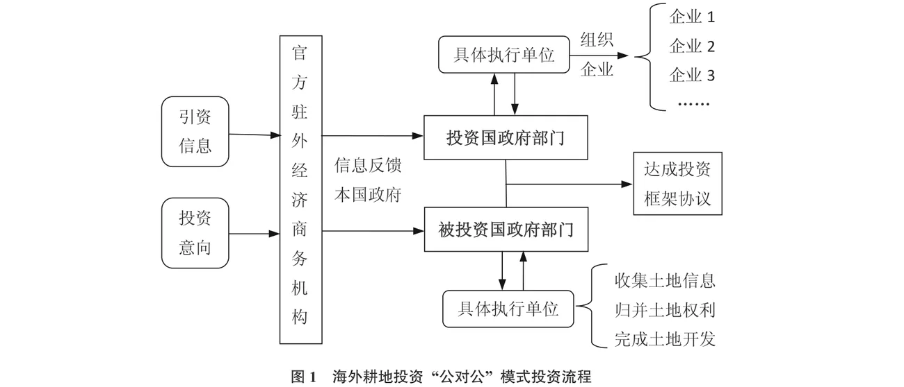
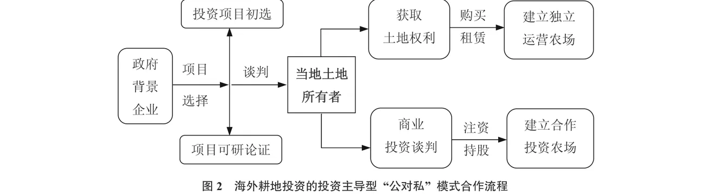
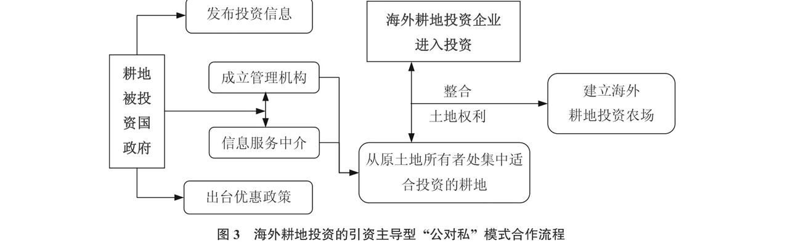
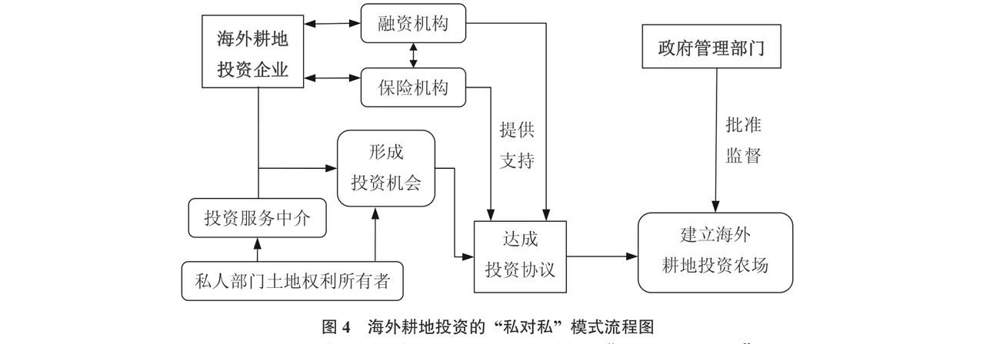

<!--folio:第1页-->

<!--col:L-->

<!--col:M-->

·《农业现代化研究》2017年第38卷第2期（总第219期）·第241–249页·

<h3 class="doc-title">部门合作型海外耕地投资模式分析</h3>

韩　璟1,2　李　岩2　卢新海1

（1. 华中师范大学公共管理学院，湖北 武汉 430079；2. 华中科技大学国土资源与不动产研究中心，湖北 武汉 430074）

<strong>摘　要：</strong>在当前全球海外耕地投资活动加剧的时代背景下，系统梳理和总结当前海外耕地投资模式，将会有力化解中国企业的海外耕地投资风险和显著提升中国企业的投资成效。基于部门合作视角，利用当前典型海外耕地投资案例资料，采用文献分析法和案例分析法，探讨海外耕地投资模式。结果表明，当前主要有“公对公”“公对私”和“私对私”三种典型的部门合作型海外耕地投资模式。其中，“公对公”模式的合作双方主要来自政府部门，投资可得到官方支持，项目成效突出，且推广效应明显；投资主导型“公对私”模式是具有官方背景的投资者与来自私人部门的被投资企业间的合作，一般前者资金实力雄厚，且对项目安全性要求较高；引资主导型“公对私”模式是被投资国政府部门与来自私人部门的投资企业之间的合作，并且前者对后者投资实力的筛选较为严格；“私对私”模式是一种在被投资国法律制度框架下的私人部门投资企业间合作，政府一般不参与其中，只负责提供相关管理和服务。研究表明，部门合作型海外耕地投资模式已演化出差异明显的表现形式、操作流程、投资特征和适用特点，中国政府应当在国家层面上重视对海外耕地投资的“公对公”模式和投资主导型“公对私”模式的推广和应用，中国投资企业应重视对国际上海外耕地投资的“私对私”模式和引资主导型“公对私”模式经验教训的总结与提炼。因此，在中国农业“走出去”战略和利用“两个市场、两种资源”的政策引导下，选择恰当的海外耕地投资模式，不仅是提升中国企业投资效益的需要，也是深入贯彻国家农业“走出去”战略和中国深入参与全球耕地资源再分配的应有之意。

<strong>关键词：</strong>海外耕地投资；投资模式；部门合作；农业合作；粮食安全　　<strong>中图分类号：</strong>F301.2　<strong>文献标识码：</strong>A　<strong>文章编号：</strong>1000-0275（2017）02-0241-09　<strong>DOI：</strong>10.13872/j.1000-0275.2017.0003

<strong>Analysis on the sector collaboration type of overseas farmland investment</strong>

HAN Jing1,2, LI Yan2, LU Xin-hai1

（1. College of Public Administration, Central China Normal University, Wuhan, Hubei 430079, China；2. Research Center for Land Resource and Real Estate, Huazhong University of Science and Technology, Wuhan, Hubei 430074, China）

<strong>Abstract：</strong><em>With the rapid growth of worldwide overseas farmland investment, it is helpful to systematically categorize and summarize overseas farmland investment modes to reduce the investment risk and improve investment efficiency for Chinese companies.</em>

<em>From the sector cooperation perspective, this paper explored the overseas investment modes through literature review and case analysis methods.</em>

<em>Results show that there are three different performances of investment modes, including “Public to Public” mode, “Public to Private” mode, and “Private to Private” mode.</em>

<em>For the “Public to Public” mode, both parties are from government sectors and they gained a lot of support from both governments and investment return is high with great potential for expansion. For the “Public to Private” mode, the investor normally has government background with abundant capital resource and seeks to work with private party in the receiving country. They require higher investment security. For the “Private to Private” mode, both parties are private businesses and no government involvement directly.</em>

<em>Based on the research results, this paper suggests that under the guidance of “going out” and “two types of resources and two markets” strategies, it is critical to choose a proper overseas farmland investment mode for Chinese companies to improve investment efficiency, to carry out “going out” strategy, and to thoroughly participate in the global farmland resource reallocation.</em>

<strong>Key words：</strong>overseas farmland investment；investment mode；sector collaboration；agricultural cooperation；food security

基金项目：国家自然科学基金项目（41501589，41371522）；中国博士后科学基金第57批面上项目（2015M572158）；英国皇家学会国际合作项目（IE151186）。

作者简介：韩璟（1985—），男，河南邓州人，博士，讲师，主要从事粮食安全与土地可持续利用研究，E-mail: hanjing@mail.ccnu.edu.cn；通讯作者：卢新海（1965—），男，湖北洪湖人，博士，教授、博士生导师，主要从事土地经济、城市规划与管理研究，E-mail: xinhailu@163.com。

收稿日期：2016-10-24；接受日期：2016-12-20。

<!--col:R-->

<!--/folio-->

<!--folio:第2页-->

<!--col:L-->

<!--col:M-->

引　言

耕地资源是土地的精华，是人类生存和发展的重要物质条件。随着全球人口规模的快速膨胀和资源承载压力的加重，除了矿石油气资源以外，耕地资源也成为一些国家争夺的重要自然资源。尤其是在全球粮食安全形势恶化、粮食价格持续走高的背景下，重新分配全球农业资源，特别是投资他国耕地资源已成为一些国家夯实粮食安全战略的重要选项[1-6]。

目前，这种以跨国农业投资为载体的耕地资源控制活动尚未形成一个统一的概念，联合国粮农组织（FAO）将其称之为 Large-scale Land Acquisitions（LSLA），世界银行（WB）将其称之为 Farmland Investment，还有一些学者称之为 Land Deal、Land Grab、Land Accumulation、Land Rush 和 Overseas Farmland Investment[7-11]。但是，这一研究话题已经引起国内外学术界的广泛关注，除了苏塞克斯大学的发展研究中心（IDS）和康奈尔大学的波尔森社会发展研究中心（PIDS）外，荷兰社会科学研究院的 Initiatives in Critical Agrarian Studies 中心、南非西开普大学的贫困、土地和农业研究中心（PLAAS）和国内的华中科技大学国土资源与不动产研究中心、浙江大学公共管理学院、中国农业科学院等高校和科研机构均加强了对这一问题的研究[12-15]。

在国际上，学术界对海外耕地投资问题的关注已经从概念争议、价值评判和农民生计问题，逐渐演进到社会影响与治理、投资风险与收益分配和投资的规范与管理方面[16-21]。国内学者对该问题的关注主要从2008年全球粮食危机开始，相关研究主要从粮食安全视角展开，相关研究概念逐渐由境外农业资源利用、海外屯田、海外圈地、国际土地争夺逐渐统一为海外耕地投资，还有学者对海外耕地投资的国家战略、风险、收益分配和法制环境等问题进行了分析[22-25]。

中国作为耕地资源匮乏的全球第一人口大国，粮食安全和耕地资源安全问题一直深受中国政府重视。2016年中央一号文件在统筹用好国际国内两个市场、两种资源的部分已明确指出，要完善农业对外开放战略布局，支持我国企业开展多种形式的跨国经营，在确保口粮绝对安全的前提下，利用国际资源和市场，优化国内农业结构，缓解资源环境压力。因此，在中国企业已纷纷深入参与全球海外耕地投资的现实背景下，综合国内外投资企业的相关成功经验，特别是对其卓有成效的投资模式进行系统的归纳总结，不但是协助中国企业有效化解投资风险、提升投资效益的需要，也是深入贯彻国家农业“走出去”战略和中国深入参与全球农业资源再分配的应有之意。

1　全球海外耕地投资的发展与中国的参与

现代意义上以“土地”要素为主导的海外耕地投资率先由日本发起。出于对国家粮食安全的担忧，日本政府早在1899年就开始着手资助国内相关公司赴秘鲁经营农场开展农业生产，这也是日本在南美洲有组织的海外耕地投资行为的开端，随后又分别由政府或民间组织在巴西、哥伦比亚和巴拉圭等地开展了类似的农业开垦活动[26]。

当前海外耕地投资活动则裂生于 FAO 和 WB 等国际机构一直倡导的全球农业投资活动，并因其投资标的物耕地属性的特殊而被异化，逐渐形成了以获取耕地为显著特征的跨国投资活动。随着全球农业投资规模的扩张，特别是在粮食危机、能源危机和金融危机三大力量的助推下，海外农业投资发展过程中的“耕地”属性逐渐凸显出来，进而引导了“农业”投资转向为“耕地”投资。2009年受韩国投资马达加斯加项目失败的影响，FAO 和 WB 一直致力推广的农业投资问题出现政治化倾向，进而使得海外耕地投资的规模和发展受到相关国际组织和研究人员的高度关注[27]。

2008年以后，在全球粮食价格高涨和金融危机的双重作用下，海外耕地投资的项目规模开始进入爆发式增长阶段。在此之前，全球海外耕地投资的面积大约为每年400万 hm²，但2008—2009年间的海外耕地投资面积就急剧增长到了4500万 hm²；单个项目的投资规模也急剧扩张，2008年以前单个项目投资面积平均约为4万 hm²，而2008—2009年间大约有四分之一的单个项目面积超过20万 hm²。据 The Economist 报道，2001至2009年间全球海外耕地投资总面积约为8000万 hm²，其中60%分布在撒哈拉以南的非洲[28]。全球粮食安全委员会高级专家组（CFS-HLPE）也认为在全球发展中地区，被国际投资者直接参与的海外耕地投资项目总面积大约在5000万 hm² 至8000万 hm²。全球土地交易联机公共数据库（Land Matrix）的统计数据显示，截止2015年全球共有列入计划的海外耕地投资项目1381个，其中营运的项目总面积达到4369.44万 hm²，涉及投资国89个，被投资国87个。

<!--col:R-->

<!--/folio-->

<!--folio:第3页-->

<!--col:L-->

<!--col:M-->

随着中国综合国力的提升和农业“走出去”战略的深入实施，中国企业已自发参与到全球海外耕地投资潮流中。2004年重庆市政府与老挝签订了“中国重庆（老挝）农业综合园区项目”合作协议，农业园区规划面积5000 hm²，包括种植业、水产业、食品加工业等项目；2006年湖北省农垦局下属的湖北省联丰海外农业开发有限公司在莫桑比克投资兴建示范农场，进行水稻、玉米等粮食作物的种植，总投资金额接近1000万美元；2007年陕西农垦局下属的农垦农工商总公司与喀麦隆政府签署协议，在该国的中央省租用土地10000 hm² 进行水稻、木薯的生产和加工，使用期限为90年，总投资金额6000万美元；2011年湖北省的万宝粮油公司在莫桑比克租用333 hm² 土地进行粮食种植，使用期限为50年，总投资金额超过1000万美元，并且该公司计划未来将租地面积扩大为6700 hm²。2005—2014连续10年，财政部、商务部均在联合下发的《对外经济技术合作专项资金申报工作的通知》中明确鼓励中国企业到海外进行农业投资，并规定相关“走出去”企业可通过直接补助和贷款贴息方式获得最高3000万元人民币的财政专项资金支持。据国际非政府组织 GRAIN 和 Land Matrix 的统计数据，截止2015年7月底中国企业在全球60多个国家已营运海外耕地投资项目132个，投资耕地总面积超过400万 hm²，大多数项目分布在撒哈拉以南的非洲、拉丁美洲和东南亚地区的国家中。

2　部门合作型海外耕地投资模式

随着全球海外耕地投资规模的增长和参与企业的增加，目前国际上已经形成了各具特色的投资模式。Vermeulen 和 Cotula[29]提出了分析海外耕地投资模式的4个关键要素：所有权（Ownership）、发言权（Voice）、风险（Risk）和报酬（Reward）。从海外耕地投资模式的特征上看，可以将其划分为两种类型。一种是立足被投资国的土地产权管理制度和投资项目的产权获取情况，根据投资企业对投资项目土地权利的占有程度划定的基于土地权利介入的海外耕地投资模式，在实践中其主要有土地权利完全拥有、土地权利部分拥有和土地权利控制3种操作形式[30]。另一种是从部门合作的角度出发，根据投资方和被投资方的部门属性而划分的部门合作型海外耕地投资模式，主要有公共部门与公共部门合作的“公对公”模式、公共部门与私人部门合作的“公对私”模式和私人部门合作的“私对私”模式三种表现形式[31]。

**2.1　“公对公”模式**

海外耕地投资的“公对公”模式，主要是指在海外耕地投资项目的实施过程中，作为其交易主体的投资方和被投资方均来自公共部门（Public Sector），即政府部门或其附属机构是达成整个海外耕地投资活动的主要参与者，这种模式多在两国政府间的农业合作框架下进行。海外耕地投资“公对公”模式一般采用以下合作流程：1）投资国公共部门或被投资国公共部门具有海外耕地投资项目合作意向；2）两国共同或单独将项目合作意向信息反馈到各自驻外机构的经济商务参赞部门；3）商务参赞部门介入海外耕地投资项目前期的论证与沟通过程；4）来自投资国与被投资国的合作主体在经济商务参赞部门的协助下开展项目谈判；5）项目投资实施主体商定投资计划，并确定项目的相关投资条款；6）投资与被投资相关公共部门签署投资协议，海外耕地投资项目开始运营（图1）。

<!--col:R-->

<!--/folio-->

<!--folio:第4页-->

<!--col:L-->

<!--col:M-->

从合作层次上看，海外耕地投资的“公对公”模式可分为国家层面的合作与地方政府层面的合作两种。在国家层面的合作中，投资国与被投资国最高层级的政府达成相关合作协议，然后由国家领导人或政府组成部门的负责人落实相关海外耕地投资合作框架，最后由来自公共部门的国有企业落实相关合作协议条款并具体实施。如2011年4月中国政府与乌克兰政府签署了建立中乌农业合作园区的谅解备忘录，以及随后建立的中乌农业合作园区框架下的合作机制，即典型的国家层面“公对公”模式。地方政府层面的“公对公”投资模式又可以细分为两种形式：一是在国家层面的投资框架下，双方地方政府或其附属部门参与到海外耕地投资项目中，如上述《中乌农业领域合作框架协议》签订后的商务合同履行阶段，辽宁的禾丰牧业集团与乌克兰农业联合体达成的相关合作意向；二是在没有中央政府的参与下，地方政府或其附属部门直接参与海外耕地投资项目的实施，如重庆市政府与老挝万象市政府之间的中国重庆（老挝）农业综合园区合作就属于此种类型。

**2.2　“公对私”模式**

海外耕地投资的“公对私”模式是指参与海外耕地投资项目的投资方和被投资方由分别来自公共部门的政府和来自私人部门（Private Sector）的企业组成。这种“公对私”的投资模式具体有两种操作形式，一种是投资主导型“公对私”模式，另一种是引资主导型“公对私”模式。

在第一种投资模式中，投资方来自公共部门，被投资方来自私人部门，其典型情况是粮食紧缺国政府与某些国家的私人部门进行合作，如沙特、阿联酋、卡塔尔等海合会国家的投资项目。在第二种投资模式中，投资方是来自于私人部门的企业，被投资方则由项目所在地政府或其附属机构组成，其典型情况是部分非洲国家为筹集本国农业发展资金或引进农业种植技术，由政府主导并制定政策将本国耕地以优惠的价格提供给来自其他国家的投资者，欧美等发达国家在非洲的耕地投资项目多采取此种模式。

海外耕地投资的投资主导型“公对私”模式一般采用以下合作流程：1）有海外耕地投资意愿的政府督促其下属的部门或企业寻找潜在的投资项目或合作者；2）投资企业（通常是国有企业）对有价值的投资项目进行论证；3）投资企业开始与当地合作者进行接触和谈判；4）投资企业在当地成立分支机构或与当地土地所有者组建合作公司；5）投资企业完成对原土地所有者的补偿或合作公司股权的划分；6）投资方与被投资方确定各自权利义务，项目运营（图2）。

海外耕地投资的引资主导型“公对私”模式一般采用以下合作流程：1）有引资意向的耕地供应国政府发布招商信息或出台相关优惠政策；2）政府成立相关的机构为投资者提供投资信息服务；3）投资企业在被投资国的投资中介服务机构协助下寻找适合进行投资的耕地；4）投资企业与被投资国的投资中介服务机构初步达成投资意向；5）被投资国的投资中介服务机构在政府的授权下负责对拟进行投资的耕地进行“一级开发”，特别是对土地权利进行整合；6）投资企业与当地投资中介服务机构进行项目勘察和可行性论证；7）在当地政府的主导下，投资企业与其他利益相关者签订投资合同；8）项目运营（图3）。

<!--col:R-->

<!--/folio-->

<!--folio:第5页-->

<!--col:L-->

<!--col:M-->

**2.3　“私对私”模式**

海外耕地投资的“私对私”模式是指合作的双方均来自私人部门，大致可分为三种形式：一是较为规范的私营企业与私营企业之间的合作，如日本三井物产株式会社2007年与巴西 Multigrain 公司之间的合作，前者通过这种“私对私”的投资模式在巴西种植大豆、玉米等农作物供应国内市场；二是私营企业与土地所有者之间的合作，如英国公司 Agrica 公司2008年在坦桑尼亚投资的5818 hm² 土地就是从 Rubada 地区的社区和农户手中购买的土地使用权；三是私人农户与农户之间的合作，如中国浙江的农民在苏丹承包的种植农场，东北地区的农民在俄罗斯远东地区承包的农场等。海外耕地投资的“私对私”模式要求投资合作双方必须在当地法律制度的允许下，通过自主协商采取购买、租赁、合营、股份合作等方式经营农场，政府一般不参与其中，只负责提供相关服务。

目前，私营企业参与的“私对私”海外耕地投资模式通常较为普遍，也是“私对私”投资模式的执行主力，而纯农户参与的“私对私”投资模式往往具有自发性，并且一般规模较小，并非“私对私”投资模式的主流。海外耕地投资的“私对私”模式通常具有以下流程：1）投资企业寻找投资信息，这种信息通常是私人部门发布的；2）投资双方进行初步协商，协商双方可以是企业、社区、农民协会等独立实体；3）投资双方确定合作形式，通常采用购买、租赁、入股、合作经营等方式；4）双方达成合作协议；5）项目合作得到官方批准，运营（图4）。

3　部门合作型海外耕地投资模式的特征

**3.1　“公对公”模式**

海外耕地投资“公对公”模式中合作双方主要来自于政府部门，投资项目往往能够得到官方的有力支持，项目稳定性较高，抗风险能力较强，并且推广效应明显。具体而言，海外耕地投资的“公对公”模式主要具有以下六个特点：1）投资国和被投资国的投资主体均来自公共部门，投资的直接参与者要么是当事双方的中央政府或中央政府组成部门，要么是地方政府或其附属机构；2）投资协议的达成有第三方机构的协助，并且这种第三方协作机构往往由驻外机构经济商务参赞部门扮演；3）投资协议的签署主体与执行主体分离，往往政府部门只负责签订耕地投资合作框架协议，而不直接参与具体项目的运营；4）项目的执行往往由具有政府背景的企业实施，企业一般由政府在合作框架协议内召集；5）耕地产权边界清晰，一般由被投资国政府负责处理耕地产权问题，完成了对被投资耕地的“一级开发”，投资方不需要再与第三方商谈土地权利问题；6）投资方政府拥有可以控制的实施主体，投资方政府能够保证在政府层面的框架协议签订后，实施主体一定可参与到具体项目的实施过程中。

<!--col:R-->

<!--/folio-->

<!--folio:第6页-->

<!--col:L-->

<!--col:M-->

“公对公”的海外耕地投资模式的优点主要体现在三个方面：1）投资合作协议由双方政府部门达成，项目的执行具有政治优势、稳定性较高，抗风险能力较强；2）参与投资的企业一般实力较强，项目一般可以按进度保证质量执行，并且项目的落实过程一般不存在资金问题；3）投资项目一般面积较大，项目实施的影响力也较强，一旦项目运营成功将会形成示范效应和广告效应，有利于促进投资方在被投资地区海外耕地投资业务的拓展。但是，该投资模式的局限也可以分为三个方面：1）政府直接参与海外耕地投资容易招致非议，特别是投资方来自于粮食紧缺国、被投资方是农业生产落后的不发达国家时，这种投资往往容易受到 NGO 的质疑；2）政府参与的、面积庞大的投资项目还容易引起当地民众的担忧和不安，增加了项目实施中的道义压力；3）项目运营失败的代价较高，政府参与的项目投资一旦失败不仅会造成投资企业的经济利益受损，更会导致投资双方特别是投资方的声誉受损，进而增加投资方企业在该地区拓展海外耕地投资项目的阻力。

**3.2　“公对私”模式**

海外耕地投资“公对私”模式的特征与启示可以从投资主导型的“公对私”和引资主导型“公对私”模式两个方面归纳。目前，投资主导型“公对私”模式主要为海湾地区国家所采用，如沙特、阿联酋、卡塔尔等国在非洲西北部埃塞俄比亚、苏丹等国的农产品生产投资项目，该模式最为显著的特征是具有官方背景的投资者与来自私人部门的被投资企业进行投资合作，并且投资方往往资金实力雄厚，对投资项目的安全性要求较高。投资主导型“公对私”海外耕地投资模式具有以下四个优点：1）来自投资方的企业具有官方背景，通常实力雄厚；2）投资稳定性较高，一旦项目运营，其管理也较为规范；3）技术溢出效应比较明显，能为被投资国带来外部经济；4）投资往往有利于当地农业基础设施水平的快速提升，如道路、水利、电力项目建设等。该投资模式的缺点也可分为四个方面：1）当地政府对项目的支持力度较弱，项目风险不易控制；2）投资者要与个体土地所有者进行谈判，程序较为复杂；3）土地权利获取程序复杂，容易引发当地农民的抵触；4）农产品的大量回运容易遭受道义指责。因此，这种投资主导型的“公对私”投资模式一般适合实力雄厚的企业采用，并且比较适合土地市场发育较好、土地权利制度较为规范的国家。

引资主导型“公对私”海外耕地投资模式主要为农业发展相对落后的国家所采用，在实际操作中特别受非洲农业落后国家的青睐，如尼日利亚、马里、几内亚等国就纷纷出台相关优惠政策吸引投资项目。该投资模式也具有四个优点：1）项目一般由被投资国官方提供信用担保，项目运营面临的风险较小；2）政府能够提供较为可靠的信息服务，便于投资者进行项目论证；3）被投资国官方机构负责土地权利的整合，投资者面临的投资程序较为简单；4）投资国一般农业生产水平比较低下，项目盈利空间较大。该模式的缺点也可以分为四个方面：1）对投资者的要求较高，一般只有实力雄厚的企业才有能力参与；2）项目面积通常较大，而且不允许分割；3）政府土地权利整合中的缺陷容易给项目的后续运营埋下不稳定风险；4）项目协议通常会有附加条款，往往要求投资者进行农业技术培训、基础设施建设、农民社区改善等。实际上，21世纪以来，受发达国家对农业部门援助金额降低的影响，部分非洲国家急需农业发展资金，通过公共部门的政策引导，以海外耕地投资的方式将富裕国家的资金引入本国农业部门，逐渐成为一些非洲国家发展本国农业的重要战略选择，这也成为引资主导型“公对私”海外耕地投资模式广泛发展的特殊有利宏观政策环境。

<!--col:R-->

<!--/folio-->

<!--folio:第7页-->

<!--col:L-->

<!--col:M-->

**3.3　“私对私”模式**

海外耕地投资的“私对私”模式要求参与合作的双方均具有清晰的产权边界，特别是被投资的耕地权利所有者必须是具有排他性的权利个体或组织。在当前全球新自由主义思潮广泛传播的背景下，随着经济全球化和市场化的推进，一些被投资区域社会制度日趋规范，土地市场逐渐发育完善，农民土地权利逐渐清晰明确，使得海外耕地投资的“私对私”模式越来越为投资企业所接受和重视。现代企业制度比较健全和管理水平较高的发达国家投资者往往青睐此种方式，只要符合被投资国的法律制度要求、土地权利边界清晰且可以流转，投资者就可以直接从拥有耕地的企业、个人、社区等来自私人部门的组织中获取耕地权利。

海外耕地投资的“私对私”模式必须以产权明确且土地权利可以自由流转为前提，其具有以下三个优点：1）外部干扰较少，合作企业可较为独立地进行投资决策；2）投资方式灵活，企业可以根据不同合作者选择适宜的合作形式；3）企业可以较为自主地把控耕地投资规模，合理安排生产经营活动。该模式的缺点主要是：1）对被投资地区的产权制度建设和土地市场发育水平的要求较高；2）投资活动缺少官方支持，投资权益保护的风险较高；3）投资合作双方参与主体复杂，企业运营容易受到不稳定因素的影响。在当前经济全球化的时代背景下，海外耕地投资的“私对私”模式因其符合当前全球化趋势而备受 FAO 和 WB 等国际组织和机构的提倡，但其面临的主要局限在于大部分海外耕地投资的被投资国均为不发达国家，其产权制度建设和土地市场建设存在先天性缺陷。

4　中国企业的部门合作型海外耕地投资模式选择策略

**4.1　“公对公”模式**

中国国有企业自身的特性、海外耕地投资的主要动力和主要投资在发展中国家的现状决定“公对公”模式应当成为中国国有企业进行海外耕地投资初始阶段的重要选项。这种投资模式的最大优势就是可以为投资企业营造一个稳定性较高的投资环境，并且这种投资环境往往由两国政府提供信用保证，所以中国企业在投资政府治理较差的发展中国家时尤应注意选择此种投资模式。

中国国有企业政府背景浓厚，并且一般实力较强，中国政府也便于引导国有企业以粮食安全为目标进行海外耕地投资。针对中国企业来说，进行海外耕地投资的最大风险就是宏观环境的不稳定性，通过政府部门间的“公对公”模式，可以在政府治理的最高层面签署相关投资合作协议，减少非经济因素对企业海外耕地投资的影响，为企业创造良好的投资环境。

另外，中国与大多数亚、非、拉发展中国家具有良好的外交关系，并且中国的农业生产对这些发展中国家的比较优势也较为明显。因此，中国国有企业在投资过程中要重视对海外耕地投资“公对公”投资模式的选择，并有意识将相关投资诉求反映给国家农业、商务部门，以便在高层交往中有效保护投资权益。

**4.2　投资主导型“公对私”模式**

目前，中国农业部已与91个国家的农业部门签署了189个有关农业合作的文件、与全球近60个国家和地区建立了农业合作委员会，并通过签订农业合作备忘录的方式为中国企业实施农业投资提供政策支持，这实际上已经为中国企业利用投资主导型“公对私”模式创造了极大的便利条件。从投资模式的适用性上看，这种投资主导型“公对私”模式比较适用于经济发展水平较好、政府治理较好一些的发展中国家，如南非、巴西、乌克兰等国。一般情况下，此类国家土地制度相对稳定，土地市场也有了一定的发展，私人部门的土地所有者或使用者一般具有参与交易的法定地位。因此，中国企业可以寻求在中国政府的农业合作框架下进行海外耕地投资。但是，在选择投资主导型“公对私”模式时还要注意以下三个问题：一是对土地所有者、使用者的补偿要科学合理，以减少国际舆论风险和利益相关者的不稳定风险；二是要注意履行社会责任，为项目的运营营造一个良好的社会环境；三是在面对投资纠纷时要善于运用官方背景，及时化解投资冲突。

<!--col:R-->

<!--/folio-->

<!--folio:第8页-->

<!--col:L-->

<!--col:M-->

**4.3　引资主导型“公对私”模式**

目前，联合国粮农组织和世界银行已经指导和帮助很多发展中国家建立了初步的土地产权制度、土地市场和农业发展计划，这均为农业不发达国家利用引资主导型“公对私”模式奠定了基础。引资主导型“公对私”模式的显著优点是投资企业可以得到被投资国政府部门的优惠政策照顾，投资项目的稳定性相对较高，其缺点是被投资国政府部门对投资企业的筛选较为严格，投资门槛相对较高，一般要求参与企业具有较强的投资实力。

目前，海外耕地投资的最大风险来自于被投资国宏观环境的不稳定所产生的非经济风险，并且这种风险在一些发展中国家尤为突出，而在引资主导型“公对私”模式中，被投资国政府的主动参与则可大大降低此类风险发生的概率。因此，对中国有实力的私人企业来说，在海外耕地投资中应首选引资主导型“公对私”模式，一方面被投资国政府提供的优惠政策会增加企业的利润空间，另一方面当地政府也会为投资项目营造良好的社会环境，便于投资项目的顺利实施和运营。

**4.4　“私对私”模式**

全球土地市场的发育和土地产权制度建设的深入也为投资企业与被投资地区私人部门的合作奠定了坚实的基础，无论是被投资地区的私营企业还是独立土地权利人均具有了参与海外耕地投资的基本条件。目前，来自北美洲、欧洲等发达地区的投资企业较多地采用“私对私”模式实施海外耕地投资，如美国 Adecoagro 公司在巴西的投资、葡萄牙 Quifel Natural Resources 公司在莫桑比克的投资、法国 Sucres & Denrée 公司在俄罗斯的投资。“私对私”模式的好处是符合当前的市场经济规则，也为世界银行、联合国粮农组织等国际组织所提倡，但其缺陷是投资发展中国家时企业面对的宏观风险较高，投资企业需要有较强的风险驾驭能力。

从当前市场环境来看，公共部门对企业经营过多的支持和干预总会招致非议，并受到相关国际规则的制约，预计随着海外耕地投资管理国际公约的规范与完善，“私对私”模式将会成为企业投资的主要选择。因此，中国私人企业应当重视对该投资模式的应用潜力，特别是要注意总结发达国家企业运用该模式进行投资的经验与教训，从而为利用“私对私”模式进行投资做好准备。

5　结　论

随着中国经济的发展和农业“走出去”战略的深入实施，以及国家利用“两个市场、两种资源”的政策指导和支持，已有大量的中国农业企业走向国际舞台，深入参与到全球海外耕地投资活动中。中国投资企业的海外耕地投资活动面临着极其复杂的投资环境，尤其深受被投资国制度、政策的影响，投资风险较大。虽然国家的宏观政策可以为企业提供一些有力的支持，但是投资风险的防控与化解与投资模式的选择更为密切。

目前，国际上的海外耕地投资企业已经形成了一些具有代表性的海外耕地投资模式，尤其是部门合作型海外耕地投资模式已演化出“公对公”“公对私”和“私对私”三种鲜明的表现形式，并形成了特征明显的适用条件。对中国政府来说，应从维护国家粮食安全和土地资源安全的角度谋划海外耕地投资战略布局，特别是要在国家层面上重视对海外耕地投资的“公对公”模式和投资主导型“公对私”模式的推广和应用，强化国家在扫清投资障碍方面的影响力。对中国海外耕地投资企业来说，除了跟随政府的海外耕地投资模式导向以外，还要积极发挥主观能动性，重视对国际上海外耕地投资的“私对私”模式和引资主导型“公对私”模式经验教训的总结与提炼，形成既适合国际管理规范，又符合中国投资企业诉求和特点的海外耕地投资模式。

中国投资企业作为全球海外耕地投资的新生力量和重要参与者，不但面临着一般的海外耕地投资企业要化解的“土地掠夺”“新殖民主义”等普遍风险，而且还面临着“中国威胁论”“中国企业社会责任缺失论”“中国企业管理水平不足论”等特殊风险。论文立足于典型的海外耕地投资案例资料，采用文献分析法和案例分析法从部门合作视角对当前海外耕地投资模式进行了系统归纳，并着重对“公对公”“公对私”和“私对私”三种投资模式的表现形式、操作流程、投资特征和适用特点进行了分析。但是，作为一种企业主导的跨国耕地资源获取和控制活动，其相关投资细节存在天然的投资透明性不足缺陷，从而致使论文对相关投资模型的总结还存在一定的欠缺，同时也为后续深入分析海外耕地投资模型提供了研究空间。总之，选择恰当的海外耕地投资模式，不但有利于中国企业有效化解投资风险、保障投资权益，而且也有利于中国深入参与全球耕地资源再分配和释放国内耕地资源承载压力。

<!--col:R-->

<!--/folio-->

<!--folio:第9页-->

<!--col:L-->

<!--col:M-->

参考文献（References）

[1] Cotula L, Vermeulen S, Leonard R, et al. Agricultural investment and international land deals: Evidence from a multi-country study in Africa[J]. Food Security, 2011, 3(1): 99-113.

[2] Deininger K. Challenges posed by the new wave of farmland investment[J]. Journal of Peasant Studies, 2011, 38(2): 217-247.

[3] 卢新海, 韩璟. 中国海外耕地投资战略与对策——基于粮食安全的视角[M]. 北京: 科学出版社, 2015. Lu X H, Han J. Strategy and Countermeasure of Overseas Farmland Investment: Based on Food Security Perspective[M]. Beijing: Science Press, 2015.

[4] 杨易, 何君, 张晨, 等. 境外农业资源利用视角下的国家粮食安全保障分析及建议[J]. 世界农业, 2012(3): 5-10. Yang Y, He J, Zhang C, et al. Analysis and suggestion of national food security from overseas agricultural resource use perspective[J]. World Agriculture, 2012(3): 5-10.

[5] 宋洪远, 张红奎. 我国企业对外农业投资的特征、障碍和对策[J]. 农业经济问题, 2014(9): 4-10, 110. Song H Y, Zhang H K. Investment for agriculture in foreign countries by Chinese firms: Characteristics, barrier and choice of government[J]. Issues in Agricultural Economy, 2014(9): 4-10, 110.

[6] 朱继东. 日本海外农业战略的经验及启示——基于中国海外农业投资现状分析[J]. 世界农业, 2014(6): 122-125. Zhu J D. Experiences and inspirations from Japan's overseas agriculture strategy[J]. World Agriculture, 2014(6): 122-125.

[7] White B, Saturnino M, Borras Jr, et al. The new enclosures: Critical perspectives on corporate land deals[J]. Journal of Peasant Studies, 2012, 39(3/4): 619-647.

[8] Francis C. Governing global land deals: The role of the state in the rush for land[J]. Development & Change, 2015, 44(2): 189-210.

[9] Henderson H, Corral L, Simning E, et al. Land accumulation dynamics in developing country agriculture[J]. Journal of Development Studies, 2015, 51(6): 1-19.

[10] Cotula L, White B, Borras S, et al. The international political economy of the global land rush: A critical appraisal of trends, scale, geography and drivers[J]. Journal of Peasant Studies, 2012, 39(3/4): 649-680.

[11] Byerlee D, Deininger K. Growing resource scarcity and global farmland investment[J]. Annual Review of Resource Economics, 2013, 5(1): 13-34.

[12] 喻燕. 中国企业海外耕地投资战略风险研究[D]. 武汉: 华中科技大学, 2011. Yu Y. Study on the strategic risks of overseas cultivated land investment of China's enterprises[D]. Wuhan: Huazhong University of Science and Technology, 2011.

[13] 李睿璞. 海外耕地投资的利益分配研究[D]. 武汉: 华中科技大学, 2011. Li R P. Research on the benefit allocation of overseas cultivated land investments[D]. Wuhan: Huazhong University of Science and Technology, 2011.

[14] 韩璟. 中国海外耕地投资：地域与模式选择[D]. 武汉: 华中科技大学, 2014. Han J. China's overseas farmland investment: Choices of regions and modes[D]. Wuhan: Huazhong University of Science and Technology, 2014.

[15] 俞琳楠. 海外耕地投资：中国的困境与出路——基于非传统安全的视角[D]. 杭州: 浙江大学, 2013. Yu L N. Overseas farmland investment: China's dilemma and outlet—With the perspective of non-traditional security[D]. Hangzhou: Zhejiang University, 2013.

[16] Saturnino M, Borras Jr, Hall R, et al. Towards a better understanding of global land grabbing: An editorial introduction[J]. Journal of Peasant Studies, 2011, 38(2): 209-216.

[17] Braun J, Meinzen-Dick R. “Land Grabbing” by foreign investors in developing countries: Risks and opportunities[R]. IFPRI-Policy Brief, 2009, 13: 4-6.

[18] Zoomers A. Globalization and the foreignisation of space: Seven processes driving the current global land grab[J]. Journal of Peasant Studies, 2010, 37(2): 429-447.

[19] De Schutter O. How not to think of land-grabbing: Three critiques of large-scale investments in farmland[J]. Journal of Peasant Studies, 2011, 38(2): 249-279.

[20] Li T. Centering labor in the land grab debate[J]. Journal of Peasant Studies, 2011, 38(2): 281-298.

[21] Milgroom J. Policy processes of a land grab: At the interface of politics ‘in the air’ and politics ‘on the ground’ in Massingir, Mozambique[J]. Journal of Peasant Studies, 2015, 42(3/4): 1-22.

[22] 卢新海. 海外耕地投资与中国面临的机遇、挑战与对策[J]. 湖北行政学院学报, 2014(3): 5-11. Lu X H. Overseas farmland investment and China's opportunity, challenge and countermeasures[J]. Journal of Hubei Administration Institute, 2014(3): 5-11.

[23] 邹文涛, 吴乐. 论我国粮食安全与境外农业资源利用[J]. 海南大学学报人文社会科学版, 2012, 30(2): 117-121. Zou W T, Wu L. On China's food security and utilization of overseas agricultural resources[J]. Humanities & Social Science Journal of Hainan University, 2012, 30(2): 117-121.

[24] 石军红. “海外屯田”与我国粮食安全问题述论[J]. 湖北社会科学, 2009(7): 81-83. Shi J H. Overseas farmland collect and China's food security[J]. Hubei Social Science, 2009(7): 81-83.

[25] 胡莹洁, 赵文武, 徐海亮. 国际土地争夺发展现状与影响因素分析[J]. 世界地理研究, 2013(4): 25-34. Hu Y J, Zhao W W, Xu H L. A study on development status and influence factor of the global land grabbing[J]. World Regional Studies, 2013(4): 25-34.

[26] 黄善林, 卢新海. 当前国际上海外耕地投资状况及其评析[J]. 中国土地科学, 2010(7): 71-76. Huang S L, Lu X H. Status and comments on current overseas farmland investment throughout the world[J]. China Land Science, 2010(7): 71-76.

[27] 卢新海, 韩璟. 海外耕地投资研究综述[J]. 中国土地科学, 2014(8): 88-96. Lu X H, Han J. Review of studies on overseas farmland investment[J]. China Land Science, 2014(8): 88-96.

[28] The Economist. Outsourcing's third wave: Buying farmland abroad[N]. The Economist, 2009-05-21.

[29] Vermeulen S, Cotula L. Making the most of agricultural investment: A survey of business models that provide opportunities for smallholders[EB/OL]. [2010-12-28]. http://www.iied.org/pubs/display.php?o=12566IIED.html.

[30] 韩璟, 卢新海. 海外耕地投资与粮食生产发展[J]. 土地经济研究, 2014(2): 91-108. Han J, Lu X H. Development of overseas farmland investment and grain produce[J]. Journal of Land Economics, 2014(2): 91-108.

[31] 卢新海, 李书宁. 海外耕地投资模式探析[J]. 西北农林科技大学学报(社会科学版), 2012(6): 81-85. Lu X H, Li S N. Probe on overseas farmland investment patterns[J]. Journal of Northwest A&F University (Social Science Edition), 2012(6): 81-85.

（责任编辑：童成立）

<!--col:R-->

<!--/folio-->
